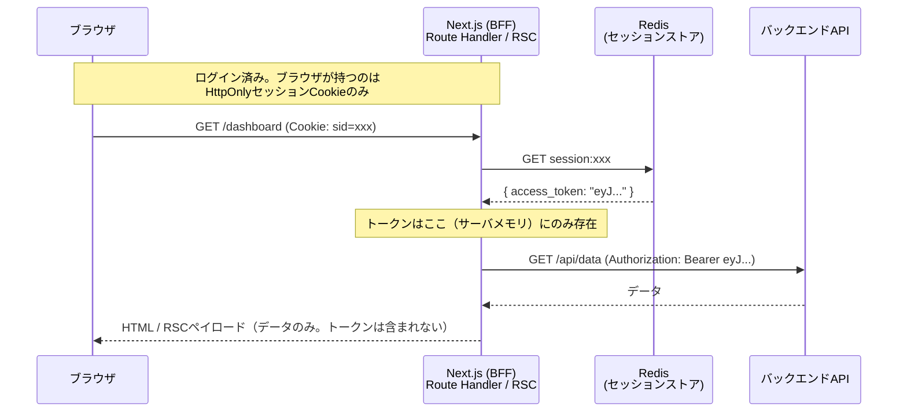
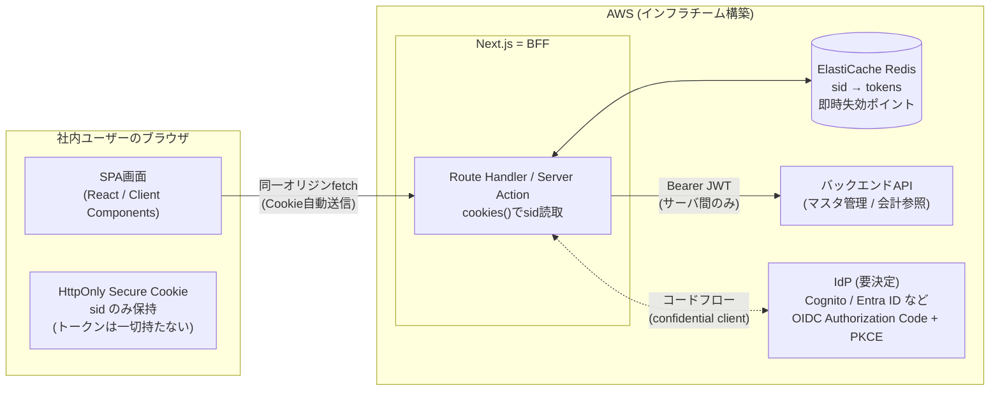

# 調査まとめ — BFF+セッション vs SPA+ブラウザトークン

[疑問.md](疑問.md) の観点A〜Eを調査し、[概要.md](../概要.md) の前提（社内用基幹システム／マスタデータ管理＋会計トランザクション表示の2サイト／現行Salesforce）に当てはめた結論までを記す。

---

## 結論（先出し）

**このケースでは「BFF + セッション（Redis）」を採るべき。**

理由の要約：

1. **標準がそう言っている**：IETFの [OAuth 2.0 for Browser-Based Applications](https://datatracker.ietf.org/doc/draft-ietf-oauth-browser-based-apps/)（ブラウザアプリ向けOAuthのBCPドラフト）は、実現可能であれば **BFFパターンが最も強い保護** であり第一推奨としている。トークンをブラウザに置く方式は「BFFが採れない場合の次善策」という位置づけ。
2. **「得るもの」が今回ほぼ実在しない**（観点C）：社内システム規模でステートレス性は不要、Next.jsならBFF追加コストはほぼゼロ、マルチクライアント要件は現状なし。
3. **「即時失効」はこのシステムでは事実上の要件**（観点E）：会計データ・基幹マスタを扱う社内システムでは、退職者・異動者のアクセス即時無効化が求められる可能性が高い。JWTブラウザ保持方式はここが構造的に弱い。
4. **観点Aの答えは「条件付きで成立」だが、その条件は守れる範囲**：後述の実装規律（トークンをServer Actionのクロージャに掴まない等）＋taint APIのガードレールで運用可能。

---

## 前提知識の整理（概要.mdの疑問への回答）

> 「そもそもトークンがJWTそのものなのか、セッションIDなのかすらもわからん」

この2つは**別の概念**で、混同されやすいので先に整理する。

| | セッションID | JWT（アクセストークン） |
|---|---|---|
| 正体 | ランダムな文字列。**それ自体に意味はない** | 署名付きのJSON。**中身にユーザー情報や権限が入っている** |
| 性質 | **reference（参照）** — サーバ側の状態（Redis等）を指すだけ | **capability（能力）** — 持っているだけで行使できる |
| 検証方法 | サーバがストアを引いて確認 | 署名検証のみ（ストア参照不要＝ステートレス） |
| 失効 | サーバ側で消せば**即時失効** | **有効期限まで失効できない**（失効リストを持てばステートレス性が消える） |
| 漏洩時 | サーバが消せば無力化できる | 期限まで攻撃者が使い放題 |

重要なのは「**JWTを使うか否か**」と「**トークンをブラウザに出すか否か**」も別の軸だということ。BFF構成でも、BFF→バックエンドAPI間の認証にJWTを使ってよい。その場合JWTは**サーバ内にのみ存在**し、ブラウザにはHttpOnlyのセッションCookieだけが渡る。今回の争点は後者の軸（ブラウザに出すか）である。

---

## 観点A：Next.jsのServer Actions / RSCでトークンは露出するのか

### 結論：「正しく使えば出ない」は成立するが、**無条件ではなく実装規律付き**で成立する

「BFFにすれば自動的に安全」は**誤り**。ただし破れ方はすべて「特定の実装ミス」に分類でき、リンター・レビュー・taint APIで機械的に防げる。以下、シリアライズ境界の正確な挙動。

### A-1. Server Actions の関数本体はクライアントに含まれない

`"use server"` の関数本体はクライアントJSバンドルに**含まれない**。クライアントに渡るのは暗号化されたアクションID（参照）のみで、未使用のServer Functionはバンドルから除去されエンドポイント自体が存在しなくなる（[Next.js: Data Security](https://nextjs.org/docs/app/guides/data-security)）。

### A-2. ⚠️ ただし「クロージャに掴んだ変数」はクライアントに送られる（暗号化はされる）

ここが最大の落とし穴。コンポーネント内にインラインで定義したServer Actionが外側の変数を閉じ込めた場合、その値は**シリアライズされてクライアントに送信され、フォーム送信時にサーバへ送り返される**。

```tsx
// ❌ 危険パターン：token がクロージャに掴まれ、（暗号化されて）クライアントに送られる
export default async function Page() {
  const token = await getAccessToken();
  async function save(formData: FormData) {
    "use server";
    await fetch(API, { headers: { Authorization: `Bearer ${token}` } }); // ← tokenを閉じ込めた
  }
  return <form action={save}>...</form>;
}
```

Next.jsはこのクロージャ変数を**ビルドごとに生成される秘密鍵で暗号化**してから送るため平文では漏れないが、公式ドキュメント自身が「**暗号化だけに依存するな**」と明言している（[Next.js: How to Think About Security](https://nextjs.org/blog/security-nextjs-server-components-actions)）。鍵はビルド成果物と同じ場所に存在し、マルチインスタンス運用では `NEXT_SERVER_ACTIONS_ENCRYPTION_KEY` を共有する＝鍵管理の問題に転化する。

**正解**：Server Actionは別ファイル（`actions.ts`）のトップレベルに定義し、トークンは**Action実行時に `cookies()` → Redisから引く**。クロージャで受け渡さない。

### A-3. Server Componentのfetch結果：RSCペイロードに載るのは「結果」だけ、ただしpropsは全部載る

疑問.mdの理解は**正しい**。Server Component内で `fetch(url, { headers: { Authorization: token } })` しても、HTMLやRSCペイロードに載るのは**レンダリングに使われたデータ**であり、リクエストヘッダのトークン自体は載らない。

**ただし**、以下は漏れる：

- **Client Component（`"use client"`）のpropsに渡したものすべて**。RSCペイロードとしてシリアライズされブラウザに届く。`token` を渡せばそのまま漏れる。
- **画面に表示していなくても、propsに渡した「オブジェクト丸ごと」**。`<Profile user={user} />` で `user` にパスワードハッシュやトークン列が含まれていれば、画面に出ていなくてもペイロードには入っている。実例として、[米政府サイトがRSCペイロード経由で非表示の個人情報を漏らした事故](https://www.bswanson.dev/blog/nextjs-hydration-payload/)が報告されている。

### A-4. `cookies()` / `headers()` 経由なら本体はサーバに留まる — この想定は正しい

セッションIDをHttpOnly Cookieで持ち、Server ComponentやRoute Handlerが `cookies()` で読み、Redisを引いてトークンを取得し、サーバ内fetchに使う。この経路ではトークンは**サーバのメモリ内にしか存在しない**。ブラウザに渡るのはHttpOnly Cookie（JSから読めない）のみ。



### A-5. ガードレール：taint API

`next.config.js` で `experimental.taint` を有効にし、[`experimental_taintUniqueValue`](https://react.dev/reference/react/experimental_taintUniqueValue) / [`experimental_taintObjectReference`](https://react.dev/reference/react/experimental_taintObjectReference) でトークンやセッションオブジェクトに「汚染」マークを付けると、**Client Component境界を越えようとした瞬間にエラーで落ちる**。ただし限界もある：加工した値（base64化・文字列連結・オブジェクトのコピー）は追跡されない。**唯一の防壁ではなく、最後の網**として使う。

### A-6. 守るべき実装規律（まとめ）

1. トークンは `cookies()` → Redis経由でのみ取得。環境変数・モジュールスコープ・propsで引き回さない
2. Server Actionは別ファイル定義。クロージャに秘匿値を掴まない
3. Client Componentにはドメインオブジェクト丸ごとではなく**表示に必要なフィールドだけのDTO**を渡す（データアクセス層で剥がす）
4. taint APIを有効化してトークン・セッションオブジェクトを汚染マーク
5. `server-only` パッケージでサーバ専用モジュールの誤importをビルドエラー化

→ **観点Aの答え**：「条件付きの話」。ただしその条件は上記5点の規律であり、コードレビューと静的な仕組みで担保できる範囲。一方SPA方式は「トークンがJSから読める」ことが**設計上の前提**なので、規律でリスクをゼロに近づける余地自体がない。この非対称性が重要。

---

## 観点B：XSSはどれほどの脅威か

### B-1. 発生確率：「自分のコードは大丈夫」では見積もれない

- XSSはOWASP Top 10で恒常的に上位（A03: Injection系）。「よく分かっているチームでも混入する」クラスの脆弱性。
- React/Next.jsはデフォルトでエスケープするため**素のXSSは起きにくい**が、`dangerouslySetInnerHTML`、`href`へのユーザー入力（`javascript:`）、markdownレンダラ、リッチテキストエディタ等が典型的な穴。
- **自前コードよりも依存とサードパーティスクリプトが主戦場**。2024年の polyfill.io 事件のように、読み込んでいる外部スクリプトのサプライチェーン侵害は自分の実装品質と無関係に発生する。
- **今回のケース**：社内基幹システムなら広告・解析タグ・チャットウィジェットはほぼゼロのはず → 攻撃面は一般公開SPAよりかなり狭い。ただしnpm依存のサプライチェーンリスクは残る。

### B-2. CSPでどこまで潰せるか

- nonce/hashベースの厳格な `script-src`（strict-dynamic）は、XSSの**実害**（外部への持ち出し、任意スクリプト実行）を大きく削れる。Next.jsはnonceベースCSPをサポート。
- ただしCSPは**緩和策であって保証ではない**：設定ミス（`unsafe-inline`残存）、許可済みドメイン上のJSONP/ガジェット経由のバイパス、`connect-src`を絞らないと持ち出しは防げない、等。
- 天秤への影響：CSPがあるとSPA方式の期待被害は下がるが、「XSS前提でも被害が封じ込められる」というBFFの構造的優位は消えない。**CSPはどちらの方式でも入れるべきもの**であり、方式選択の代替にはならない。

### B-3. XSS発生時に起きることの比較（ここが本質的な差）

| | SPA + ブラウザ保持トークン | BFF + HttpOnlyセッション |
|---|---|---|
| 攻撃者ができること | トークンを**持ち出し**、攻撃者のサーバから直接APIを叩ける | Cookieは読めない。被害者のブラウザ内から**セッションに相乗り**（session riding）してAPIを叩けるのみ |
| 被害の持続時間 | **トークン有効期限まで**（リフレッシュトークンも取られれば事実上無期限） | **被害者がタブを開いている間だけ**。かつ発覚したら… |
| 失効 | 不可能（JWTは期限まで有効） | **Redisからセッション削除で即時全滅** |
| 被害の場所 | 攻撃者のインフラ（オフライン・並列・自動化し放題） | 被害者のブラウザ内（挙動が監視・検知されうる） |
| 発覚後の対応 | 鍵ローテーション＋全ユーザー再ログインなど大掛かり | 該当セッション削除、全セッション削除も一撃 |

「XSSがあればBFFでもAPIは叩ける」という反論は事実だが、上表の通り**持続時間・実行場所・失効可否がすべて違う**。セキュリティ設計の観点では「侵害の発生」ではなく「侵害の爆発半径」を比べるべきで、BFFは半径が構造的に小さい。

### B-4. 今回の脅威モデル

- **資産**：基幹マスタデータ＋会計トランザクション。漏洩・改ざんは事業インパクト大（財務報告・内部統制に直結しうる）。象限としては「**確率は低め（社内・3rdパーティ少）× 影響は大**」。
- **攻撃者想定**：無差別botよりも、フィッシング経由の社員端末侵害や退職者の残存アクセスが現実的な脅威。→ これは**即時失効・集中管理の価値を直接高める**。

---

## 観点C：「得るもの」実在チェック（今回のケースで記入済み）

| 得るもの | 価値がある条件 | 今回の状況 | 判定 |
|---|---|---|---|
| (1) ステートレス性 | 超大規模・水平スケール要件・Redis運用が真に重荷 | 社内システム。同時セッションは多くて数百〜数千のオーダー。ElastiCache最小構成で余裕、なんならRDB/DynamoDBセッションでも足りる | **実在しない** |
| (2) 実装の単純さ | 素のAPI構成でBFF層追加が重い | Next.js App Router採用ならRoute Handler/Server Actionが**既にBFF**。追加コストはRedisクライアントとセッションミドルウェアのみ。逆に「安全なSPAトークン方式」（メモリ保持＋HttpOnlyリフレッシュ＋サイレントリフレッシュ＋ローテーション＋失効検知）の方が複雑 | **逆転（BFFの方が単純）** |
| (3) マルチクライアント | Web以外のクライアントが**現に**存在・確定 | ~~社内Web 2サイトのみ。モバイル・外部API連携の確定計画なし~~ **【更新】別ベンダーアプリからのAPI呼び出し要件が判明 → 実在する。ただしこれはAPI層をJWTリソースサーバにする話であり、ブラウザにトークンを出す理由にはならない。詳細は[調査まとめ2.md](調査まとめ2.md) §2** | ~~実在しない~~ → **API層のみ実在** |

補足：(3)について「2サイト」はマルチクライアントに当たらない。両サイトが同一IdP（後述）でSSOし、それぞれがBFFセッションを持てばよい。将来モバイルが確定した時点で、**そのクライアント向けにだけ**トークンフローを追加すればよく、今Webの安全性を下げる理由にならない。

---

## 観点D：BFF側のコスト（正直な列挙と今回の評価）

| コスト | 一般論 | 今回の評価 |
|---|---|---|
| Redis導入・運用 | 可用性=認証の可用性になる | AWS前提ならElastiCache（マネージド）で運用負荷は小さい。社内システムのSLAなら Multi-AZ 1構成で十分。**インフラチームへの依頼事項として明示的に伝える**（下記） |
| ステートフル化 | セッション共有の設計が必要 | 共有ストア（Redis）前提にすればスティッキーセッション不要。ECS/Lambdaどちらでも成立 |
| CSRF対策 | Cookieベースの宿命 | `SameSite=Lax`（またはStrict）＋Next.jsのServer Actionsは**Origin/Hostヘッダ検証を組み込みで実施**。Route Handlerの変更系にはCSRFトークンかOriginチェックを追加。負担は小さい |
| デバッグ・テストの複雑さ | セッション状態がテストに絡む | Next.js文脈ではトークン方式でもリフレッシュ処理のテストが必要になるため、差は小さい |

---

## 観点E：意思決定基準への回答

| # | 質問 | 今回の答え | 寄る方向 |
|---|---|---|---|
| 1 | 資産の価値 | 会計データ・基幹マスタ＝**高** | BFF |
| 2 | 攻撃面の広さ | 社内・3rdパーティスクリプトほぼなし＝狭い。ただしnpm依存は残る | 中立〜ややBFF |
| 3 | 即時失効・集中管理は要件か | 退職者・異動者の即時無効化は社内基幹システムでは**ほぼ確実に要件**（内部統制・監査対応） | **BFF（決定打）** |
| 4 | マルチクライアント要件の実在 | なし | BFF |
| 5 | Redis運用コスト | ElastiCacheで軽い | BFF |
| 6 | トークン非露出の規律を維持できるか | 観点Aの規律5点＋taint API＋レビューで維持可能 | BFF成立 |

→ 1〜3が「重い/要る」、4〜5が「軽い/不要」に揃った。**BFF+セッションが正当化される典型ケース**。逆方向の決め手（強いマルチクライアント要件）は存在しない。

---

## 推奨アーキテクチャ（インフラチームとの連携用）



要点：
- **ブラウザ↔BFF**：HttpOnlyセッションCookieのみ。`Secure` / `HttpOnly` / `SameSite=Lax以上` / `Path=/` / `Domain`属性なし（[IETFドラフトのMUST/SHOULD](https://www.ietf.org/archive/id/draft-ietf-oauth-browser-based-apps-26.html)に準拠）
- **BFF↔API**：JWT（アクセストークン）。ここでJWTを使う分にはステートレス検証の利点だけ享受でき、ブラウザ露出の欠点を負わない
- **BFF↔IdP**：Authorization Code + PKCE。BFFはconfidential clientとしてclient_secretを保持
- **失効**：Redisのセッション削除が唯一の真実。退職処理＝IdP無効化＋該当ユーザーの全セッション削除

---

## 残タスク（このドキュメントで解決していないこと)

- [ ] **IdPの決定**：自前で認証基盤を作るのか、Cognito / Entra ID（社内ADがあるなら有力）/ Keycloak等を使うのか。「認証認可の基盤を自分たちで作る」前に、**社内の既存ID基盤（AD/Entra）との連携可否を先に確認**すべき。自前実装は最終手段
- [ ] 2サイト間のSSO要件の確認（同一IdPなら自然に解決）
- [ ] セッションTTL・アイドルタイムアウトのポリシー（会計系なら短め＋操作で延長が定石）
- [ ] CSP導入（nonceベース `script-src`。BFFでも入れる）
- [ ] インフラチームへ伝える構成要素：ElastiCache（セッションストア）、IdP、Next.jsホスティング（ECS等）、`NEXT_SERVER_ACTIONS_ENCRYPTION_KEY` の管理（Secrets Manager）
- [ ] 実装規律のコード化：`server-only` パッケージ、taint API有効化、DTO層の設計、ESLintルール

---

## Sources

- [OAuth 2.0 for Browser-Based Applications (IETF draft)](https://datatracker.ietf.org/doc/draft-ietf-oauth-browser-based-apps/) / [本文](https://www.ietf.org/archive/id/draft-ietf-oauth-browser-based-apps-26.html)
- [Next.js: How to Think About Security in Next.js](https://nextjs.org/blog/security-nextjs-server-components-actions)
- [Next.js: Data Security ガイド](https://nextjs.org/docs/app/guides/data-security)
- [Next.js: Server Actions ガイド](https://nextjs.org/docs/app/guides/server-actions)
- [next.config.js: taint](https://nextjs.org/docs/app/api-reference/config/next-config-js/taint)
- [React: experimental_taintUniqueValue](https://react.dev/reference/react/experimental_taintUniqueValue) / [experimental_taintObjectReference](https://react.dev/reference/react/experimental_taintObjectReference)
- [Government Website Leaks Information in Next.js RSC Payload（RSCペイロード漏洩の実例）](https://www.bswanson.dev/blog/nextjs-hydration-payload/)
- [Next.js Server Action Security (Arcjet)](https://blog.arcjet.com/next-js-server-action-security/)
- [Security in Next.js 14: What Taint API Won't Protect Against (Vidoc)](https://blog.vidocsecurity.com/blog/security-in-nextjs-14)
