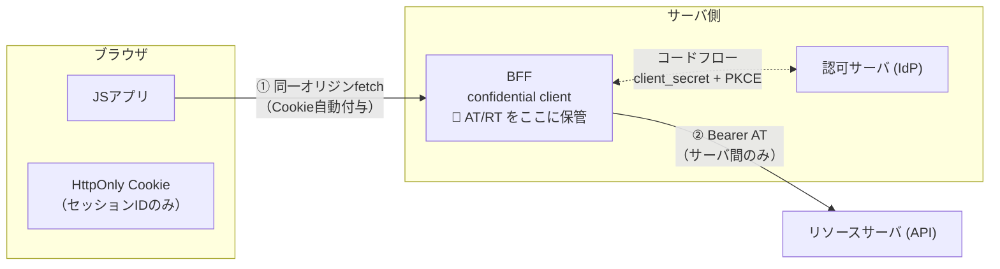
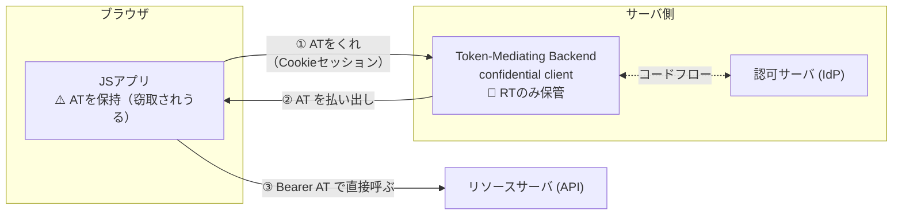
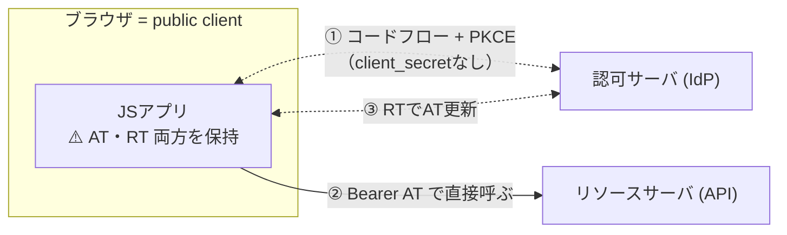
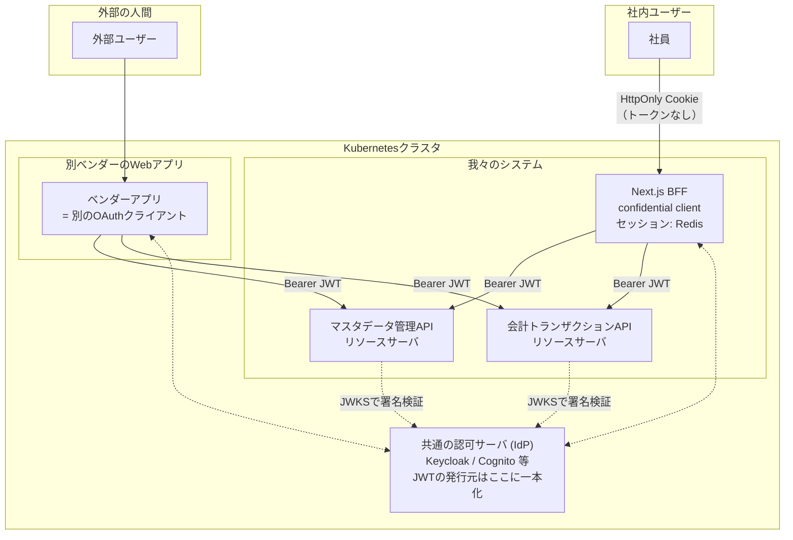
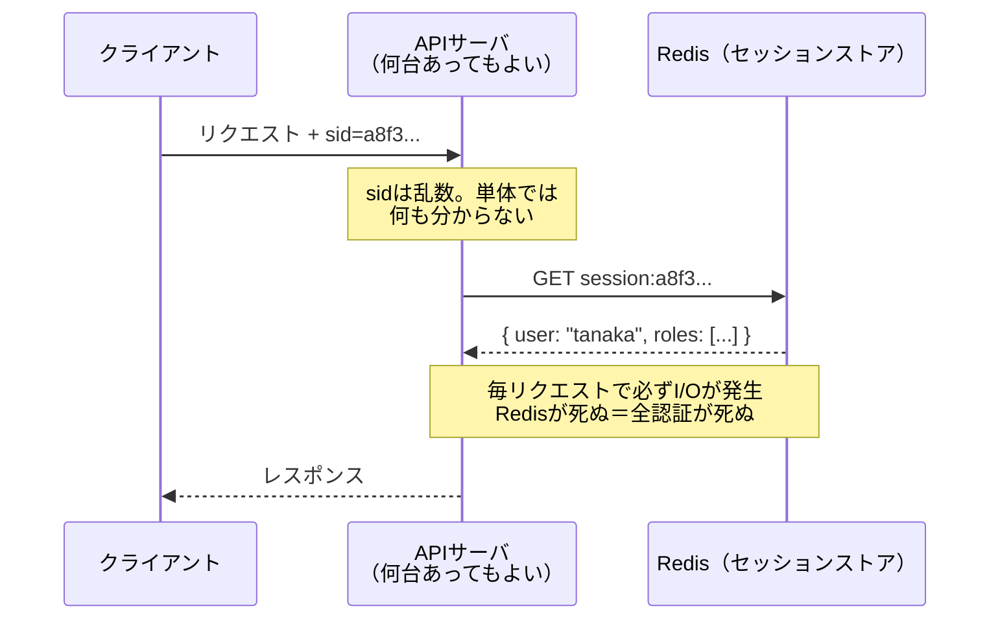
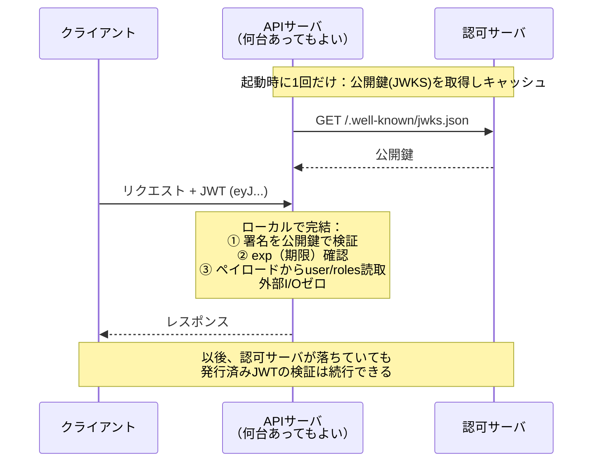

# 調査まとめ2 — IETF全パターン図解／外部API要件の分析／ステートレスの原理

[調査まとめ.md](調査まとめ.md) の続編。今回の3テーマ：

1. IETFドラフトが定義する**全アーキテクチャパターン**の図解
2. 「得るもの」が実在するケースの調査 ＋ **新要件（別ベンダーアプリからのAPI呼び出し）** の分析
3. 認識確認への回答：トークン形式と露出の関係、ステートレスと可用性の原理

---

## 1. IETFドラフトの全アーキテクチャパターン

[OAuth 2.0 for Browser-Based Applications (draft-26)](https://www.ietf.org/archive/id/draft-ietf-oauth-browser-based-apps-26.html) は、ブラウザアプリの構成として **3つの推奨パターン（§6）** と **非推奨パターン群（§7）**、ブラウザ保管する場合の **保管場所のバリエーション（§8）** を定義している。

### パターン1：Backend For Frontend — BFF（§6.1）

トークンは**一切ブラウザに出ない**。BFFがconfidential clientとしてOAuthフローを実行し、トークンをサーバ側に保管。ブラウザはHttpOnlyセッションCookieのみ持ち、リソースサーバへのアクセスは全てBFF経由（プロキシ）。

- **守れるもの**：トークン窃取／リフレッシュトークン悪用／サイレントなトークン再取得攻撃を全て防ぐ
- **残るリスク**：XSSによるセッション相乗り（BFF側で異常検知・即時失効が可能）
- **ドラフトの位置づけ**：「**業務アプリ・機微なアプリ・個人データを扱うアプリに強く推奨**」
- **コスト**：サーバコンポーネントの運用、全リクエストのプロキシ

### パターン2：Token-Mediating Backend — TMB（§6.2）

中間形。バックエンドがconfidential clientとしてトークンを取得するが、**アクセストークンだけはブラウザに渡し**、ブラウザがリソースサーバを**直接**叩く。リフレッシュトークンはサーバに留まる。

- **守れるもの**：RT窃取防止、攻撃者による新規トークンのサイレント取得防止（clientがconfidentialなため）
- **守れないもの**：**ATの持ち出しは防げない**（有効期限まで攻撃者のサーバから悪用可）
- **ドラフトの位置づけ**：「**プロキシ型BFFが使えない事情がある場合にのみ**検討せよ」
- **利点**：プロキシのオーバーヘッドがない（ブラウザ→APIが直通）

### パターン3：ブラウザベースOAuthクライアント（§6.3）

いわゆる「素のSPA + トークン」。ブラウザ自身がpublic clientとしてPKCE付きコードフローを実行し、**AT・RTともにブラウザに保管**して直接APIを叩く。

- **ドラフトの評価**：「**本書で論じた全攻撃シナリオに対して脆弱**」「高度な攻撃（サイレント認可フロー等）への**実用的な対抗策は存在しない**」
- 必須要件：PKCE、RTローテーション、RT寿命のユーザーセッション連動など — ただしこれらは緩和であって解決ではない

#### §8：パターン3を採る場合のトークン保管場所（すべて「ましさ」の差でしかない）

| 保管場所 | 特性 | XSS耐性 |
|---|---|---|
| Cookie（§8.1） | HttpOnlyならJS読取不可。ただしCSRF対策必須 | JSからの**読取**は防げるが、Cookieは自動送信されるため相乗りは可 |
| Service Worker（§8.2） | メインJSコンテキストから隔離、リロード生存 | SW自体が侵害されれば同じ |
| Web Worker（§8.3） | スレッド隔離、リロードで消える | 隔離は暗号学的保護ではない |
| メモリのみ（§8.4） | リロードで消える＝永続窃取リスク減 | 実行中のJSからは読める |
| localStorage / IndexedDB（§8.5） | 永続・大容量 | **最悪**。同一オリジンの任意JSが常時読める |

### §7：非推奨・廃止パターン

- **Implicit Grant（§7.2）**：URLフラグメントでATを返す旧方式。履歴・Referer・ログに漏れる。**廃止**
- **Resource Owner Password Grant（§7.3）**：アプリがID/パスワードを直接預かる。**非推奨**
- **Service Worker内でOAuthフロー実行（§7.4）**：SWも侵害対象なので意味がない。**非推奨**
- **単一ドメインアプリはそもそもOAuth不要（§7.1）**：フロントとバックエンドが同一ドメインなら、伝統的なCookieセッションで足りる（本仕様のスコープ外）という注記。※今回のNext.js構成はまさにこの性質を持つ

### 3パターンの比較表

| | BFF | TMB | ブラウザクライアント |
|---|---|---|---|
| ブラウザが持つもの | セッションCookieのみ | Cookie + **AT** | **AT + RT** |
| XSS時：AT持ち出し | ❌ 不可能 | ⭕ 可能 | ⭕ 可能 |
| XSS時：RT持ち出し | ❌ 不可能 | ❌ 不可能 | ⭕ 可能 |
| XSS時：新規トークン取得 | ❌ 不可能 | ❌ 不可能 | ⭕ 可能 |
| 即時失効 | ⭕ セッション削除 | △ RT失効のみ（AT期限は残る） | △ 同左＋RT自体も奪われうる |
| サーバ運用 | 必要（プロキシ） | 必要（トークン仲介のみ） | 不要 |
| ドラフトの推奨度 | **業務・機微データに強く推奨** | BFF不可の場合のみ | 消去法の最後 |

---

## 2. 「得るもの」が実在するケース ＋ 新要件の分析

### 2-1. 一般論：ブラウザ保持トークン（パターン2・3）が実際に正当化されるケース

調査した範囲で、トークンをブラウザに出す選択が合理的になる実在ケースは以下に絞られる：

1. **バックエンドを一切持てない**：純粋な静的ホスティング（S3+CloudFront のみ、サーバ実行環境ゼロ）で完結させたい社内小物ツール等。BFFを置く場所自体がない
2. **第三者のAPIをブラウザから直接叩く必要がある**：例えば Microsoft Graph を MSAL.js で直接呼ぶ構成。全トラフィックを自前BFFでプロキシするとレイテンシ・転送コスト・レート制限の付け替えが発生し、他社APIの単なる土管になる
3. **BFFプロキシが性能上のボトルネックになる**：ブラウザ→リソースサーバの通信量が膨大（大容量メディア、リアルタイム系）で、間に挟むコストが支配的になる場合 → これはTMB（ATだけ渡す）の出番
4. **組織的制約**：フロントとAPIが完全に別組織・別ドメインで、SPAと同一オリジンのバックエンドを誰も持てない場合

→ いずれも「**BFFが物理的・組織的に置けない**」が本質。IETFドラフトの「BFFが使えない事情がある場合のみTMB以下を検討」という整理と一致する。**性能・スケーラビリティを理由にパターン3を選ぶ正当化はドラフト上存在しない**点に注意。

### 2-2. 新要件の整理

今回判明した要件：

- 我々の基幹システム（マスタデータ管理＋会計トランザクション管理の2サービス）の**APIが外部から呼び出される**
- 「外部」＝**同じKubernetesクラスタ内**の、**別ベンダーが開発するWebアプリケーション**（※「同じPod内」と聞いているが、別ベンダーの別アプリが同一Podに同居するのは通常の構成ではないため、おそらく「同一クラスタ／同一ネームスペース」の意。要確認。ただし後述の通り、**どちらであっても認証設計は変わらない**）
- そのベンダーアプリは**外部の人間にアカウントを払い出す**想定がある

### 2-3. 最重要の整理：「マルチクライアント要件」は実在するようになったが、それは**API層の話**であって**ブラウザ層の話ではない**

前回の観点C(3)で「マルチクライアントは実在しない（YAGNI）」と判定したが、この要件で**実在する**ことになった。ただしここで混同してはいけないのは：

> **「APIが複数クライアントから呼ばれる」から導かれるのは「APIはJWTを受け取るリソースサーバになるべき」であって、「我々のブラウザにトークンを出すべき」ではない。**

この2つは独立している。APIをJWTベースのリソースサーバにした上で、我々のWeb UIは引き続きBFFパターンを採ればよい。**BFFは「APIのいちクライアント」に過ぎない**。ベンダーアプリも「別のいちクライアント」であり、両者は同じAPIを同じ方式（JWT）で叩く。

### 2-4. 問い①：「外部からのAPI呼び出しもJWTを使ったものになる？」

**Yes。ここはJWTが正解であり、しかもブラウザ露出の議論とは無関係に安全。**

- サービス間（machine-to-machine）呼び出しの標準は **OAuth 2.0 client_credentials グラント + JWTアクセストークン**。ベンダーアプリの**バックエンド**が認可サーバからJWTを取得し、我々のAPIに `Authorization: Bearer` で渡す
- このJWTは**ベンダーアプリのサーバと我々のサーバの間**でのみ流れ、**誰のブラウザにも渡らない**。よって前回議論したXSS持ち出しリスクの土俵に乗らない
- 後述（§3）の通り、サービス間認証ではJWTのステートレス性（署名検証のみ・ストア共有不要）がフルに活きる。**別ベンダーとRedisを共有するなどあり得ない**ので、ここでセッション方式は選択肢にならない

### 2-5. 問い②：「外部が作るWebアプリの認証も我々と同じものを使う必要がある？」

**No。共有しなければならないのは「ユーザー認証の仕組み」ではなく「我々のAPIが信頼するトークン発行元（認可サーバ）」だけ。**

分解すると：

- ベンダーアプリが**自分のユーザーをどう認証するか**（パスワード、独自IdP、何でも）は、ベンダーの自由
- ただし我々のAPIを呼ぶ以上、**我々のAPIが署名検証できるJWT**＝**共通の認可サーバが発行したトークン**を持ってくる必要がある

その上で、設計は「我々のAPIが**誰の操作か**を知る必要があるか」で3案に分かれる：

| 案 | 仕組み | APIから見える主体 | 適するケース |
|---|---|---|---|
| **(a) システム間認証のみ** | ベンダーアプリが client_credentials で「アプリとして」トークン取得 | 「ベンダーアプリ」という1主体のみ。**エンドユーザーは見えない** | APIが誰の操作か知る必要がない場合 |
| **(b) ユーザー連携（フェデレーション）** | ベンダーアプリのユーザーも共通IdPで認証（またはベンダーIdPと共通IdPを信頼連携）。トークンにユーザーIDが載る | エンドユーザー個人 | ユーザー単位の認可・監査が要る場合 |
| **(c) Token Exchange（RFC 8693）** | ベンダー独自トークンを共通認可サーバで「我々のAPI用トークン」に交換。ユーザーコンテキストを引き継ぐ | エンドユーザー個人（act/subクレームで委任関係も表現） | ベンダーが既存の独自認証を変えられない場合 |

**今回の推奨は (b) または (c)**。理由：

- 会計トランザクション・基幹マスタを扱うAPIで、しかも**外部の人間**のアカウント経由の操作が入るなら、「どのユーザーが何をしたか」の**監査証跡（内部統制）はほぼ確実に要件**になる。案(a)だと我々のログには「ベンダーアプリが操作した」としか残らず、SoD・監査対応が破綻する
- 案(a)を採るなら、少なくともベンダー側にユーザーIDをリクエストに含めさせることになるが、**自己申告のユーザーIDは認証ではない**（ベンダーアプリの侵害＝全ユーザーなりすまし）。トークンにIdPが署名したユーザークレームが載る(b)(c)と安全性が根本的に違う

**ベンダーとの調整事項として今すぐ確認すべきこと**：
- [ ] 我々のAPIはユーザー単位の認可・監査が必要か（→ ほぼYesのはず。要件として確定させる）
- [ ] ベンダーアプリのユーザー認証を共通IdPに乗せられるか（案b）、無理なら Token Exchange 対応可能か（案c）
- [ ] 共通認可サーバを**どちらが（またはインフラチームが）運用するか** — これは両者の合意事項であり、早期にAWSチームへ伝える必要がある
- [ ] スコープ設計：ベンダーアプリに許すAPI範囲（例：`master:read` は許すが `accounting:write` は許さない等）

### 2-6. 「同じPod内」について

仮に本当に同一Pod（＝localhost通信）だとしても、**ネットワーク的近さを認証の代わりにしてはいけない**（ゼロトラスト原則。別ベンダーのコードが同居するならなおさら）。JWT検証は同一Podでも必須。逆に言えば、トークンベースにしておけば**将来Podが分かれても、別クラスタに出ても、認証設計は一切変わらない**。ネットワーク層の防御（NetworkPolicy、mTLS/サービスメッシュ）は「追加の層」として積む。

### 2-7. 前回結論への影響

**Web UIの結論（BFF+セッション）は変わらない。** 変わるのはAPI層の設計で：

- 我々の2サービスは**JWTを検証するリソースサーバ**として設計する（BFF専用の内部APIではなく、最初からOAuthリソースサーバとして作る）
- 認可サーバ（IdP）は「社員のSSO」だけでなく「クライアントアプリの管理（client_credentials）」「（案bなら）外部ユーザーの収容」まで担う。**IdP選定の要件が前回より重くなった** — Keycloak / Cognito / Entra External ID あたりの比較が次の宿題

---

## 3. 認識確認への回答

### 3-1. 「Server Actionsでの露出はトークン形式（セッションID/JWT）に関係ない」→ **正しい**

観点Aで論じたRSC/Server Actionsのシリアライズ境界問題は、「**サーバが握っている秘密が、クロージャやpropsに乗って境界を越えるか**」という問題。越えるものがセッションIDだろうがJWTだろうがDBパスワードだろうが、メカニズムは同一。認証方式の選択とは独立した、Next.js実装規律の問題である。

### 3-2. 「JWTなら保存機構がないから原理的にクライアントに渡すしかない」→ **半分正しい。重要な見落としが1つある**

まず、暗黙に混ざっている**2つの独立した軸**を分離する必要がある：

| 軸 | 選択肢 |
|---|---|
| **軸1：資格情報の形式** | reference（セッションID：サーバ状態への参照） vs self-contained（JWT：それ自体が完結した証明） |
| **軸2：資格情報の置き場所** | ①サーバのみ（ブラウザにはセッションCookie） / ②ブラウザの**HttpOnly Cookie** / ③ブラウザの**JSが読める場所**（memory/localStorage） |

正しい部分：**サーバ側に保存機構を持たないと決めた瞬間、資格情報はブラウザ側に持たせるしかない**。これはその通り（サーバが覚えていない以上、毎回クライアントが証明を持参するしかない）。

見落とし：「クライアントに渡す」には**②と③の2種類**があり、セキュリティ特性が全く違う。

> **JWTをHttpOnly Cookieに入れる**という構成（軸1=JWT × 軸2=②）が存在する。これは「ステートレスセッション」と呼ばれ、サーバに保存機構を持たず、かつ**JSからトークンが読めない**。Auth.js（旧NextAuth）のデフォルトのセッション戦略がまさにこれ。

つまり「JWT＝JSに露出」は必然ではない。整理すると：

| 構成 | 軸1 | 軸2 | ステートレス | XSSでの持ち出し | 即時失効 |
|---|---|---|---|---|---|
| BFF+Redisセッション | reference | ① | ✗ | 不可 | **可** |
| ステートレスセッション（JWT in HttpOnly Cookie） | JWT | ② | **○** | 不可（読めない。相乗りは可） | **不可** ← 弱点はここ |
| SPA+トークン（パターン3） | JWT | ③ | ○ | **可** | 不可 |

したがって本当のトレードオフは「セッションID vs JWT」ではなく、**「即時失効を取る（①）か、ストアレス運用を取る（②）か」**。③はどちらの利点のためにも必要ない。

### 3-3. 「署名検証のみだからステートレスで可用性が高い？」→ **原理はその通り。ただし「高い」の正確な意味に注意**

#### 原理の解説

**ステートフル（セッションID）の場合**：セッションIDはただの乱数で、それ自体は何も証明しない。「このIDは有効か？誰のものか？」に答えるには、**毎リクエスト、サーバがストアに問い合わせる**しかない。

**ステートレス（JWT）の場合**：JWTは「ペイロード（誰で、何の権限で、いつまで有効か）＋発行者の署名」が一体になっている。検証に必要なのは**発行者の公開鍵だけ**で、公開鍵は事前に取得してメモリにキャッシュできる。つまり**検証時に外部I/Oが一切発生しない**。

#### 「可用性が高くなる」の正確な意味

絶対的に可用性が上がるのではなく、**認証経路から依存コンポーネントが消える**ということ：

- ステートフル：`認証の可用性 = APIサーバ × セッションストア`（Redisが単一障害点候補になり、可用性の掛け算に入る）
- ステートレス：`認証の可用性 = APIサーバ`（公開鍵はキャッシュ済みなので、検証時は認可サーバの生死すら関係ない）

加えてスケールの面でも、サーバを何台に増やしてもストアの共有・整合を考えなくてよい（各サーバが公開鍵だけ持てば独立に検証できる）。

#### ただし、この対価が「即時失効の喪失」

署名検証だけで通すということは、**発行済みトークンを止める手段がexp（期限切れ）しかない**ということ。失効させたければ「失効済みトークンのリスト（denylist）を全サーバが参照する」ことになるが、それは**毎リクエストのストア参照が復活する＝ステートレス性の放棄**に他ならない。ここが3-2の表の「即時失効：不可」の正体であり、**ステートレス性と即時失効性は原理的にトレードオフ**（部分緩和として「ATを5分などの超短命にし、失効はRT更新時にチェックする」折衷が実務では多い）。

#### 今回のシステムへの当てはめ

この原理が示すのは、**層ごとに最適解が違う**ということ：

- **人間のブラウザセッション**（社員→Web UI）：失効要件が支配的 → ステートフル（BFF+Redis）。リクエスト頻度も人間の操作速度なのでRedis参照コストは無視できる
- **サービス間API呼び出し**（BFF→API、ベンダーアプリ→API）：ベンダーとストアを共有できない／呼び出し頻度が高い／クライアントは「アプリ」なので退職者失効のような要件が薄い（クライアント無効化は次回のトークン更新で効く）→ **ステートレスJWT（短命AT）が最適**

前回の結論「BFF+セッション」と今回の「API層はJWT」は矛盾ではなく、**この原理に従って層ごとに使い分けた結果**である。

---

## Sources

- [OAuth 2.0 for Browser-Based Applications draft-26（本文）](https://www.ietf.org/archive/id/draft-ietf-oauth-browser-based-apps-26.html) / [datatracker](https://datatracker.ietf.org/doc/draft-ietf-oauth-browser-based-apps/)
- [OAuth 2.0 Token Exchange — RFC 8693](https://datatracker.ietf.org/doc/html/rfc8693)
- [OAuth 2.0 Security Best Current Practice — RFC 9700](https://datatracker.ietf.org/doc/html/rfc9700)
- [oauth.net: Browser-Based Apps](https://oauth.net/2/browser-based-apps/)
- [Auth.js: Session strategies（JWT in HttpOnly Cookie の実例）](https://authjs.dev/concepts/session-strategies)
