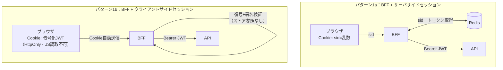
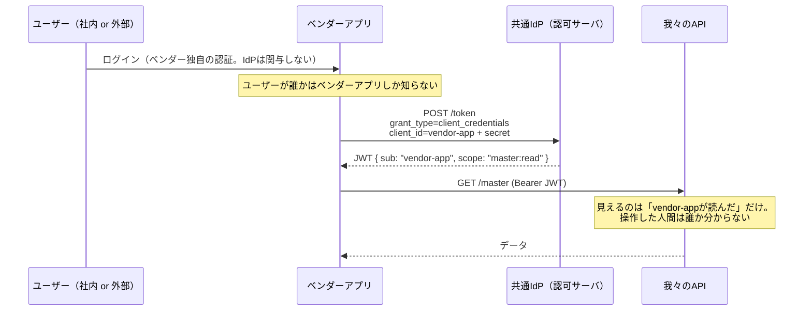
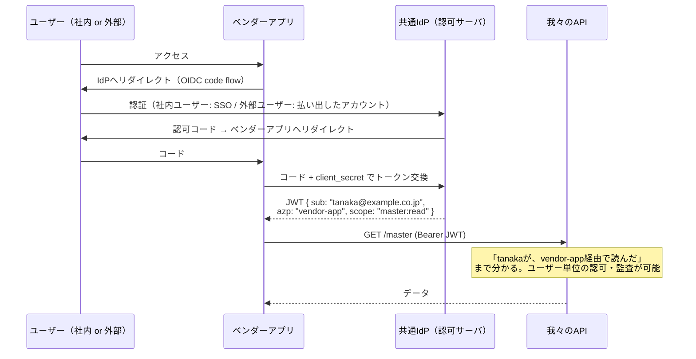
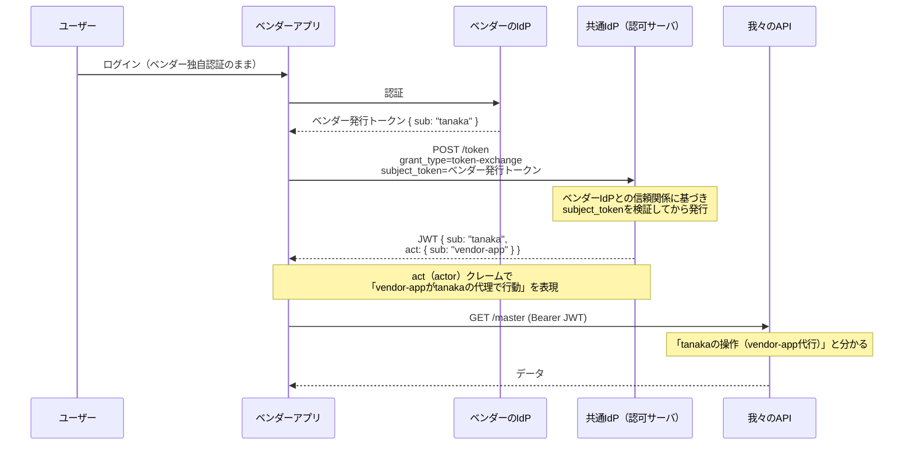

# 調査まとめ3 — JWTをHttpOnly Cookieで渡す方式の正確な評価／(a)(b)(c)の詳細解説と監査要件

[調査まとめ.md](調査まとめ.md)・[調査まとめ2.md](調査まとめ2.md) の続編。[プロンプト.md](プロンプト.md) 質問02への回答。

---

## 1. 「Redisを使わずJWTそのものをクライアントに渡すのは危険」という認識の訂正

### 1-1. 結論：危険なのは「JWTを渡すこと」ではなく「**JSが読める場所に置くこと**」

「JWTをクライアントに渡す＝危険」は**不正確**。前回（調査まとめ2 §3-2）の2軸で言えば、危険性を決めるのは軸1（形式）ではなく**軸2（置き場所）**：

- HttpOnly Cookie に入れたJWT → XSSでも**読めない・持ち出せない**。この点でRedisセッションIDのCookieと**同等の耐性**
- localStorage / JSメモリのJWT → XSSで持ち出され、期限まで攻撃者インフラから悪用される

つまり「Redisなし + JWT in HttpOnly Cookie」は、**持ち出し耐性を保ったままステートレスにする正当な構成**であり、IETF的にも認められている（次項）。危険という認識は「JWT＝localStorageに置くもの」という古いSPA実装の印象に引きずられている。

### 1-2. IETFパターン分類での正解：これは**パターン2でも3でもなく、パターン1（BFF）の変種**

質問の「IETFのパターン2になるってことかな？パターン3もか？」への回答：**どちらでもない**。

パターンの分類軸は「**OAuthトークンがブラウザのJSから見えるか／誰がBearerヘッダを付けるか**」であり、保管がRedisかCookieかではない。

| 構成 | JSからトークンが読める？ | Bearerを付けるのは誰？ | パターン |
|---|---|---|---|
| BFF + Redisセッション | 読めない | BFF（サーバ） | **1（サーバサイドセッション型BFF）** |
| BFF + JWT in HttpOnly Cookie | 読めない | BFF（サーバ） | **1（クライアントサイドセッション型BFF）** |
| バックエンドがATをJSに払い出し、JSが直接APIへ | **読める** | ブラウザのJS | 2（TMB） |
| ブラウザ自身がOAuthクライアント | **読める** | ブラウザのJS | 3 |

根拠として、[ドラフト§6.1](https://www.ietf.org/archive/id/draft-ietf-oauth-browser-based-apps-26.html) はBFFのセッション管理として**サーバサイドセッションとクライアントサイドセッションの両方**を明示的に認めている：

> "Client-side sessions push all data to the browser in a signed, and optionally encrypted, object."
> （クライアントサイドセッションは、署名済み・必要に応じて暗号化したオブジェクトとして全データをブラウザに押し出す）

さらに、そのCookieにアクセストークンを含める場合は「**SHOULD encrypt its cookie contents**（内容を暗号化すべき）」としている。Auth.js（旧NextAuth）のデフォルトはまさにこれ（JWE=暗号化JWTをHttpOnly Cookieに格納）。

なお**パターン3 × HttpOnly Cookieは物理的に成立しない**ことにも注意：パターン3はブラウザのJSが自分でリソースサーバに `Authorization: Bearer` を付けて直接リクエストする構成なので、JSがトークンを**読めなければならない**。HttpOnlyにした瞬間、JSはヘッダを組み立てられなくなる（§8.1のCookie保管が挙がっているのは、リソースサーバ側がCookieを直接受ける変則構成の話）。

どちらもブラウザのJSにトークンは見えず、Bearerを付けるのはBFF。**セキュリティ上の分類は同じパターン1**で、違いは運用特性（次項）。

### 1-3. 「そうするとCSRFみたいな別の脅威が出てくるのか？」→ 出てくる。ただし**Redisセッションでも全く同じだけ出てくる**

ここも認識を正したいポイント。**CSRFは「Cookieを認証に使うこと」に付随する脅威**であり、Cookieの中身がセッションIDかJWTかは無関係。

- CSRFの原理：Cookieはブラウザが**宛先ドメインに自動で付ける**。攻撃者サイトが `POST https://our-app/api/transfer` を発火させると、被害者のCookieが勝手に付いて飛ぶ。中身が乱数だろうがJWTだろうが同じように付く
- つまり「Redisセッション（前回の推奨構成）を選んでもCSRF対策は同様に必須」。JWT-Cookieにしたから**増える**脅威ではない
- ドラフトもBFFに対して「**The BFF MUST implement a proper CSRF defense**」と要求しており、手段として以下を挙げる：
  1. `SameSite=Strict`（クロスサイトからのCookie送信自体を止める）
  2. CORS + カスタムヘッダ要求（プリフライトで弾く）
  3. anti-forgeryトークン（double-submit等）
- Next.js補足：Server Actionsは**Origin/Hostヘッダ検証が組み込み**。Route Handlerの変更系には自前でOriginチェックかCSRFトークンを足す

逆に、パターン2・3（JSがBearerヘッダを手で付ける方式）はCSRF**耐性が構造的に高い**（Cookieの自動送信に依存しないため）。これがトレードオフの正確な姿：**Cookie方式はXSS持ち出しに強くCSRFの手当てが必要、Bearer-in-JS方式はCSRFに強くXSS持ち出しに無力**。そして CSRFには`SameSite`という決定的で安価な対策があるのに対し、XSS持ち出しには決定的な対策がない——だからIETFはCookie側（BFF）を推奨している。

### 1-4. では JWT-Cookie（1b）と Redis（1a）のどちらを選ぶか：真の差分表

| | 1a：Redisセッション | 1b：JWT in HttpOnly Cookie |
|---|---|---|
| XSSでの持ち出し | 不可 | 不可（**同等**） |
| XSSでのセッション相乗り | 可（生存セッション内） | 可（**同等**） |
| CSRF対策の要否 | 必要 | 必要（**同等**） |
| ストア（Redis）依存 | あり | **なし** ← 1bの利益 |
| **即時失効** | **可（削除一撃）** | **不可**（expまで有効。denylistを持てば1aに退化） |
| セッション内容の更新（権限変更の反映） | 即時 | 再発行まで反映されない |
| サイズ制限 | なし | Cookie上限 約4KB（複数トークンを入れると苦しい） |
| 鍵管理 | 不要 | 署名・暗号鍵のローテーション設計が必要 |
| リクエスト毎のコスト | Redis往復（〜1ms） | 復号＋署名検証（CPUのみ） |

→ **今回の結論は変わらず1a**。理由は前回同様「会計・基幹システムでは即時失効（退職者無効化・インシデント時の全セッション破棄）が事実上の要件」だから。1bは「Redisを置けない・置きたくない環境での正当な次善」であり、「危険な構成」ではない——この位置づけの訂正が今回の答え。

---

## 2. 基幹システムの認証認可：(a)(b)(c)の詳細解説と監査の論点

### 2-0. 前提の更新

新たに判明した事実：

- ベンダーアプリのユーザーは**外部の人間だけではない**。**社内ユーザーも我々のシステムとベンダーアプリの両方を使う**
- ベンダーアプリは我々のリソースサーバ（マスタ/会計API）からデータを取得する

### 2-1. 「社内ユーザーがベンダーアプリを使うときも構成は変わらない認識で合っているか」→ **合っている**

「我々のAPIを呼ぶ以上、我々のAPIが署名検証できるJWTを持ってこい。発行元はこのIdP（Cognito等）だ」というスタンスは、OAuthアーキテクチャとして**正確**。

リソースサーバ（我々のAPI）がやることは常に同じで、呼び出し元が誰であっても変わらない：

1. JWTの**署名**を共通IdPの公開鍵で検証（発行元の確認）
2. `aud`（このAPI向けのトークンか）、`exp`（期限）、`scope`（この操作の権限があるか）を検証
3. `sub` 等のクレームから主体を特定

我々のBFFも、ベンダーアプリも、この検証を通るトークンを持ってくる「いちクライアント」に過ぎない。**ユーザーが社内か外部か、どのアプリ経由かは、この構造を一切変えない**。変わるのは「トークンの`sub`に何が入るか」——それを決めるのが(a)(b)(c)の選択。

### 2-2. (a) システム間認証のみ — client_credentials グラント

**「アプリがアプリとして」認証する方式。トークンにユーザーという概念が存在しない。**

ベンダーアプリのバックエンドが、自分のID/シークレット（人間のパスワードに相当するアプリの資格情報）でIdPからトークンをもらう。ユーザーが誰であろうと、取得されるトークンは常に同じ主体（`sub=vendor-app`）。

- **長所**：最も簡単。ベンダーアプリの改修ほぼゼロ。ユーザー管理の連携不要
- **短所**：我々のAPIログには全操作が「vendor-app」として記録される。**ユーザー単位の認可もできない**（外部ユーザーに見せてよいデータと社内ユーザー向けデータをAPI側で区別できない）
- 用途：バッチ連携、夜間同期など「人間の操作ではない」通信にはこれが正解

### 2-3. (b) ユーザー連携（フェデレーション）— ユーザー自身が共通IdPで認証

**「ユーザーがユーザーとして」認証し、トークンにユーザーが載る方式。**

ベンダーアプリを共通IdPの**OAuthクライアントとして登録**し、ユーザーのログインをOIDC（Authorization Code Flow）で共通IdPに委ねる。ユーザーはIdPのログイン画面で認証し、ベンダーアプリは「そのユーザーの」トークンを受け取る。

- **長所**：トークンの`sub`が**IdPが署名保証したユーザー本人**。ユーザー単位の認可・監査証跡が成立。さらに副産物として——**社内ユーザーは我々のシステムとベンダーアプリを1回のログインで使える（SSO）**。今回「社内ユーザーが両方使う」ことが判明したため、この価値が大きい
- **短所**：ベンダーアプリの認証をOIDCに載せ替える改修が必要。外部ユーザーのアカウントを共通IdP側に収容する運用（払い出し・棚卸し）が必要
- 「ベンダーが独自のIdPを既に持っている」場合は、共通IdPとベンダーIdPの間で**IdP間フェデレーション**（Cognitoなら外部IdP連携、SAML/OIDC）を張る変種もある

### 2-4. (c) Token Exchange（RFC 8693）— ベンダーの認証はそのまま、トークンだけ交換

**「ベンダー独自トークンを、我々のAPIが信頼するトークンに両替する」方式。**

ユーザーはベンダーアプリに**ベンダー独自の方法**でログインしたまま。ベンダーのバックエンドが、自分の発行したユーザートークン（subject_token）を共通IdPに提示し、「このユーザーの代理として我々のAPIを呼ぶためのトークン」に交換してもらう（[RFC 8693](https://datatracker.ietf.org/doc/html/rfc8693)）。

- **長所**：ベンダーは既存のユーザー認証を変えずに済む。委任関係（誰が・どのアプリの代理で）が`act`クレームで標準表現できる
- **短所**：共通IdPが**RFC 8693に対応している必要がある**。ここで重要な制約——
  > ⚠️ **Amazon CognitoはToken Exchangeグラントをネイティブサポートしていない**（[AWS re:Post](https://repost.aws/questions/QUO3Q1dpQOTHKY9F6JVl3hEQ/does-aws-cognito-support-oauth-2-0-token-exchange-grant-type)。2026年時点でもコアのトークンエンドポイントには未実装で、AgentCore等の周辺サービス経由の限定的な形のみ）。**(c)を採るならKeycloak等の対応IdPが必要**になり、IdP選定に直結する
- また、ベンダーIdPの認証品質（パスワードポリシー、MFA）を我々が間接的に信頼することになる＝**信頼境界がベンダーに広がる**

### 2-5. 三案の比較表

| | (a) client_credentials | (b) フェデレーション | (c) Token Exchange |
|---|---|---|---|
| トークンの`sub` | アプリ（vendor-app） | **ユーザー本人** | **ユーザー本人**＋`act`=アプリ |
| ユーザーを認証したのは | ベンダー（自己申告の世界） | **共通IdP** | ベンダーIdP（共通IdPが信頼） |
| ユーザー単位の認可・監査 | ❌ 不可 | ⭕ 可 | ⭕ 可 |
| 社内ユーザーのSSO | ❌ | ⭕ **両アプリ1回ログイン** | ❌（ベンダー独自ログインのまま） |
| ベンダーの改修量 | ほぼゼロ | 中（認証をOIDCへ） | 中（交換フロー実装） |
| IdP要件 | どれでも可 | Cognito可 | **Cognito不可**（Keycloak等） |
| 適する用途 | バッチ・システム連携 | **人間の操作全般** | ベンダー認証を変えられない場合 |

### 2-6. 「ユーザーが誰か知る必要はない？それは監査的にまずいのか？」

質問の再掲：「(a)なら、我々のシステムは呼び出しユーザーが払い出しユーザーか社内ユーザーかを知る必要がない、ということ？それは監査的にまずいのか？」

**技術的には「知らなくても動く」。しかし会計を扱う基幹システムでは、監査的にまずい可能性が高い。** 理由：

1. **トレーサビリティの喪失**：(a)では我々のAPIログの操作主体が全て「vendor-app」に潰れる。「誰が・いつ・どの会計データを参照/変更したか」に我々のログ単独では答えられない
2. **職務分掌（SoD）の検証不能**：「承認者と起票者が別人か」のような統制はユーザー識別が前提
3. **ベンダーログとの突合依存**：「ベンダー側のログと突き合わせればよい」は一応の反論だが、ログの完全性・改ざん耐性・保持期間・時刻同期を**他社に依存**することになり、監査対象範囲（監査境界）が広がって説明コストが増える
4. **「(a)+ユーザーIDヘッダ」は解決にならない**：ベンダーが `X-User-Id: tanaka` を付ける案は**自己申告**であって認証ではない。ベンダーアプリが侵害されれば全ユーザーなりすまし放題であり、監査人には「統制なし」と評価されうる。IdPが署名したクレームとして`sub`に載る(b)(c)とは証拠能力が根本的に違う

#### 「監査的にまずいかどうかはどこを調べれば分かる？IETF的なサイトはあるの？」

**IETF/OAuthの世界には答えはない**（あれは「どう作るか」の標準であって「何を残すべきか」の基準ではない）。監査要件の出どころは法令・基準・監査人で、調べる先は：

| 出どころ | 具体的に見るもの | 今回との関係 |
|---|---|---|
| **J-SOX（金商法・内部統制報告制度）** | 金融庁「財務報告に係る内部統制の評価及び監査に関する実施基準」— IT統制（ITGC）の「アクセス管理」 | **会計トランザクションを扱う基幹システムはど真ん中の対象**。上場企業（または連結子会社）なら毎年ITGC評価が入り、「誰がアクセスできるか・したか」の統制と証跡が見られる |
| 経済産業省 | 「システム管理基準」「システム監査基準」 | 国内システム監査の一般基準。アクセス管理・ログ管理の章がある |
| ISACA | **COBIT** | ITGCの国際フレームワーク。監査法人のIT監査はほぼこれ系の観点 |
| ISO/IEC | **27001/27002**（ISMS）のログ取得・アクセス制御の管理策 | 会社がISMS認証を持っているなら内部監査でも見られる |
| NIST | SP 800-53 の AU（監査）・AC（アクセス制御）ファミリ | 参考。要件の粒度感を掴むのに良い |
| 業界固有 | 金融ならFISC安全対策基準、医療なら3省2ガイドライン | 業種によって上乗せ |

**実務上の最短経路**は文書を読むことではなく、**要件の決定者に聞くこと**：
- [ ] 自社（発注元）が上場企業か、このシステムがJ-SOXの評価範囲（財務報告に係るシステム）に入るかを確認する — 会計トランザクション管理なら入る可能性が極めて高い
- [ ] 入るなら、**内部監査部門・経理部門・監査法人のIT監査担当**に「ユーザー単位の操作証跡は必要か」を確認する（ほぼ確実にYesが返る）
- [ ] その回答を「(a)では満たせない」根拠として、ベンダーとの方式協議（→(b)推奨）に持ち込む

### 2-7. 今回の推奨（更新）

新事実「社内ユーザーが両アプリを使う」により、**(b) フェデレーションの優位がさらに強まった**：

- 監査要件（ユーザー単位の証跡）を標準的な形で満たす
- 社内ユーザーは共通IdPで**1回のログインで両アプリを利用**（SSO）— (a)(c)では得られない実益
- Cognitoで実現可能（(c)はCognito不可）
- 外部ユーザーは共通IdPに払い出して収容（Cognitoならユーザープール。社内/外部でプールやグループを分け、トークンのクレームで区別 → API側で「外部ユーザーには見せない」認可も可能になる）

併用の整理：**人間の操作は(b)、人間が介在しないバッチ・システム間連携は(a)**、という使い分けが標準形。(c)は「ベンダーが認証改修を拒否した場合」の代替カードとして温存（その場合IdP選定がKeycloak側に倒れる）。

---

## Sources

- [OAuth 2.0 for Browser-Based Applications draft-26（BFFのクライアントサイドセッション・CSRF要件）](https://www.ietf.org/archive/id/draft-ietf-oauth-browser-based-apps-26.html)
- [OAuth 2.0 Token Exchange — RFC 8693（act/subject_tokenの定義）](https://datatracker.ietf.org/doc/html/rfc8693)
- [AWS re:Post: Does AWS Cognito support OAuth 2.0 Token Exchange grant type?（非対応の確認）](https://repost.aws/questions/QUO3Q1dpQOTHKY9F6JVl3hEQ/does-aws-cognito-support-oauth-2-0-token-exchange-grant-type)
- [Amazon Cognito: The token issuer endpoint（対応グラント一覧）](https://docs.aws.amazon.com/cognito/latest/developerguide/token-endpoint.html)
- [金融庁: 財務報告に係る内部統制の評価及び監査に関する実施基準（J-SOX・ITGC）](https://www.fsa.go.jp/news/2023/20230407/naibutousei.html)
- [経済産業省: システム管理基準](https://www.meti.go.jp/policy/netsecurity/sys-kansa/)
