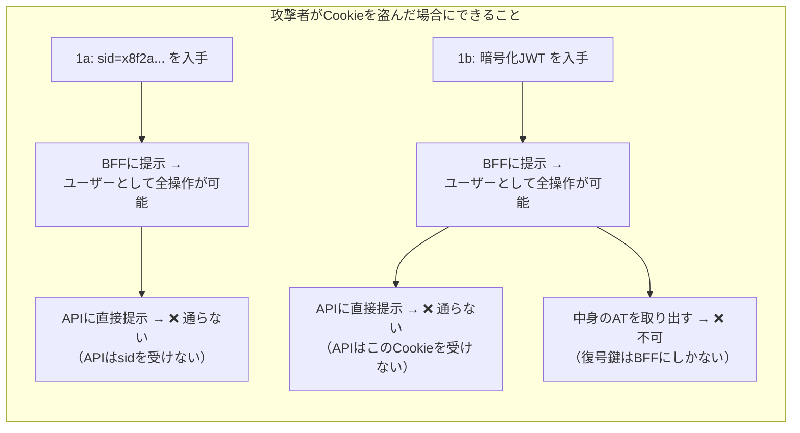
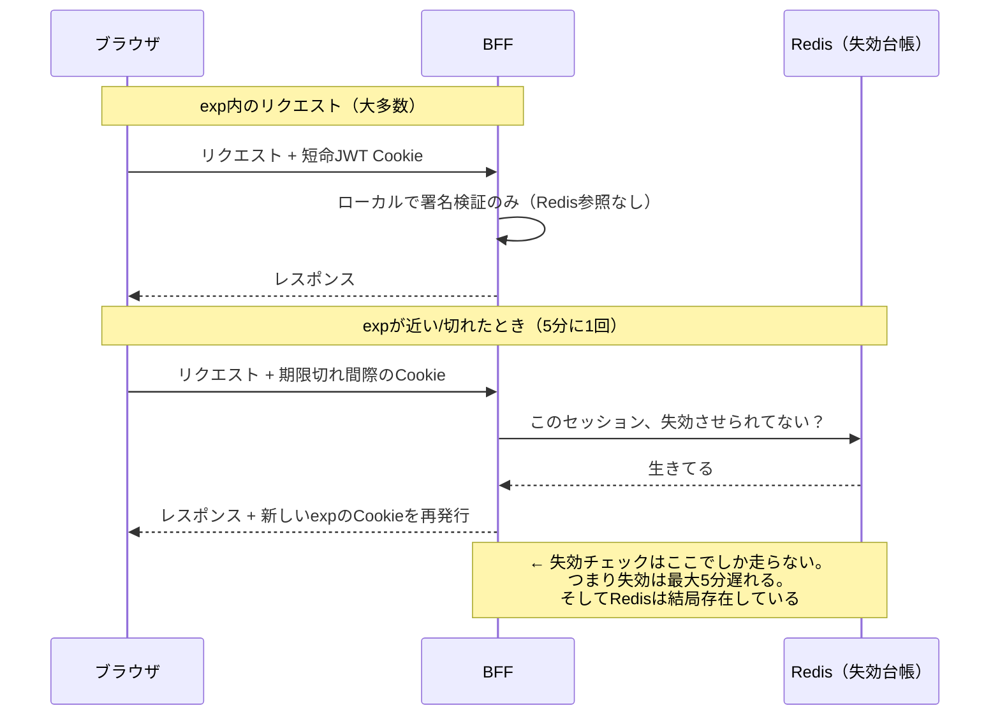
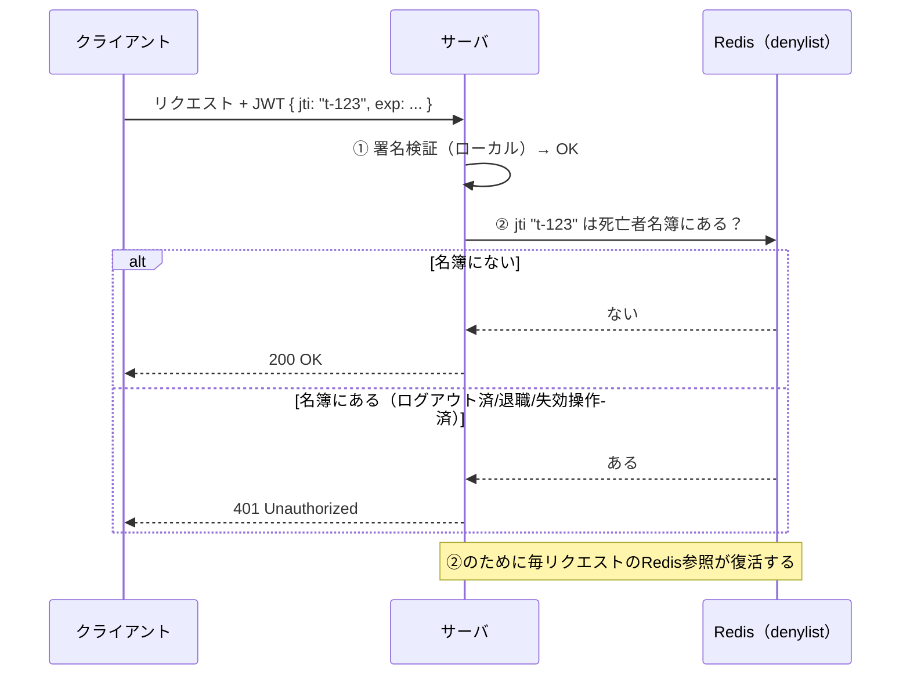

# 調査まとめ4 — 「引換券 vs 本体」の認知の矯正／短命exp・denylistの正体／我々のスタンス

[調査まとめ3.md](調査まとめ3.md) の続編。[プロンプト.md](プロンプト.md) 質問03への回答。

---

## 1. 「HttpOnlyでもJWT本体を渡すのは、引換券だけ渡すより危ないはず」という認知の矯正

### 1-1. 間違っているのは「引換券は無害で、本体は危険」というメンタルモデル

まず、この直感の根っこにある誤解を直接叩く。

**誤解①：「セッションIDはただの引換券だから、盗まれても大したことない」**

違う。セッションIDは**BFFに対する全権の bearer credential**（持参人払い証券）である。攻撃者がRedis方式のsid Cookieを盗めば、**そのユーザーとして何でもできる**。Redisにトークン本体があることは、盗んだ攻撃者にとって何の障害でもない——BFFが代わりに引き出して使ってくれるのだから。「引換券」という言葉の穏やかな響きに騙されてはいけない。**引換券を持つ者は、本体を持つ者と同じことができる**。クロークの引換券を盗んだ人間はコートを着て帰れる。

**誤解②：「1bはJWT『本体』をクライアントに渡している」**

これも正確ではない。IETFドラフトが1bで要求しているのは「**署名済み、かつ（トークンを含むなら）暗号化した**オブジェクト」（SHOULD encrypt its cookie contents）。つまりブラウザに置かれるのは生のJWTではなく**暗号化された封筒（JWE）**であり：

- 開けられるのは**復号鍵を持つBFFだけ**。攻撃者から見れば中身の読めないランダムなバイト列——**その観点では乱数のsidと区別がつかない**
- そしてこの封筒Cookieを**受け付けるのはBFFだけ**。我々のAPI（リソースサーバ）はこのCookieを受理しない。APIが受けるのは、BFFが封筒を開けて取り出したトークンをサーバ間で付け直したもの

つまり1bのCookieも、機能的には「**BFFにしか意味が分からず、BFFにしか使えない、セッションの証書**」であって、sidと同じカテゴリのものである。違いは「BFFが意味を解決する方法」だけ——sidはRedisに問い合わせて解決し、封筒は自分の鍵で復号して解決する。

**盗まれた瞬間にできることは、1aと1bで完全に同一**。これが「同じ安全度」の意味である。

### 1-2. では何も違わないのか？——違うのは「盗まれた後、止められるか」だけ

資格情報の危険度は次の3要素の積で考えるのが正確：

> **危険度 = ①提示された側が与える権限 × ②盗める場所の広さ × ③盗まれてから止めるまでの時間**

| | ① 権限 | ② 盗める場所 | ③ 止めるまで |
|---|---|---|---|
| 1a（Redisセッション） | BFFへの全権 | HttpOnly＝XSS読取不可（同じ） | **0秒**（Redisから削除した瞬間、次のリクエストで死ぬ） |
| 1b（暗号化JWT Cookie） | BFFへの全権（同じ） | HttpOnly＝XSS読取不可（同じ） | **expまで**（サーバは「発行した事実」を忘れているので、署名が正しい限り通してしまう） |
| （参考）パターン3のlocalStorage AT | **APIへの直接権限** | **JSから読み放題** | expまで |

①②は同一で、**差は③のみ**。あなたの直感が「危ない」と感じているのは実はパターン3の記憶（①も②も最悪の構成）であって、1bはそれとは全く別物である。

公平のために、**サーバ側侵害**のシナリオも並べておく（1aにも弱点はある）：

| サーバ側の侵害 | 1a | 1b |
|---|---|---|
| 何が漏れると全滅か | **Redisの中身**（全ユーザーの生トークンが並んでいる＝金庫） | **Cookie暗号鍵**（全Cookieの復号＋偽造が可能） |
| 対策 | Redisのネットワーク隔離・認証・暗号化 | 鍵の保管（KMS/Secrets Manager）・ローテーション |

どちらも「サーバ側に crown jewel が1つある」点は対称で、ここでも優劣はつかない。**構成選択の決定打は③（失効性）と運用特性しかない**——だから前回の表で即時失効だけを太字にした。

### 1-3. 「1bでもexpは5分とか15分に設定できるでしょ？これもだめなの？」への回答

**だめではない。ただし、それをやると「ステートレス」が消えて、結局Redisが戻ってくる**。順を追って説明する。

まず前提：1bのCookieは**セッションそのもの**なので、`exp` = **ログインの寿命**。素朴にexp=5分にすると、ユーザーは5分ごとにID/パスワードを入れ直すことになり、業務システムとして成立しない。よって短命expにするなら**再発行（リフレッシュ）の仕組み**が必須になる。その再発行のやり方は2つしかない：

**案i：無条件で再発行（ステートレスなスライド延長）**
「期限内の正しい署名のCookieを持ってきたら、新しいexpで発行し直す」。サーバは何も覚えていないので、これは完全にステートレスのまま。
→ **しかし失効が永遠に効かなくなる**。Cookieを盗んだ攻撃者も同じように5分ごとに延長し放題。退職者のセッションも、使い続けている限り死なない。**短命expの意味が完全に消える**。

**案ii：再発行時にサーバ側の台帳を確認する**
「再発行の前に、このセッション（またはユーザー）が失効済みでないかをストアで確認する」。
→ 失効は効くようになる（最大5分遅れ）。**しかしその「台帳」はRedis等のステートフルなストアである**。つまりこれは「ステートレス構成」ではなく——

> **「状態の参照頻度を、毎リクエストから5分に1回に間引いた構成」**

である。Redisは結局必要。得たものは「Redisへの問い合わせ回数が1/N」という**負荷軽減**であり、失ったものは「失効の即時性（最大5分の遅延）」と「実装の複雑さ（再発行フロー・境界条件）」。

この案iiは実在する正当なパターンで（OAuthの「短命AT＋ステートフルなRT」はまさにこの構造）、**大規模システムでRedisの毎リクエスト参照がボトルネックになる場合の最適化**として選ばれる。だめかどうかの判定は：

- 「失効が最大5分遅れる」を監査・インシデント対応要件が許容するか（退職者無効化なら5分遅れは普通は許容される。インシデント時の全セッション破棄で5分は微妙）
- その複雑さに見合うRedis負荷問題が**実在するか**

→ **今回は社内システム規模でRedis負荷は問題にならないため、複雑さを足す理由がない**。「だめ」ではなく「**支払う複雑さに対して、得るものが今回はゼロ**」が正確な評価。

### 1-4. denylistとは何をしているのか

denylist（拒否リスト）は「**発行済みトークンを失効させるための、サーバ側の死亡者名簿**」。

仕組み：

1. 各JWTに一意のID（`jti`クレーム）を入れて発行する
2. 失効させたいとき（ログアウト、退職、インシデント）、そのトークンの`jti`をストア（Redis等）に記録する——「この`jti`は死んだ」と
3. **毎リクエスト**、署名検証が通った後に「この`jti`は名簿に載っていないか？」をストアに問い合わせる
4. 名簿のエントリは、そのトークンの`exp`が過ぎたら消してよい（期限切れトークンはどうせ署名検証後のexpチェックで死ぬため）

セッションストア（allowlist＝**生存者名簿**：載っている者だけ通す）とdenylist（**死亡者名簿**：載っている者だけ弾く）は互いの裏返しで：

| | allowlist（セッションストア） | denylist |
|---|---|---|
| ストアに載るもの | 生きているセッション全部 | 失効させたトークンだけ（expまで） |
| ストアのサイズ | ユーザー数に比例 | 通常ごく小さい |
| 毎リクエストのストア参照 | **必要** | **必要** ← ここが同じ |
| ストアが落ちたら | 全員認証不能（fail closed） | 「失効が効かない」状態に（fail openの誘惑が生まれる—危険） |

つまり調査まとめ2で「denylistを持てばステートレス性の放棄」と書いたのはこの③のこと——**毎リクエストのストアI/Oが復活する時点で、ステートレスの利点（外部依存ゼロの検証）は消えている**。それなら最初から素直にセッションストア（1a）でよい、というのが今回の結論の理路。

---

## 2. 我々のスタンスをどう持つか（認証基盤統一の話への向き合い方)

### 2-1. 事実確認：あなたの認識は2つとも正しい

**「(a)だと、CognitoをIdPとしてユーザーの証跡を追うのは理論上不可能」→ 正しい。**
(a)のトークンには`sub=vendor-app`しか入っていない。我々のログ・トークン・Cognitoのどこにも「操作した人間」の情報は**存在しない**（ベンダーアプリの内部ログだけが知っている）。後からログを頑張って解析しても復元できない——記録されていないものは追えない。

**「要件段階で『ユーザーの証跡をどこまで追えるべきか』が整理されていないからだめ」→ 正しい。そしてこれが本質。**
(a)か(b)かは技術の優劣問題ではなく、**「ユーザー単位のトレーサビリティは要件か否か」という未確定の要件に従属する決定**である。要件が決まっていないのに方式を先に決めるのは順序が逆——これは技術チームで抱える問題ではなく、**発注元に確定させるべき要件事項としてエスカレーションする案件**。

### 2-2. 「Bだと全ての認証認可の責務を我々が負うことになる」→ ここは**半分誤解**。責務を分解する

「(b)＝我々が認証認可を全部背負う」ではない。責務を分解すると、(b)で本当に増えるものは一部で、しかも**誰が持つかは交渉可能**：

| 責務 | (a)でも存在？ | (b)で増える？ | 担い手の候補 |
|---|---|---|---|
| APIの認可（scope設計・データレベル認可）と監査ログ | **ある**（我々） | 増えない（`sub`の扱いが増える程度） | 我々（どの案でも不変） |
| クライアント登録・client_id/secret払い出し | **ある**（我々 or インフラ） | 増えない | IdP運用者 |
| IdP（Cognito）自体の構築・運用 | **ある**（(a)でもトークン発行元は要る） | 増えない | **インフラチーム/発注元**が自然（「認証基盤の統一」を言い出しているのは向こう） |
| 社内ユーザーの認証・ディレクトリ | — | **増える** | 既存の社内ID基盤（AD/Entra）とのフェデレーションで、実体は情シス |
| **外部ユーザーのアカウントライフサイクル**（払い出し・棚卸し・削除・リセット） | — | **増える。ここが一番重い** | **ベンダーに委譲可能**（Cognitoの管理APIをベンダーに開放して払い出し業務はベンダー運用、など）。「誰の顧客か」で決めるべき事項 |
| ベンダーアプリのOIDC対応改修 | — | 増える | **ベンダー**（我々の作業ではない） |

つまり(b)で我々に**本質的に増えるのは「共通IdPというサービスの提供者になる」ことのガバナンス**（クライアント審査、スコープ設計、SLA）であって、認証の運用実務（IdP運用・アカウント払い出し・アプリ改修）はインフラチーム・情シス・ベンダーに分担できる。「全責務を負う」前提で身構える必要はないが、**分担表なしで(b)を飲むと全部こっちに落ちてくる**——だから分担表を先に出す。

### 2-3. 推奨スタンス：3層に分けて持つ

「結局どういうスタンスで行くべきか」への回答。**技術・要件・契約の3層に分けると、各層で言うべきことが明確になる**：

**第1層（技術・不変・今すぐ着手可能）：**
> 「我々のAPIは、共通IdPが発行したJWTのみを受け付けるOAuthリソースサーバとして作る。」

これは(a)でも(b)でも**同じ**。署名・aud・exp・scopeの検証、scope設計、監査ログ出力——API実装は方式決定を待たずに進められる。(a)/(b)の差がAPIコードに現れるのは「`sub`をどう認可・ログに使うか」程度。**方式論争でAPI開発を止めない**ことが実務上重要。

**第2層（要件・エスカレーション）：**
> 「『ユーザー単位の操作証跡がどこまで必要か』は我々が決められる事項ではない。J-SOX/内部統制の観点を含め、発注元（経理・内部監査・監査法人）に要件として確定させてほしい。**Yesなら(a)は要件を満たせないので(b)が必須になる**。」

ポイントは「我々はBがやりたい」ではなく「**要件がBを要求するかを確定してくれ**」という形にすること。判断責任を正しい場所（要件のオーナー）に置く。会計トランザクションを扱う以上、答えはほぼ確実にYesで返ってくるが、**文書で返ってこさせる**ことに意味がある（後述の追加費用の根拠になる）。

**第3層（契約・変更管理）：**
> 「当初想定は(a)相当だった。証跡要件が確定するなら(b)へのスコープ変更であり、上の責務分担表と、ベンダー側改修（OIDC対応）・IdP運用体制・外部ユーザー運用の費用/スケジュール影響を添えて、変更管理プロセスで合意する。」

あなたの言う「Bだと追加要件だよ」というスタンスは**この第3層としては正しい**。ただし「我々が全責務を負うから追加」ではなく「**当初スコープ外の要件が確定したから、分担表に基づき各社に追加作業が発生する**」という形にする。追加が発生するのは我々だけではない（ベンダーのOIDC改修の方がむしろ大きい）。

### 2-4. 「認証基盤を統一したい」の動きは脅威ではなく追い風

最後に構図の整理。「統一したい」という話は、我々のスタンスと**対立しない**どころか、(b)の実体そのものである：

- 統一認証基盤 ＝ 共通IdP ＝ (b)のフェデレーションの土台。誰かがCognito（等）を建てて全アプリがOIDCでぶら下がる、というのは(b)の絵と同一
- むしろ**先に我々のAPIの信頼境界（どのIdPの、どのクレームの、どのスコープを信頼するか）を定義して提示する側に回る**ことで、統一の設計を主導できる。受け身で待つと、他所の決めたトークン仕様を我々のAPIが飲まされる側になる
- 提示すべき成果物：①APIが要求するJWTの仕様（iss/aud/scope/subの規約）、②スコープ一覧、③クライアント登録の手順、④責務分担表（2-2）——この4点を「我々のAPIを使うための約款」として先に文書化しておくのが、最も強いスタンスの取り方

### まとめ：一言で言うと

> **「APIは共通IdPのJWTのみ受ける——これは不変（今から作る）。ユーザー証跡の要否は要件として発注元に確定させる——Yesなら(b)が必須。(b)は当初スコープ外なので、責務分担表付きで変更管理に乗せる。統一認証基盤の議論には、API信頼境界の仕様書を持って主導権を取りに行く。」**

あなたの案（「おそらくBが必要、でも当初Aの想定だから追加要件」）は方向として正しく、上記はそれを「誰に・何を・どの順で言うか」に展開したもの。

---

## Sources

- [OAuth 2.0 for Browser-Based Applications draft-26（BFFのクライアントサイドセッション暗号化要件）](https://www.ietf.org/archive/id/draft-ietf-oauth-browser-based-apps-26.html)
- [RFC 7519: JSON Web Token — jti クレーム](https://datatracker.ietf.org/doc/html/rfc7519#section-4.1.7)
- [RFC 7009: OAuth 2.0 Token Revocation（失効の標準の考え方）](https://datatracker.ietf.org/doc/html/rfc7009)
- [OWASP: JSON Web Token Cheat Sheet（denylist/失効の実装指針）](https://cheatsheetseries.owasp.org/cheatsheets/JSON_Web_Token_for_Java_Cheat_Sheet.html)
