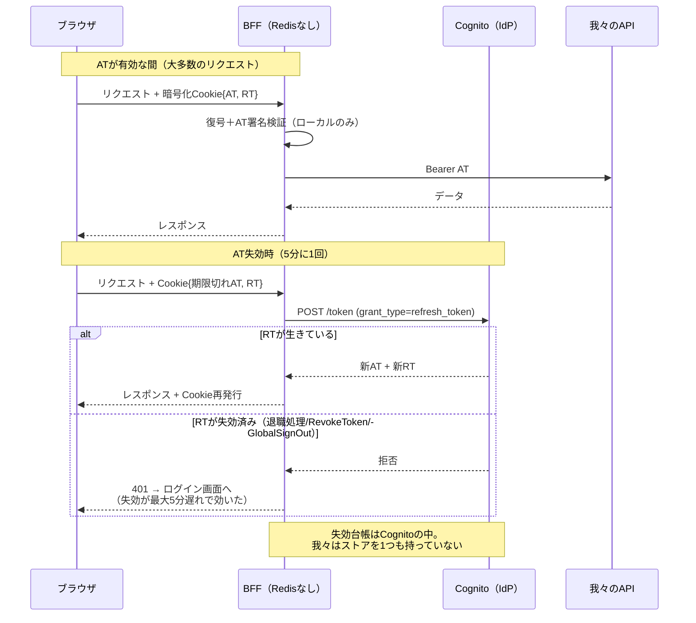
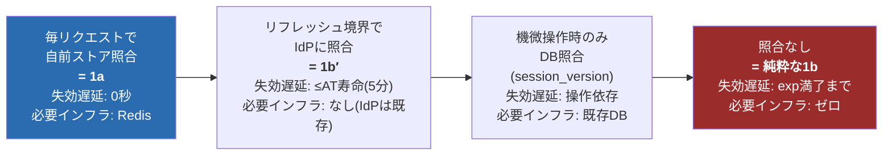

# 調査まとめ5 — Redisなし暗号化JWT Cookie方式（1b）は、実際いつ使うのか

[調査まとめ4.md](調査まとめ4.md) の続編。[プロンプト.md](プロンプト.md) 質問04-1への回答。

あなたの三段論法——「Redisなしのexp＝期限まで全権」「短命expにすると失効確認機構が要る」「それはRedis」——は**論理として正しい**。ただし前提に見落としが2つあり、そこに1bの実在用途がある。

---

## 1. 見落とし①：失効の台帳は「自前のRedis」である必要がない — **IdPが既に台帳を持っている**

調査まとめ4の案ii（再発行時にサーバ状態を確認）を読み返すと、「失効台帳＝我々が新設するRedis」と暗黙に置いていた。しかし今回の構成には**最初からステートフルな失効台帳が存在する——Cognito（IdP）自身**である。

Cognitoは**リフレッシュトークンの失効**をサポートしている（[RevokeToken API](https://docs.aws.amazon.com/cognito/latest/developerguide/token-revocation.html)、ユーザー単位の全RT失効＝[GlobalSignOut](https://docs.aws.amazon.com/cognito-user-identity-pools/latest/APIReference/API_GlobalSignOut.html)）。これを使うと**Redisを一切持たない1bの変種（以下「1b′」）**が組める：

- 暗号化Cookie（セッション）の中に **短命AT（5分）＋RT** を入れる
- AT有効期間内：BFFはCookieを復号して署名検証するだけ。**外部I/Oゼロ**
- ATが切れたら：BFFがRTでCognitoにリフレッシュ要求。**ここが失効チェックポイント**——退職処理等でRTが失効済みなら、リフレッシュが拒否され、セッションはそこで死ぬ
- 新しいAT＋（ローテーションされた）RTを再暗号化してCookieを書き戻す

つまり「**Redis使うしかないんじゃない？**」への答えは No：**状態を持つ仕事をIdPに外注する**のが1b′であり、失効遅延はAT寿命（5分）に抑えられる。ステートレスなのは「我々のBFF」であって、システム全体から状態が消えたわけではない——**状態の置き場所がCognitoに移っただけ**。これが1bが実務で成立する最大のカラクリ。Auth.js（旧NextAuth）のデフォルト構成（JWTセッション＋IdPリフレッシュ）はまさにこの形。

## 2. 見落とし②：「失効できなくてもよいシステム」は世の中の多数派

もう1つの前提「失効確認は必須」が成り立たない領域が広大にある。**Webの相当部分は、失効チェックなしのステートレスCookieセッションで動いている**——しかもフレームワークの**デフォルト**として：

| フレームワーク | デフォルトのセッション |
|---|---|
| Ruby on Rails | **暗号化Cookieセッション**（CookieStore）がデフォルト |
| Flask | **署名付きCookieセッション**がデフォルト |
| ASP.NET Core | Cookie認証は**暗号化チケットをCookieに格納**（サーバストアなし）がデフォルト |
| Express | `cookie-session`（Cookie格納）が広く使われる |
| Auth.js / NextAuth | **JWTセッション戦略**がデフォルト |

これらが許容される理由は、対象システムの脅威モデルでは「**Cookieが盗まれたら期限まで悪用されうる」というリスクの期待損失が、ストア運用のコストを下回る**から：

- **ECの閲覧・コンテンツサイト・ブログ・SaaSの一般ユーザー層**：セッション乗っ取りの被害が限定的（決済時は再認証を挟む等の局所対策で足りる）
- **サーバレス／エッジ実行環境**（Lambda@Edge、Cloudflare Workers、マルチリージョンCDN認証）：低レイテンシな共有ストアが**そもそも置けない／高くつく**環境。署名検証だけで各エッジが独立に認証できる価値が支配的
- **読み取り専用の社内ダッシュボード・プレビュー環境**：守る資産が軽い

そして「無制限のexpを設定するのか？」への答え：**しない**。実務の1bは「exp=数時間〜数十日＋アクセスの度にスライド延長」が普通で、「盗まれたら最悪その期間」を**受容したリスク**として明示的に飲んでいる。加えて応急手段として「ユーザーDBに`session_version`を持ち、パスワード変更時にインクリメント、**機微な操作のときだけ**DBと照合する」という部分的ステートフル化で妥協する実装も多い（毎リクエストではなく要所だけ状態を見る、という間引きの一形態）。

## 3. 全体像：これは「失効チェックをどこに置くか」のスペクトラムである

左へ行くほど失効が速く・インフラが増え、右へ行くほど軽く・失効が遅い。**「1bか1aか」の二択ではなく、失効遅延の許容量を要件から決めて、この線上の点を選ぶ**のが正確な設計行為。あなたの三段論法は「左端でなければ無意味」と言っていたことになるが、実際は中間点（1b′）と右端（受容）にそれぞれ実在の市場がある。

## 4. 今回のケースへの適用：1a vs 1b′ の正面比較

1b′が成立する以上、今回も「Redisなし」は選択肢になりうる。正面から比較する：

| | 1a（Redisセッション） | 1b′（暗号化Cookie＋Cognitoリフレッシュ） |
|---|---|---|
| 失効遅延（退職者無効化） | 0秒 | ≤5分（AT寿命）— 通常の退職処理には十分 |
| インシデント時の全セッション破棄 | Redis flush**一撃** | 全ユーザーにGlobalSignOut を回す（API連打）＋AT寿命分の残存 |
| 追加インフラ | ElastiCache（運用・可用性・費用） | **なし** |
| Cookieサイズ | sid数十バイト。問題なし | CognitoのAT/RTは各1KB前後、暗号化でさらに膨張 → **4KB上限に接触し分割Cookieが必要**（Auth.jsは自動分割で対処している） |
| セッションに載せる付加情報 | Redisに何でも置ける | Cookieサイズと相談 |
| 障害点 | Redis停止＝全員ログイン不能 | Cognito停止＝リフレッシュのみ不能（AT有効中は動き続ける） |
| 実装の複雑さ | 素直（ライブラリ豊富） | リフレッシュ競合（並行リクエスト時の二重リフレッシュ）、Cookie分割、鍵ローテーション |

**推奨は引き続き1a**。決め手は：①会計・基幹システムの「インシデント時に確実に・即座に・全部止める」要件はRedis flushの単純さが最も確実に満たす、②Cookie分割やリフレッシュ競合という**地味に厄介な実装課題**を回避できる、③社内規模でElastiCacheのコストは軽微。

ただし**1b′は「インフラチームがRedisの新設を渋った場合」の正当な代替カード**として資料に載せる価値がある（失効遅延≤5分を監査側が許容するなら、構成要素が1つ減る）。「Redisを使うしかない」ではなく「**Redisが最善だが、IdPに状態を外注する次善が存在する**」が正確な結論。

---

## Sources

- [Amazon Cognito: Revoking tokens（RevokeToken）](https://docs.aws.amazon.com/cognito/latest/developerguide/token-revocation.html)
- [Amazon Cognito: GlobalSignOut API](https://docs.aws.amazon.com/cognito-user-identity-pools/latest/APIReference/API_GlobalSignOut.html)
- [Auth.js: Session strategies（JWTセッション＋リフレッシュの実例）](https://authjs.dev/concepts/session-strategies)
- [Rails Guides: Session storage（CookieStoreがデフォルト）](https://guides.rubyonrails.org/security.html#sessions)
- [Flask: Sessions（署名付きCookieがデフォルト）](https://flask.palletsprojects.com/en/stable/quickstart/#sessions)
- [ASP.NET Core: Cookie authentication（暗号化チケット方式）](https://learn.microsoft.com/en-us/aspnet/core/security/authentication/cookie)
