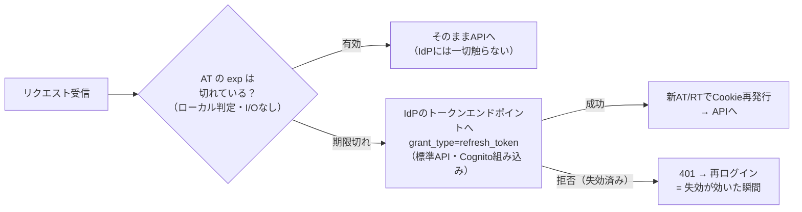

# 調査まとめ6 — 1b′の細部の認識合わせ／expの決め方／統一認証へのスタンスのケース別整理

[調査まとめ5.md](調査まとめ5.md) の続編。[プロンプト.md](プロンプト.md) 質問05への回答。
アーキテクチャ図（1a/1b′併記版・論点①No版・フェーズ別）は [資料/00_全体像_現状と展望.md](資料/00_全体像_現状と展望.md) に反映済み。

---

## 1. 「つまりSPAでも同じことができるわけだ」→ **半分だけ正しい。重要な限定がある**

「SPA」が何を指すかで答えが分かれる：

**「画面がSPA（React等）で、後ろにBFFがいる構成」の意味なら → Yes。** 1b′の画面がSPAかMPAかは無関係。というより1b′はそもそもBFFパターン（IETFパターン1）の変種なので、画面は何でもよい。

**「バックエンドなしのSPA単体（IETFパターン3）」の意味なら → No。原理的に不可能。** 1b′を成立させている要素は、実は**全部サーバ側にある**：

| 1b′の成立要素 | ブラウザ単体でできるか |
|---|---|
| ① HttpOnly Cookieの発行 | ❌ HttpOnlyはサーバの`Set-Cookie`でしか付けられない（JSから付けたCookieはJSから読める） |
| ② Cookie暗号鍵の秘匿 | ❌ ブラウザに秘密を隠す場所はない（JSに埋めれば読まれる） |
| ③ confidential clientとしてのRT保持とリフレッシュ | ❌ ブラウザはpublic client。RTをブラウザに置いた瞬間、パターン3の弱点（RT持ち出し）が復活する |

つまり1b′の教訓は「**サーバを消せる**」ではなく「**セッションストアを消せる（状態はIdPに外注できる）**」。**サーバ（BFF）は依然として必須**。「ステートレスにできる＝SPAだけでいける」と混同すると、パターン3に逆戻りするので注意。

## 2. 「BFFはIdPにexpをチェックするAPIを叩く。そのAPIはCognitoが用意するのか」→ **少し違う。「チェックAPI」は叩かない**

ここは誤解を正確に潰したい。1b′でBFFがやることの正しい分解：

1. **expのチェックはBFFがローカルでやる**。JWTの`exp`クレームを見るだけ（署名検証と同じくI/O不要）。IdPに「これ期限切れ？」と聞くAPIは**叩かない**
2. expが切れていたら、IdPの**トークンエンドポイント**（`POST /oauth2/token`、`grant_type=refresh_token`）を叩く。これは「チェックAPI」ではなく**標準のOAuthトークン発行API**で、Cognitoが最初から用意している（[Token endpoint](https://docs.aws.amazon.com/cognito/latest/developerguide/token-endpoint.html)）。カスタム開発は不要
3. 失効は「問い合わせの答え」としてではなく、**「更新を試みたら断られる」という形**で現れる。RevokeToken/GlobalSignOut済みのRTでのリフレッシュ要求をCognitoが拒否する——これが失効チェックポイントの正体

参考：OAuthには「このトークンは今も有効か」を能動的に聞く標準API（**イントロスペクション**、[RFC 7662](https://datatracker.ietf.org/doc/html/rfc7662)）も存在するが、**Cognitoは非対応**。そして1b′はそれを必要としない設計（必要とするなら毎リクエストI/Oが復活し、1aと変わらなくなる）。

## 3. 「これはメジャーな構成か」→ **Yes。Next.js界隈では事実上の最多数派**

- **Auth.js（旧NextAuth）のデフォルトのセッション戦略がまさにこれ**（JWTセッション戦略：暗号化JWE Cookie＋IdPリフレッシュ）。Next.jsアプリの認証ライブラリとして最普及であり、その既定値である以上、世界中のNext.jsアプリの相当数がこの構成で動いている
- ASP.NET CoreのCookie認証＋OIDC連携、その他フレームワークにも同型のパターンがある
- なお「メジャー＝我々に最適」ではない点はこれまで通り（デフォルトが1b′なのは「Redisなしで動き出せる」という導入体験のためであり、Auth.jsもDBセッション戦略への切替をサポートしている）

## 4. 「expは何を基準に決めるのか」→ **技術定数ではなく「失効遅延SLAと運用コストの交点」**

決めるexpは2つあり、基準が違う：

### 内側のAT寿命（＝失効遅延の上限そのもの）

| 力学 | 方向 |
|---|---|
| 監査・セキュリティ要件：「アクセス権を剥奪してから、実際に遮断されるまで」の許容時間（退職処理、インシデント対応のSLA） | **短く**押す |
| IdP呼び出し頻度＝コストとレート制限（ユーザー数 × 1回/AT寿命）、リフレッシュ競合の発生率 | **長く**押す |

相場は**5〜15分**。Cognitoは5分〜24時間で設定可（デフォルト60分）。「即時（0秒）が要件」ならこの構成自体が不成立で1a行き——これが次節の分岐条件になる。

### 外側のセッション寿命（RT寿命・Cookie寿命）

こちらは失効とは別の話で、**「ユーザーを何時間/何日ログインさせ続けるか」という業務要件**で決める。アイドルタイムアウト（例：30分、操作で延長）＋絶対タイムアウト（例：12時間）。Cognitoの RT は60分〜10年で設定可（デフォルト30日）。会計系の業務システムなら「1営業日を超えない」あたりが定石。

## 5. 「1aと1b′を両方提示して、即時無効化の要否で分岐、expを許容できないならRedis——であってるか」→ **合っている。1点だけ精緻化を**

そのフレーミングで正しい。展開時は分岐条件を「即時無効化の要否」ではなく、**「失効遅延の許容値」という連続量**で言うとより正確で、相手（インフラ・監査）と数字で会話できる：

> **失効遅延の許容値 = 0秒（アクセス権剥奪が次のリクエストから効くこと）が要件なら 1a（Redis）。**
> **許容値 ≥ AT寿命（5〜15分）なら 1b′ も選択可（コンポーネントが1つ減る）。**

付随する差分（決定打ではないが添えるべき）：

- インシデント時の**全セッション一括破棄**：1aはRedis flush一撃。1b′は全ユーザーへのGlobalSignOut連打＋AT寿命分の残存
- Cookieサイズ：1b′はCognitoトークンが大きく4KB制限に接触 → 分割Cookie実装が必要
- セッション付加データ（画面状態等）：1aは自由、1b′はCookieサイズと相談
- 障害特性：1aはRedis停止＝全員停止。1b′はCognito停止でもAT有効中は動き続ける

図・比較表は [資料/00](資料/00_全体像_現状と展望.md) §3に反映済み。

## 6. 論点①No版アーキテクチャと「話の持って行き方」→ **その持って行き方が正しい**

「これが現状我々が考えているアーキテクチャ（＝当初想定）だが、要件的に足りない可能性がある箇所がここ。本当にこれで良いか？」という構成で持ち込むのが正解。理由：

- No版（方式a）を「欠陥案」としてではなく「**当初スコープの正当な案**」として見せることで、方式bへの変更が「我々の設計ミスの尻拭い」ではなく「**要件の追加確定に伴うスコープ変更**」として整理される（費用・工期交渉の土台）
- 図の中に「⚠ ここで個人が見えなくなる」を**視覚的に**入れる。文章より図の欠落の方が伝わる
- その場で方式bを売り込まない。「この欠落を許容するかは監査要件の問題なので、確認してほしい（資料01）」で止める——判断責任を要件のオーナーに置く原則（調査まとめ4 §2-3）の実践

No版の図は資料/00 §4-Aに追加済み。

## 7. 「認証を共通化したい」への我々のスタンス — ケース別整理

統一構想の帰趨は我々がコントロールできないので、**どっちに転んでも取る行動を先に決めておく**。不変の原則は1つ：

> **我々のAPIが信頼するトークン発行元（iss）は1つ。クレーム仕様（aud/scope/sub）は我々が定義する。IdPの実体がどこの誰でも、この契約面は我々が握る。**

| ケース | 状況 | 我々のスタンス |
|---|---|---|
| **1. 全社主導で統一IdPが建つ** | インフラ/全社がオーナー | **最良シナリオ。乗る**。トークン仕様書とスコープ表を先に提示して「統一IdPが満たすべき仕様」を我々が定義する側に回る。IdP運用は持たない |
| **2. 統一は進むが、我々がオーナーを振られる** | 「言い出しっぺ/詳しい人がやって」 | 条件付きで受ける：**ガバナンス（仕様・クライアント審査・スコープ管理）は持つが、運用実務（ヘルプデスク・アカウント棚卸し・外部ユーザー払い出し）は持たない**を責務分担表で明文化。運用込みなら追加費用として見積る |
| **3. 統一が進まない ＋ 証跡要件Yes** | 全社の動きを待てない | 我々のCognitoをベンダーに開放する「**ミニ統一**」を変更管理で実施。ただし将来の全社統一に備え、issを設定値化し、フェデレーションで挿し替え可能な設計にしておく |
| **4. 統一が進まない ＋ 証跡要件No** | 方式(a)のまま | 現行想定を維持。ただし「ベンダー経由の操作は個人を特定できない」という**リスク受容をお客様の文書で残す**。APIは`sub`ベースの認可・ログを実装済みにしておき、将来Yesに転じたときの移行コストを最小化 |
| **5. 「ベンダーのIdPに統一」方向に転ぶ** | 主導権が向こうに | 技術的には成立する（我々のAPIはissを差し替えるだけ）が、**会計データのアクセス統制の鍵（アカウント発行・失効・ログ）を他ベンダーの運用に委ねる統制リスク**をお客様に提示する。飲む場合もクレーム仕様・SLA・監査ログ提供義務を契約に入れる |

全ケースに共通する先手：①トークン仕様書、②スコープ表、③クライアント登録手順、④責務分担表——この4点セット（「API利用の約款」）を**どのケースでも使い回せる形で先に作っておく**（資料02がその原型）。

---

## Sources

- [Amazon Cognito: Token endpoint（リフレッシュはIdP標準装備のAPI）](https://docs.aws.amazon.com/cognito/latest/developerguide/token-endpoint.html)
- [RFC 7662: OAuth 2.0 Token Introspection（能動的な有効性照会の標準。Cognito非対応）](https://datatracker.ietf.org/doc/html/rfc7662)
- [Auth.js: Session strategies（JWT戦略がデフォルト＝1b′の普及例）](https://authjs.dev/concepts/session-strategies)
- [Amazon Cognito: ユーザープールのトークン有効期限設定](https://docs.aws.amazon.com/cognito/latest/developerguide/amazon-cognito-user-pools-using-the-access-token.html)
