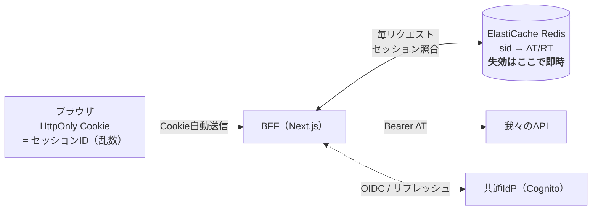
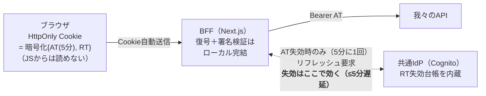
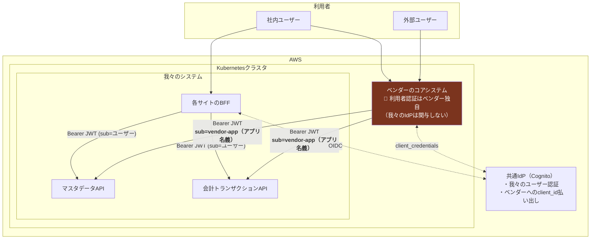
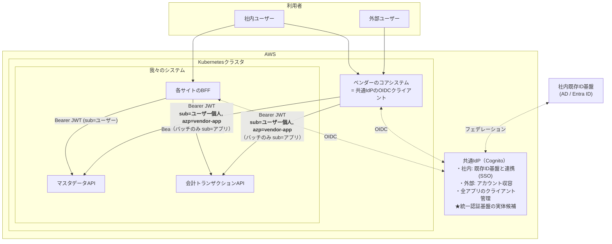
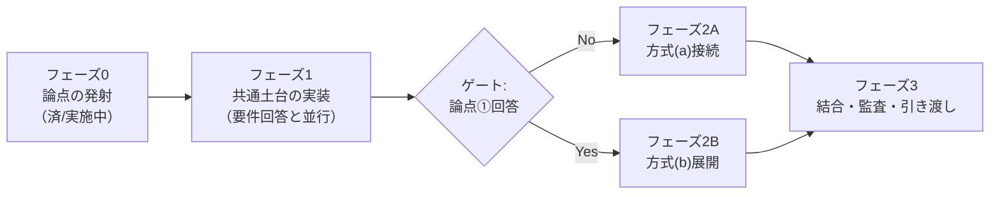
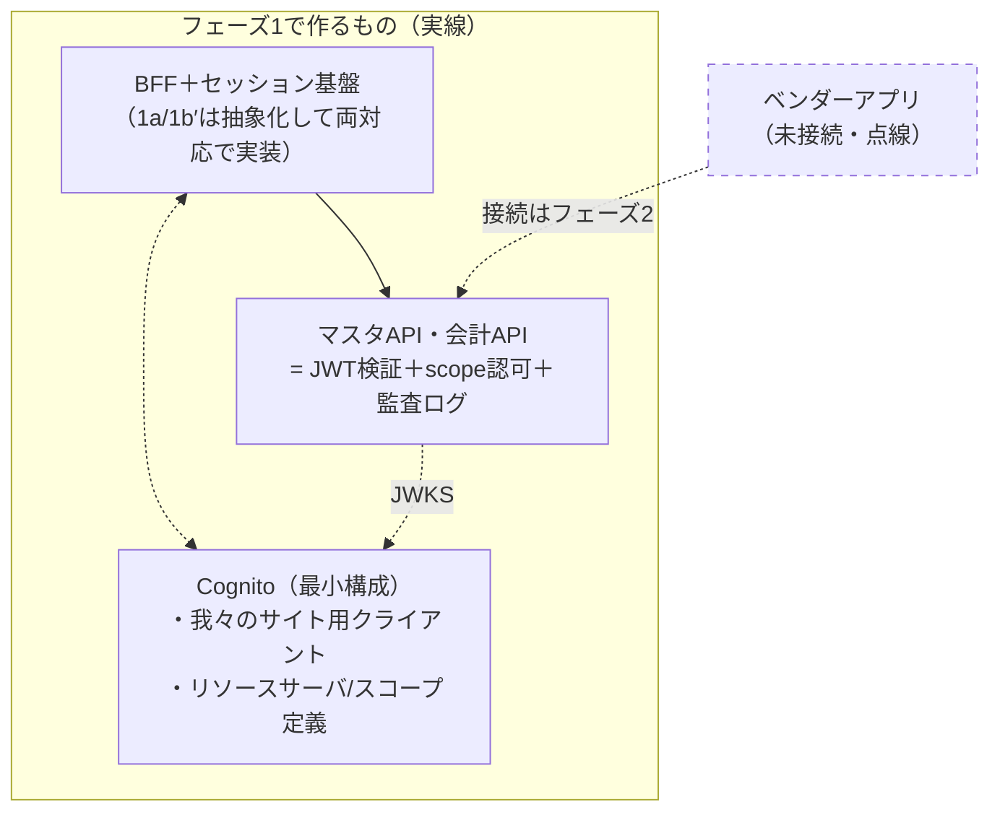
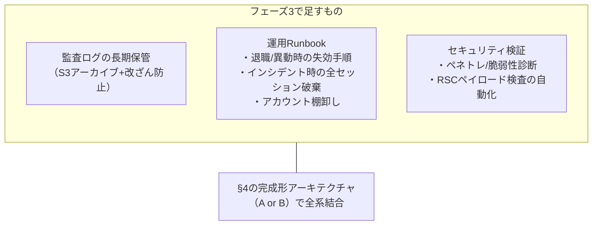

# 認証認可アーキテクチャ — 現状整理と今後の展望（全体像）

各ステークホルダー向け資料（01〜04）の親ドキュメント。検討の経緯・確定事項・未確定事項・今後の進め方をここに集約する。
（検討の詳細な根拠：[調査まとめ.md](../調査まとめ.md)〜[調査まとめ6.md](../調査まとめ6.md)）

---

## 1. システムの全体像（前提）

- 我々（アプリケーションチーム）が提供するもの：
  - **マスタデータ管理サービス**（基幹マスタのDB＋参照/更新サイト）
  - **会計トランザクション管理サービス**（会計データのDB＋参照サイト）
- 別ベンダーが**コアシステム（Webアプリ）**を開発し、我々のAPIからデータを取得する（同一Kubernetesクラスタ内）
- 利用者：**社内ユーザー**（我々のサイトもベンダーアプリも使う）＋**外部ユーザー**（ベンダーアプリからアカウント払い出し）
- インフラは同じ会社のインフラチームがAWSで構築。現行システムはSalesforceで運用中
- 直近、関係者間で「**認証基盤を統一したい**」という議論が発生している

## 2. これまでの検討で確定した方針（技術面）

| # | 確定事項 | 根拠の要約 |
|---|---|---|
| 1 | **我々のWebサイトはBFFパターン**（トークンをブラウザのJavaScriptに一切露出しない。HttpOnlyセッションCookieのみ） | IETF標準ドラフトが業務・機微データを扱うアプリに強く推奨。XSS時の被害を封じ込め可能 |
| 2 | **セッション方式は2案を並行提示**（§3）：第一案=Redisセッション（1a）、代替案=暗号化Cookie＋IdPリフレッシュ（1b′）。**分岐条件は「失効遅延の許容値」**（監査要件マター） | 許容値0秒（剥奪が次リクエストから効く）なら1a必須。AT寿命（5〜15分）の遅延が許容されるなら1b′も可 |
| 3 | **我々のAPIは、共通IdPが発行したJWTのみを受け付けるOAuthリソースサーバ**として作る | 呼び出し元がBFFでもベンダーアプリでも検証は同一（署名・iss・aud・exp・scope）。方式論争と切り離して実装着手できる |
| 4 | **サービス間連携（バッチ等）は client_credentials グラント** | 人間が介在しない通信の標準形 |
| 5 | ネットワーク的な近さ（同一クラスタ/Pod）を認証の代替にしない | ゼロトラスト。別ベンダーのコードが同居するならなおさら |

## 3. セッション方式：1a / 1b′ の2案（アプリ・インフラチーム向け）

どちらも**トークンはブラウザのJSから見えない**（IETFのBFFパターン準拠）。違いは「セッションの状態をどこに置くか」と「失効が効くまでの時間」。

### 案1a：Redisセッション（第一案）

### 案1b′：暗号化Cookie＋IdPリフレッシュ（代替案・Redis不要）

### 比較と分岐条件

| | 1a（Redis） | 1b′（暗号化Cookie＋IdP） |
|---|---|---|
| 失効遅延（アカウント剥奪→遮断） | **0秒** | ≤AT寿命（5〜15分） |
| インシデント時の全セッション破棄 | Redis flush**一撃** | 全ユーザーGlobalSignOut＋AT寿命分残存 |
| 追加インフラ | ElastiCache必要 | **不要**（状態はCognitoが持つ） |
| Cookieサイズ | 数十バイト | 数KB（4KB制限で分割Cookie実装が必要） |
| 障害特性 | Redis停止＝全員ログイン不能 | Cognito停止でもAT有効中は継続動作 |
| 実装複雑度 | 低（定石） | 中（リフレッシュ競合・Cookie分割・鍵管理） |

> **分岐条件（監査要件の確認結果で決まる）**：
> 「アクセス権を剥奪してから実際に遮断されるまでの許容時間」が **0秒（即時）なら1a**。**5〜15分の遅延が許容されるなら1b′も選択可**（コンポーネントが1つ減る）。
> ※ 1b′は特殊な構成ではなく、Auth.js（旧NextAuth）のデフォルトと同型のメジャー構成。

## 4. 目指すアーキテクチャ（論点①の結論で2枚に分岐）

**論点①**：ベンダーアプリ経由の操作を含め、**個人単位の操作証跡**は要件か？（→ お客様確認中、[資料01](01_お客様向け_要件確認依頼.md)）

### 4-A. 論点① = No の場合（方式a：システム間認証のみ）— **当初想定の構成**

> ⚠️ **この構成の既知のギャップ**：ベンダーアプリ経由の操作は、我々のAPIログに**すべて「vendor-app」名義**で記録される。**どの個人（社内/外部）の操作かは我々側の記録に存在しない**（ベンダー側ログのみが知っている）。
> 会計データを扱う本システムがJ-SOX等の監査対象となる場合、この欠落が許容されるかは**我々では判断できない** → 論点①としてお客様に確認中。**許容される場合も、リスク受容の文書化を依頼する。**

### 4-B. 論点① = Yes の場合（方式b：ユーザー連携）— 変更提案する構成

> ✅ 全経路で「**誰が（sub）・どのアプリから（azp）・いつ・何を**」がAPIの監査ログに残る。社内ユーザーは1回のログインで両システム利用（SSO）。「認証基盤を統一したい」構想の実体になる。
> 💰 変更影響：ベンダーアプリのOIDC対応改修＋外部ユーザーの収容運用＋AD連携 → **当初スコープからの変更管理案件**。

## 5. 「認証基盤を統一したい」議論への我々のスタンス（ケース別）

不変の原則：**我々のAPIが信頼するトークン発行元（iss）は1つ。クレーム仕様（aud/scope/sub）は我々が定義する。** 詳細は [調査まとめ6.md](../調査まとめ6.md) §7。

| ケース | 我々の動き |
|---|---|
| 全社主導で統一IdPが建つ | 乗る。トークン仕様書・スコープ表を先に提示し「統一IdPが満たすべき仕様」を定義する側に回る |
| 我々がIdPオーナーを振られる | ガバナンス（仕様・クライアント審査）は持ち、運用実務（払い出し・棚卸し・ヘルプデスク）は持たない——を分担表で明文化して条件付きで受ける |
| 統一が進まない＋証跡要件Yes | 我々のCognitoをベンダーに開放する「ミニ統一」を変更管理で。issは設定値化し将来の全社IdPに挿し替え可能にしておく |
| 統一が進まない＋証跡要件No | 方式(a)維持＋リスク受容の文書化。APIは`sub`対応済みにして将来の移行コストを最小化 |
| ベンダーIdPへの統一に転ぶ | 技術的には成立（issの差し替え）。ただし会計データのアクセス統制の鍵を他社運用に委ねる統制リスクを提示し、クレーム仕様・SLA・ログ提供義務を契約化 |

## 6. ロードマップ（詳細版・フェーズごとの構成図つき）

### フェーズ0：論点の発射（実施中）

| タスク | 宛先/担当 | 完了条件 |
|---|---|---|
| 証跡要件の確認依頼（[資料01](01_お客様向け_要件確認依頼.md)） | お客様 | **文書回答**の受領 |
| API利用条件ドラフト送付＋Q1〜Q5回答依頼（[資料02](02_ベンダー向け_API利用条件.md)） | ベンダー | 現行認証方式・OIDC対応可否の回答 |
| インフラ構成協議の開始（[資料03](03_インフラチーム向け_構成依頼.md)） | インフラ | Cognito/AD連携可否・IdPオーナー協議の開始 |

### フェーズ1：共通土台の実装（論点の回答を待たずに進める）

**この範囲は論点①がどちらに転んでも変わらない**——だから先行する。

| タスク | 担当 | 完了条件 |
|---|---|---|
| Cognitoユーザープール＋我々用クライアント＋スコープ定義 | インフラ＋我々 | 開発環境でトークン発行できる |
| APIのJWT検証ミドルウェア（署名/iss/aud/exp/scope/alg固定） | 我々 | [資料04](04_アプリチーム向け_実装方針.md) §4の全チェック緑 |
| 監査ログ出力（sub/azp/when/what/result/request_id） | 我々 | 全エンドポイントで構造化ログが出る |
| BFFセッション基盤（セッション層をインターフェース化し1a/1b′を差し替え可能に） | 我々 | ログイン→API呼び出し→ログアウトのE2E通過 |
| Next.js非露出規律の仕込み（taint/server-only/DTO層/CSP） | 我々 | 資料04 §3の全チェック緑 |
| セッション方式の分岐条件をお客様/監査に提示（§3の表） | 我々 | 失効遅延の許容値の回答 → **1a/1b′を確定** |

### ゲート：論点①の回答受領

- **回答が遅延する場合**：フェーズ1完了後もベンダー接続だけが止まる（我々のサイトはリリース可能）。遅延リスクはお客様に帰属することを議事録に残す。

### フェーズ2A：論点① = No → 方式(a)接続（構成図は§4-A）

| タスク | 担当 | 完了条件 |
|---|---|---|
| ベンダー用 client_credentials クライアント払い出し（スコープ最小） | インフラ＋我々 | ベンダーが検証環境でトークン取得できる |
| リスク受容の文書化（個人特定不能の明記） | お客様 | 署名/承認済み文書 |
| NetworkPolicy（ベンダーPod→APIの明示許可） | インフラ | 適用済み・疎通試験通過 |

### フェーズ2B：論点① = Yes → 方式(b)展開（構成図は§4-B）

| タスク | 担当 | 完了条件 |
|---|---|---|
| 変更提案（責務分担表＋費用/工期影響）の合意 | 我々→お客様 | 変更管理の承認 |
| 社内ID基盤（AD/Entra）とCognitoのフェデレーション | インフラ＋情シス | 社内ユーザーがSSOでログインできる |
| 外部ユーザーの収容設計（プール/グループ、払い出し運用フロー） | 我々＋ベンダー＋お客様 | 運用手順書＋払い出しの試行完了 |
| ベンダーアプリのOIDC対応改修 | ベンダー | 検証環境で sub=ユーザーのJWTでAPI呼び出し成功 |
| バッチ用 client_credentials 併設 | インフラ＋我々 | 人間操作系エンドポイントはアプリ名義トークンを拒否 |

### フェーズ3：結合・監査対応・引き渡し

| タスク | 担当 | 完了条件 |
|---|---|---|
| 全系結合試験（正常系＋401/403系＋失効シナリオ） | 我々＋ベンダー | 失効テスト：剥奪→遮断が要件の許容時間内 |
| 監査リハーサル（「この操作をしたのは誰か」をログから実演） | 我々＋お客様 | 内部監査/監査法人の観点でのレビュー通過 |
| ログ長期保管・改ざん防止の実装 | インフラ | 保存期間要件（資料01 Q3回答）の充足 |
| 運用Runbook整備と引き渡し | 我々→運用 | 退職処理・インシデント対応の机上演習完了 |
| ペネトレーションテスト/脆弱性診断 | 外部 or 社内 | 指摘の是正完了 |

## 7. 各ステークホルダー向け資料

| 資料 | 宛先 | 目的 |
|---|---|---|
| [01_お客様向け_要件確認依頼.md](01_お客様向け_要件確認依頼.md) | お客様（発注元） | 証跡要件の確定依頼＋方式の選択肢と影響の説明 |
| [02_ベンダー向け_API利用条件.md](02_ベンダー向け_API利用条件.md) | 別ベンダー | API利用の技術条件（JWT仕様）提示＋対応可否の確認 |
| [03_インフラチーム向け_構成依頼.md](03_インフラチーム向け_構成依頼.md) | インフラチーム | 必要コンポーネントの依頼＋統一認証基盤議論への合流 |
| [04_アプリチーム向け_実装方針.md](04_アプリチーム向け_実装方針.md) | 我々 | 確定方針の実装ガイドライン・チェックリスト |
