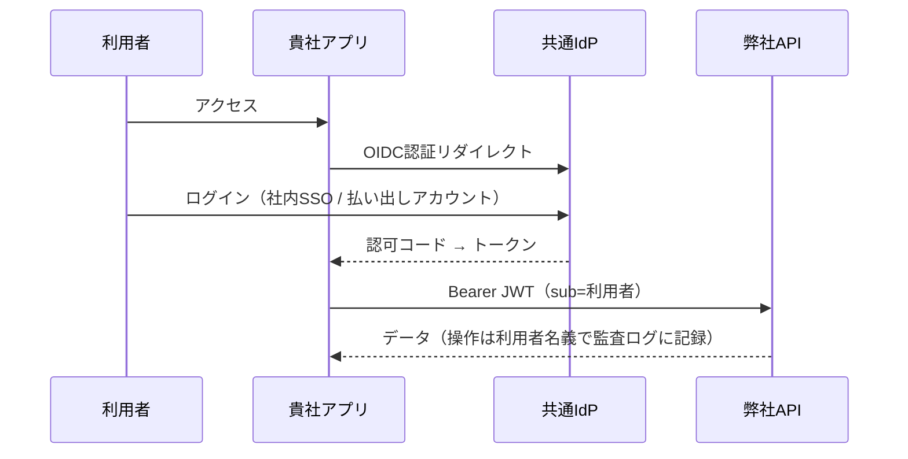

# 【技術連携資料】マスタデータ／会計トランザクションAPI 利用条件（ドラフト）

宛先：コアシステム開発ベンダー様
発信：アプリケーション開発チーム
目的：**弊社APIを利用いただくための認証・認可の技術条件の提示**と、**貴社側の対応可否・現状構成のご確認**

> 本書はドラフトです。認証方式（後述の方式A/B）は発注元の要件確認の結果により確定します。先行して技術条件をご確認ください。

---

## 1. 基本原則（方式によらず不変）

弊社API（マスタデータAPI・会計トランザクションAPI）は **OAuth 2.0 リソースサーバ**として実装されます。

1. すべてのAPIリクエストに、**共通IdP（Amazon Cognito想定）が発行したJWTアクセストークン**を `Authorization: Bearer` ヘッダで付与してください
2. トークンは弊社API側で以下を検証します。いずれかを満たさないリクエストは `401/403` で拒否されます
   - **署名**：共通IdPの公開鍵（JWKS）で検証
   - **iss**：共通IdPであること
   - **aud / resource**：弊社API向けに発行されたトークンであること
   - **exp**：有効期限内であること
   - **scope**：呼び出すAPIに必要なスコープを含むこと（下表）
3. **同一クラスタ内・同一Pod内であっても認証は省略しません**（ネットワーク的な近接を信頼の根拠にしない方針です）。通信はTLSを前提とします
4. トークンを貴社アプリの**ブラウザ側（JavaScript から読める場所）に保存しないでください**。トークンの取得・保持・付与はサーバサイドで行ってください

## 2. スコープ設計（ドラフト）

| スコープ | 意味 |
|---|---|
| `master:read` | マスタデータの参照 |
| `master:write` | マスタデータの更新 |
| `accounting:read` | 会計トランザクションの参照 |
| `accounting:write` | 会計トランザクションの登録・更新 |

貴社クライアントに付与するスコープは必要最小限で個別に合意します（例：参照のみなら `master:read accounting:read`）。

## 3. 接続方式は用途で2種類あります

### 方式1：システム間連携（バッチ・同期処理など人間が介在しない通信）

**client_credentials グラント**を使用します。貴社バックエンドに `client_id` / `client_secret` を払い出します。

```
POST {IdP}/oauth2/token
grant_type=client_credentials&scope=master:read
→ JWT（sub=貴社アプリ）を取得し、Bearerヘッダで弊社APIへ
```

- secretはブラウザ・モバイル・リポジトリに置かず、シークレット管理サービスで保管してください
- この方式のトークンには**利用者個人の情報が含まれません**。よって**人間の画面操作に起因するAPI呼び出しへの使用は、下記方式2が確定した場合は不可**となります

### 方式2：利用者の操作に伴う呼び出し（発注元の要件確認で確定した場合）

貴社アプリを共通IdPの**OIDCクライアント**として登録し、利用者（社内ユーザー・貴社が払い出す外部ユーザーとも）のログインを共通IdPで行っていただきます（Authorization Code Flow + PKCE）。

- 取得したアクセストークン（`sub`=利用者個人）で弊社APIを呼び出してください
- 弊社側はトークンの `sub`（誰が）と `azp`/`client_id`（どのアプリ経由か）を監査ログに記録します
- 社内ユーザーは既存の社内認証との連携によりシングルサインオンとなる予定です



## 4. 貴社にご確認したい事項

- [ ] **Q1.** 貴社アプリの現在の利用者認証の仕組み（自前実装／既存IdP製品／SaaS）を教えてください
- [ ] **Q2.** 方式2（OIDC / Authorization Code Flow への対応）となった場合の**改修可否と概算規模**を教えてください
- [ ] **Q3.** 貴社が外部利用者に払い出すアカウントの想定数・発行/削除の運用フローを教えてください（共通IdPへの収容方法の設計に必要です）
- [ ] **Q4.** 既に自社IdPをお持ちの場合、共通IdPとの**フェデレーション（SAML/OIDC連携）**は可能ですか？（方式2の変種として、貴社IdPを維持したまま連携する構成も検討可能です）
- [ ] **Q5.** バッチ等のシステム間連携の有無・頻度を教えてください（方式1のクライアント払い出しの要否）

## 5. 今後の流れ

1. 発注元にて証跡要件を確定（弊社から確認中）
2. 方式確定後、本書を正式版に更新し、クライアント登録手順・環境情報（IdPエンドポイント、JWKS URL、検証環境）をご提供します
3. 結合試験の際は、弊社側で `401/403` 系のエラー応答仕様・レート制限を含むAPI仕様書を別途提示します
