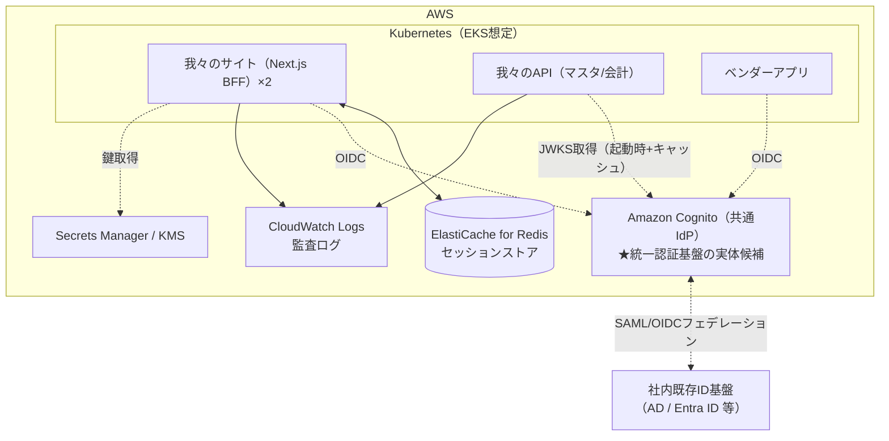

# 【構築依頼・協議】認証認可まわりのインフラ構成について

宛先：インフラチーム
発信：アプリケーションチーム
目的：認証認可に必要なAWSコンポーネントの構築依頼と、「認証基盤統一」議論への合流のための構成案共有

背景と全体像は [00_全体像_現状と展望.md](00_全体像_現状と展望.md) を参照。

---

## 1. 構成の全体像

## 2. 構築を依頼したいコンポーネント

### 2-1. Amazon Cognito（共通IdP）— 最重要・全社調整事項

| 項目 | 内容 |
|---|---|
| ユーザープール | 社内ユーザー＋（方式B確定時）外部ユーザー。プール分割 or グループ/カスタム属性での区別は設計協議したい |
| 社内ID連携 | **社内の既存ID基盤（AD/Entra ID等）とのフェデレーション可否の確認をお願いしたい**。可能なら社内ユーザーのパスワードをCognitoで持たない（SSO） |
| アプリクライアント | 我々のBFF×2（confidential、secret有り）＋ベンダーアプリ（方式確定後）＋バッチ用（client_credentials） |
| リソースサーバ定義 | カスタムスコープ：`master:read/write`, `accounting:read/write` |
| トークン設定 | アクセストークン寿命 5〜15分、リフレッシュトークン失効（RevokeToken）有効化 |
| **注意（IdP選定に関わる制約）** | CognitoはRFC 8693（Token Exchange）非対応。ベンダーが「自社認証を維持したままユーザー連携」を要求した場合はKeycloak等の検討が必要になる可能性がある。現時点の第一候補はCognitoで進めたい |

> 「認証基盤を統一したい」という全社議論が出ています。この共通IdPがその実体になるため、**オーナー（構築・運用主体）を誰にするかの協議**をこの資料をたたき台にお願いしたい。我々はAPIが信頼するトークン仕様（iss/aud/scope）の定義は持ちますが、IdP自体の運用はインフラチームまたは全社側が適切と考えています。

### 2-2. ElastiCache for Redis（セッションストア）

| 項目 | 内容 |
|---|---|
| 用途 | 我々のサイトのログインセッション保持（**Redisの可用性＝ログインの可用性**になります） |
| 規模感 | 社内ユーザー規模（同時セッション数百〜数千想定）。最小クラスのMulti-AZで十分 |
| 要件 | 転送中/保存時暗号化、AUTH有効、アプリPodからのみ到達可能なセキュリティグループ/NetworkPolicy |
| 補足 | Redis新設が運用上難しい場合、セッションをIdPリフレッシュに寄せるRedisレス代替案（失効遅延≤5分）があるため相談ください（[調査まとめ5.md](../調査まとめ5.md)） |

### 2-3. シークレット管理

- Next.jsの `NEXT_SERVER_ACTIONS_ENCRYPTION_KEY`（マルチインスタンス運用で必須）— Secrets Manager管理・ローテーション設計
- BFFの `client_secret`、Redis AUTHトークン、（採用時）セッションCookie暗号鍵

### 2-4. ネットワーク／K8s

- ベンダーアプリと我々のAPIが同一クラスタに同居するため、**NetworkPolicyでPod間通信を明示許可制**にしたい（認証はJWTで行うが、ネットワーク層も絞る多層防御）
- クラスタ内通信のTLS（サービスメッシュ/mTLSの採用方針があれば合わせたい）
- APIからCognito JWKSエンドポイントへのegress許可

### 2-5. ログ・監査

- API監査ログ（誰が・どのアプリから・いつ・何を・結果）をCloudWatch Logsへ。**保存期間は監査要件確認中**（J-SOX対応の場合、年単位の保持＋改ざん防止が要求される見込み。S3アーカイブ＋Object Lock等を相談したい）
- Cognitoの認証イベントログ（サインイン成功/失敗、トークン発行）の収集

## 3. 確認・協議したい事項

- [ ] 社内既存ID基盤（AD/Entra）とCognitoのフェデレーションは可能か（情シス確認含む）
- [ ] 共通IdPのオーナーシップ（構築・運用・費用負担）をどこに置くか
- [ ] ElastiCacheの標準構成・運用ルール（バックアップ、パッチ、監視）の有無
- [ ] クラスタ内mTLS/サービスメッシュの方針の有無
- [ ] 監査ログの長期保管の標準パターンの有無
