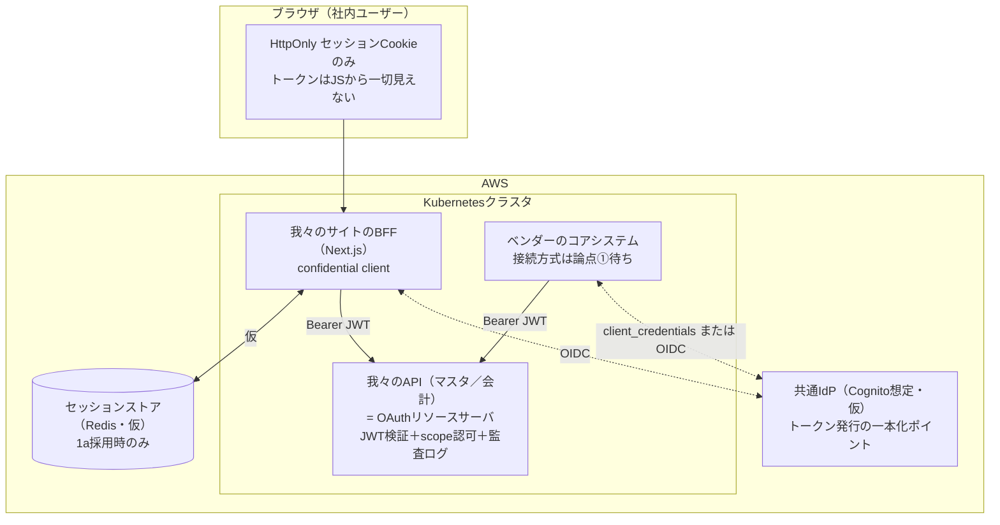

# 【社内会議用】認証認可アーキテクチャ — 状況整理と論点の切り分け

宛先：社内（自分たち）。**外部持ち出し前提の資料ではない**
目的：①現状の構成案と検討状況を1枚で共有する、②**大枠のアプリケーション構成を確定させる**、③その上で「仕様確認」「インフラで考えること」「アプリで考えること」を切り分け、担当外の論点を明示的にインフラへ切り出す

既存資料との関係：

- [00_全体像_現状と展望.md](00_全体像_現状と展望.md)（検討経緯の集大成）、[01](01_お客様向け_要件確認依頼.md)〜[04](04_アプリチーム向け_実装方針.md)（各ステークホルダー向け）、[調査まとめ1〜6](../調査まとめ.md)（技術的根拠）は**そのまま維持**。本書はそれらを「会議で決める」ために再編成したスナップショット
- 本書の「仮」マークが付いた箇所は**詳細を詰め切れていない**（特にインフラ寄り）。会議の目的は仮の部分を潰すことではなく、**仮のままでも確定できる大枠を先に固めること**

---

## 1. 状況整理 — 現状どういう構成を考えているか

### 1-1. 登場人物と提供物（前提のおさらい）

| 登場人物 | 役割 |
|---|---|
| 我々（アプリチーム） | **マスタデータ管理サービス**＋**会計トランザクション管理サービス**（DB＋Webサイト＋API）を開発 |
| 別ベンダー | **コアシステム（Webアプリ）**を開発。我々のAPIからデータ取得（同一Kubernetesクラスタ内） |
| 利用者 | 社内ユーザー（両方使う）＋外部ユーザー（ベンダーアプリのみ） |
| インフラチーム | AWS構築。Cognito・ElastiCache等の構築主体の想定 |
| お客様（発注元） | 要件のオーナー。J-SOX等の監査要件は彼らしか確定できない |
| （背景）| 関係者間で「**認証基盤を統一したい**」議論が発生中 |

### 1-2. 現時点で考えている大枠の構成

構成の柱は3つ。**この3つはどの論点がどちらに転んでも変わらない**：

1. **Web UIはBFFパターン**（IETF draft-ietf-oauth-browser-based-apps 準拠。トークン非露出、HttpOnlyセッションCookieのみ）
2. **APIは共通IdPが発行したJWTのみを受け付けるOAuthリソースサーバ**（呼び出し元がBFFでもベンダーでも検証は同一）
3. **ネットワーク的な近さ（同一クラスタ/Pod）を認証の代替にしない**（ゼロトラスト）

### 1-3. 確定していること／未確定のこと

**確定済み（技術方針。根拠は調査まとめ1〜6）：**

| # | 確定事項 |
|---|---|
| 1 | Web UIはBFFパターン。SPA+ブラウザトークン方式は不採用 |
| 2 | APIはOAuthリソースサーバとして最初から作る（BFF専用内部APIにしない） |
| 3 | 人間の操作＝ユーザー名義トークン、バッチ・システム間連携＝client_credentials |
| 4 | セッション層はインターフェースで抽象化し、1a（Redis）/1b′（暗号化Cookie＋IdPリフレッシュ）の両対応で実装 |
| 5 | 純粋な1b（失効チェックなしの無限延長）は不採用 |

**未確定（2つのゲート。いずれも我々では決められない）：**

| ゲート | 内容 | 決定者 | 分岐 |
|---|---|---|---|
| **ゲートA：個人証跡要件（論点①）** | ベンダーアプリ経由の操作も個人単位の証跡が要件か | お客様（[資料01](01_お客様向け_要件確認依頼.md)で確認中） | Yes→方式(b)ユーザー連携／No→方式(a)システム間認証＋リスク受容文書 |
| **ゲートB：失効遅延の許容値** | アクセス権剥奪→遮断までの許容時間 | お客様・監査 | 0秒→1a（Redis）必須／AT寿命（5〜15分）許容→1b′も可 |

---

## 2. 自分の仮説 — こうしたい・こうなると想定している

> ここは「方針の提案」であり、ゲートの回答が出るまで確定扱いにしない。ただし**見積もり・段取りはこの仮説ベースで準備しておく**。

- **仮説1：ゲートAはYes（方式(b)が必要）に倒れる**
  会計データを扱う以上、J-SOXのITGC観点で個人単位の証跡はほぼ確実に要件化される。よって方式(b)（ベンダーアプリも共通IdPのOIDCクライアント化）を本命として、変更管理の準備（責務分担表・費用影響）を先行して仕込む。方式(a)は「当初スコープの正当な案」として提示し、採る場合はリスク受容の文書化を必須とする
- **仮説2：セッションは1a（Redis）が第一候補**
  即時失効（0秒）とインシデント時のflush一撃、実装の単純さが決め手。1b′は「Redis新設が通らない場合」「失効遅延≤5分が許容される場合」の正当な代替カードとして温存
- **仮説3：IdPはCognitoが第一候補（ただし絶対ではない）**
  インフラがAWSで統一されている前提なら自然な選択。ただしベンダーが「自社認証を維持したままのユーザー連携（Token Exchange / RFC 8693）」を要求した場合、**Cognitoは非対応**のためKeycloak等に倒れる可能性が残る。→ ベンダー回答（資料02 Q1/Q4）待ち
- **仮説4：「認証基盤を統一したい」議論には、仕様を提示する側で乗る**
  我々のAPIが信頼するiss/クレーム/スコープの仕様書を先に文書化し、「統一IdPが満たすべき仕様」を定義する側に回る。IdPの運用実務は持たない（分担表で明文化）
- **仮説5：方式・IdPがどう転んでも、アプリ側の実装は共通土台部分から先行着手できる**
  JWT検証ミドルウェア・監査ログ・セッション抽象化・非露出規律は、ゲートの回答を待つ必要がない（フェーズ1）

---

## 3. 会議で確定させたいこと（最優先）

> **決めたいのは以下の3点だけ。詳細（トークンのクレーム構成、サービス選定の最終確定）はここでは決めない。**

- [ ] **決定1：大枠構成の承認** — §1-2の3本柱（BFF／OAuthリソースサーバ／ゼロトラスト）と§1-3の確定事項5点を、チームの確定方針として固定する
- [ ] **決定2：仮説ベースでの段取りの承認** — §2の仮説（特に「方式(b)本命で変更管理を準備」「1a第一候補」）で見積もり・資料準備を進めることの合意
- [ ] **決定3：論点の切り分けと担当の承認** — §4（仕様確認）・§5（インフラ切り出し）・§6（アプリ側）の割り振りと、資料01/02/03をいつ発射するかの確認

---

## 4. 仕様確認事項（外部に確認しないと決まらないこと）

| 宛先 | 確認内容 | 使う資料 | ブロックしているもの |
|---|---|---|---|
| お客様 | 個人証跡の要否（ゲートA）、失効遅延の許容値（ゲートB）、ログ保存期間、統一認証のオーナー、外部ユーザー運用責任 | [資料01](01_お客様向け_要件確認依頼.md) Q1〜Q5 | 方式(a)/(b)の確定、1a/1b′の確定、ログ保管設計 |
| ベンダー | 現行認証方式、OIDC対応可否と改修規模、外部ユーザーの想定数と運用、自社IdPの有無（フェデレーション可否）、バッチ連携の有無 | [資料02](02_ベンダー向け_API利用条件.md) Q1〜Q5 | 方式(b)の実現性、IdP選定（Token Exchange要否）、クライアント払い出し計画 |
| インフラ | §5の論点一式 | [資料03](03_インフラチーム向け_構成依頼.md)＋本書§5 | トークン仕様の最終化、環境構築 |

---

## 5. インフラに切り出す論点【仮置き・詳細未詰め】

> **前提の明示**：この章の内容は現時点ではすべて「仮」。自分（アプリ担当）の担当外であり、Cognitoのトークンの中身をどうするか・どのサービスを使うかはインフラチームと詰める必要がある。**アプリ側はこの章の結論に依存しないよう抽象化して実装を進める**（依存が切れない箇所は各項に明記）。

### 5-1. Cognitoトークンの中身（最優先で詰めたい）

調査の過程でCognito固有の制約が判明している（AWS公式ドキュメントで確認済み）。**一般的なOAuthの教科書通りの検証（aud/azp）がそのままは成立しない**ため、トークン仕様の確定が必要：

| 論点 | 判明している事実（一次情報確認済み） | インフラと決めたいこと |
|---|---|---|
| **`aud`クレーム** | Cognitoアクセストークンに`aud`はデフォルトで**入らない**。リソースバインディング（RFC 8707 `resource`パラメータ）を使えば入るが、**managed login経由のユーザー認証限定で、client_credentialsでは使えない** | aud検証を諦めて`client_id`許可リスト方式で統一するか、ユーザートークンのみリソースバインディングを使うか |
| **経由アプリの識別** | `azp`クレームは**Cognitoには存在しない**。アプリ識別は`client_id`クレーム | 監査ログの「どのアプリ経由か」は`client_id`で取る、で確定してよいか |
| **ユーザー種別の区別** | 社内/外部ユーザーの区別はデフォルトでは`cognito:groups`で可能。アクセストークンへのカスタムクレーム追加はPre Token Generation Lambda（**Essentials/Plusプラン要件**）が必要 | グループ運用で足りるか、カスタムクレームが要るか（=フィーチャープラン選定に直結） |
| **トークン寿命** | AT：5分〜24時間（デフォルト1時間）。RT：デフォルト30日。RTローテーションはオプション機能として存在 | AT寿命（5〜15分想定）、RT寿命、ローテーション有効化の要否 |
| **失効の仕組み** | RevokeToken／AdminUserGlobalSignOut（管理者主導はAdmin版）。ユーザーアカウント無効化でもRT/ATが失効。ただし**ローカル署名検証では失効済みトークンも通る**（1b′の失効遅延≤AT寿命の根拠） | 退職処理Runbookの手順（IdP無効化＋セッション削除の順序） |

### 5-2. サービス選定（仮：Cognito第一候補）

| 論点 | 内容 | 決定に必要な材料 |
|---|---|---|
| Cognito確定の可否 | Token Exchange（RFC 8693）非対応が唯一の脱落条件。ベンダーが自社認証維持を要求した場合のみKeycloak等を再検討 | ベンダー回答（資料02 Q1/Q4） |
| フィーチャープラン | Lite/Essentials/Plusの選定。カスタムクレーム（Pre Token Generation）、脅威保護・認証イベントログのエクスポート要否に依存 | §5-1のトークン設計＋監査ログ要件 |
| **M2M課金** | client_credentials用クライアントは**アクティブクライアント数＋トークンリクエスト数で課金**（2024年〜）。AT寿命を短くするほどトークン要求が増えてコスト増 | ベンダー・バッチのトークン取得頻度の見積もり |
| ElastiCache Redis | 1a採用時のみ必要。最小Multi-AZ、転送中/保存時暗号化、AUTH | ゲートBの回答（0秒要件なら必須） |
| AD/Entraフェデレーション | 社内ユーザーのSSO。情シス確認が必要 | 情シスの回答（資料03で依頼済み） |

### 5-3. その他インフラ論点（列挙のみ・詳細は資料03）

- [ ] **managed login（Hosted UI）を使うか自前ログイン画面か**。managed loginの場合：セッションCookieが1時間有効 → **BFFログアウト時にCognitoの`/logout`エンドポイント呼び出しが必要**（現状どの資料にも未記載の穴）。AWSは「managed login使用時はトークン有効期間1時間未満を非推奨」としており、AT=5分方針と要調整
- [ ] NetworkPolicy（ベンダーPod→API明示許可制）、クラスタ内mTLS/サービスメッシュの方針
- [ ] 監査ログの長期保管（S3＋Object Lock等。保存期間はお客様回答待ち）
- [ ] Secrets管理（BFFのclient_secret、`NEXT_SERVER_ACTIONS_ENCRYPTION_KEY`、Redis AUTH、1b′採用時のCookie暗号鍵）
- [ ] 共通IdPのオーナーシップ（構築・運用・費用負担）— 統一認証基盤議論との合流点

---

## 6. アプリケーション側で考えること（自分の担当・着手可能）

> この章は自分が把握しており、**インフラの結論を待たずに進められる**。詳細チェックリストは[資料04](04_アプリチーム向け_実装方針.md)。ここでは会議共有用に要点と、§5の結論待ちで「抽象化して逃がす」箇所だけ列挙する。

### 6-1. 確定して進められること

- **BFFのトークン非露出規律5点**（`cookies()`→ストア経由のみ／Server Action別ファイル／DTO層／taint API／`server-only`）＋CSP＋CSRF（資料04 §3）
- **セッション層の抽象化実装**：1a/1b′をインターフェースで差し替え可能に。ゲートB確定後に片方を本採用
- **JWT検証ミドルウェア**：署名（JWKS＋kidローテーション追従）／`iss`／`exp`／`scope`／`alg`固定
- **監査ログ**：who/via/when/what/result/request_id の構造化ログ（資料04 §5）
- **セッション・Cookie設計**：`__Host-`プレフィックス＋`SameSite=Strict`を第一候補に（IETFドラフトのSHOULDに合わせて資料04の「Lax推奨」から更新したい）
- **管理機能**：特定ユーザーの全セッション削除／全セッション削除（1aの「失効0秒」はこの機能＋Runbookとセットで初めて成立する）
- **テスト**：失効・改ざんJWT・CSRF・セッション固定・RSCペイロード検査（資料04 §6）

### 6-2. §5の結論待ちのため抽象化して逃がすこと

| 箇所 | 依存先 | 逃がし方 |
|---|---|---|
| トークン検証の`aud`/`client_id`チェック | §5-1（audの扱い） | 検証項目を設定値化。**`token_use=access`の検証は依存なしで先に入れる**（IDトークン誤受理の防止。資料04のチェックリストに追加したい） |
| 監査ログの「経由アプリ」フィールド | §5-1（client_id） | クレーム名を設定値化（`client_id`前提で実装、`azp`にも切替可能に） |
| ログアウト処理 | §5-3（managed login） | 「BFFセッション破棄」＋「IdPログアウト呼び出し（フック）」の2段構成にしておく |
| 人間操作系エンドポイントでのアプリ名義トークン拒否 | §5-1 | Cognitoではclient_credentialsトークンに`username`が無い／`sub`=client_idである点で判別可能。判別ロジックを差し替え可能に |
| issの将来差し替え（統一IdP合流） | §5-2 | issを設定値化。移行期の複数iss並行受け入れの要否は将来判断 |

---

## 7. 次のアクション（会議後）

| # | アクション | 担当 | 備考 |
|---|---|---|---|
| 1 | 決定1〜3の議事録化 | 自分 | 本書§3の3点 |
| 2 | 資料01をお客様へ発射（ゲートA/B・保存期間の文書回答依頼） | 自分→お客様窓口 | 設計確定の律速 |
| 3 | 資料02をベンダーへ発射（現行認証・OIDC対応可否） | 自分→ベンダー窓口 | IdP選定（Cognito確定）の律速 |
| 4 | 資料03＋本書§5をインフラチームへ持ち込み、トークン仕様のすり合わせ会を設定 | 自分→インフラ | §5-1（aud/client_id/token_use）を最優先議題に |
| 5 | フェーズ1実装の着手（§6-1） | アプリチーム | ゲート回答を待たない |
| 6 | 資料04の更新（`token_use`検証追加、`SameSite=Strict`への変更、ログアウト2段構成の追記） | 自分 | 本書のレビュー指摘の反映 |
