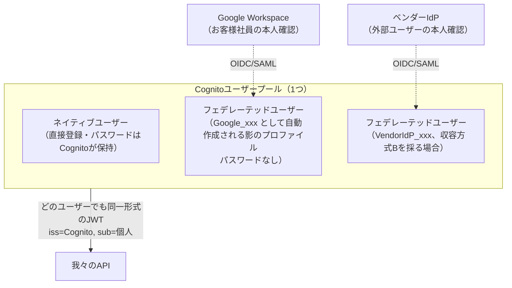
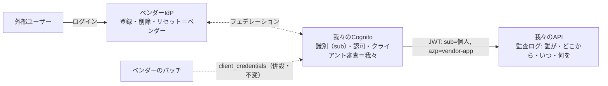

# ディスカッション：IdP・ユーザー管理・M2Mはどう繋がるのか

[ディスカッション_認証グラントと責務分割.md](ディスカッション_認証グラントと責務分割.md) の続編。
「IdPとユーザー管理とM2Mの運用がイメージで繋がらない」という疑問を起点に、
**「誰がどこに登録され、どこでログインし、誰がそのユーザーを管理するのか」**を利用者の種類ごとに解きほぐす。

> このドキュメントは検討過程の記録であり、確定仕様ではない。

---

## 0. 繋がらない原因：「IdP」「ユーザー管理」「M2M」は別の軸の話

3つを1つの絵に押し込もうとすると混乱する。まず軸を分ける。

| 軸 | 問い | 本件での答え |
|---|---|---|
| **トークン発行** | 我々のAPIが信じるJWTを発行するのは誰か | **常にCognito1つ**（issは1つ。方式A/Bでも収容方式でも不変） |
| **本人確認** | パスワード等を実際に検証するのは誰か | **ユーザーの種類ごとに委譲先が違ってよい**（Cognito直 / Google Workspace / ベンダーIdP） |
| **ユーザー管理** | アカウントの登録・削除・リセット・棚卸しを回すのは誰か | **「識別」と「運用実務」に分けて分担**（前回ディスカッション§5の③と④） |
| **M2M** | 人間が介在しない通信はどうするか | **上の3つと直交**。バッチ等は方式A/Bどちらでも client_credentials（確定方針#4） |

> **要点**：Cognitoは「全ユーザーのパスワードを持つ場所」ではなく「**認証結果を束ねてJWTに変換するハブ**」。
> 本人確認をどこでやっても、APIに届くトークンは全部「Cognito発行・sub=個人」に正規化される。だからAPIは1種類の検証で済む。

---

## 1. Q. お客様社員はGoogle Workspaceで、それ以外はCognitoのユーザープールに登録？両立するのか？

**両立する。というより、それがまさに方式B（[00_全体像](00_全体像_現状と展望.md) §4-B）の構成そのもの。**

Cognitoユーザープールは「直接収容したユーザー」と「外部IdPにフェデレーションしたユーザー」を**同じプールの中に共存**させられる。



### 押さえるべきCognitoの挙動

- **フェデレーテッドユーザーも「プールに登録される」**。Googleで初回ログインした瞬間、Cognitoのプール内にプロファイル（例：ユーザー名 `Google_1138...`）が自動作成される。パスワードはGoogle側のまま。
- つまり「Cognitoに登録」と「Googleで認証」は**排他ではない**。全員がプールに「居る」。違いは**パスワード（クレデンシャル）をどこが持つか**だけ。
- プールに全員居るので、**グループ・カスタム属性・アカウント無効化・棚卸しの起点はCognitoで一元化**できる。scope/認可の制御も同じ場所。

| | ネイティブユーザー | フェデレーテッドユーザー |
|---|---|---|
| プール内のエントリ | ある | **ある**（初回ログイン時に自動作成） |
| パスワードの保管場所 | Cognito | 元のIdP（Google / ベンダーIdP） |
| パスワードリセット | Cognitoで実施 | **元のIdP側で実施**（Cognitoではできない） |
| 無効化・グループ・属性 | Cognitoで可能 | Cognitoで可能 |
| APIから見たJWT | iss=Cognito, sub=個人 | **同じ**（区別不要） |

> ⚠️ **設計時の注意（アカウントリンキング）**：同一人物がGoogleとネイティブ（またはベンダーIdP）の両方から入れる状態を作ると、プール内に**別人として2エントリ**できる。同一人物を1つのsubに束ねるか（Cognitoのユーザーリンク機能）、入口をユーザー種別ごとに1つに固定するかは、フェーズ2Bの収容設計で決める事項。

---

## 2. Q. ベンダーのコアシステムに登録したユーザーは、我々のシステムでどう扱うのか？

### まず前提の修正：方式Bでは「ベンダーのユーザーDBに登録して終わり」という状態がなくなる

方式Bの定義は「利用者のログインを我々のCognitoで行う」（[02_ベンダー向け](02_ベンダー向け_API利用条件.md) §3方式2）。
つまり**外部ユーザーも、何らかの形で必ずCognitoから見える場所に居なければならない**。その「居させ方」が前回ディスカッション§6の2択：

#### 収容方式A：Cognitoに直接収容（ネイティブユーザー化）

```
ベンダーの管理画面で外部ユーザーを登録
  → 裏でCognitoの管理API（AdminCreateUser等）を叩き、実体はCognitoに作られる
  → 外部ユーザーはCognitoのログイン画面で直接認証
```

- ベンダーは「払い出しの操作」は続けられる（API経由）が、**クレデンシャルの保管責任は我々側（Cognito）に移る**。
- 我々のプールに全情報が揃うので棚卸しは楽。ただしパスワードリセット等のヘルプデスク導線をどうベンダーに残すかの設計が必要。

#### 収容方式B：ベンダーIdPをフェデレーション（Googleと同じ構造）

```
ベンダーが外部ユーザーを自社IdPに登録（実体はベンダー側のまま）
  → 外部ユーザーはベンダーIdPで本人確認
  → Cognitoは結果を受けてフェデレーテッドユーザーとしてJWT発行
```

- **「GoogleWorkspaceで認証した人と同じ扱いになる」という直感は、この方式を採った場合に完全に正しい。** 社内=Googleに委譲、外部=ベンダーIdPに委譲、という**対称な構造**になる。
- ユーザー管理（登録・削除・リセット）はベンダーに残る。我々が持つのは識別（sub）と認可。
- 前提条件：**ベンダーが「IdPとして振る舞える製品/基盤」を持っていること**（[02_ベンダー向け](02_ベンダー向け_API利用条件.md) Q4で確認中）。単なる自前ユーザーテーブルしか無い場合はこの方式は成立せず、収容方式Aに倒れる。

### 答え：どちらの収容方式でも「我々のシステムでの扱い」は同じになる

| 観点 | 収容方式A（直収容） | 収容方式B（ベンダーIdPフェデレーション） |
|---|---|---|
| APIから見える姿 | JWT（iss=Cognito, sub=個人） | **同じ** |
| 監査ログ | sub=個人で残る | **同じ** |
| Cognitoプール内 | ネイティブエントリ | フェデレーテッドエントリ |
| クレデンシャル管理 | 我々（Cognito） | ベンダー |
| 払い出し・リセット等の運用実務 | ベンダー（API経由）＋我々の関与大 | ベンダーに完全に残せる |
| 棚卸し | Cognitoで完結 | Cognito＋ベンダー台帳の突合が必要 |

> **要点**：「個別で登録するユーザーの管理」は、**認可・識別・無効化はCognitoで一元管理**（全員プールに居るから）、**クレデンシャルと日々の運用は収容方式の選択でベンダーに残すか決める**、という二層で答えが出る。

---

## 3. Q. M2MでAPIを提供するのは「どう転んでも変わらない」認識で合っているか？

**半分合っていて、半分危ない。**

### 合っている部分：バッチ・システム間連携のM2Mは不変

人間が介在しない通信（夜間バッチ、定期同期）が client_credentials なのは確定方針#4であり、**方式A/Bどちらに転んでも残る**。フェーズ2Bのタスクにも「バッチ用 client_credentials 併設」が明記されている。ここは「どう転んでも変わらない」で正しい。

### 危ない部分：「ベンダーからのAPI呼び出し＝常にM2M」ではない

それは**方式Aそのもの**であり、まさに論点①（個人証跡は要件か）で分岐する部分。

- 論点① = **No** → ベンダーの人間操作もM2Mトークン（sub=vendor-app）のまま。ただしリスク受容の文書化が条件。
- 論点① = **Yes** → 人間の画面操作に起因する呼び出しは**OIDC（sub=個人）に切り替え**。M2Mトークンは人間操作系エンドポイントで**拒否**する（「バッチが人間のフリをする」抜け道を塞ぐ）。

つまり変わらないのは「M2Mという仕組みの存在」であって、「ベンダー接続の方式」ではない。

### 「M2Mのまま、フェデレーションで監査に応える」は成立しない（用語の混線ポイント）

> 仮に監査でログを証跡として出せと言われたら、M2Mで外部ベンダーにフェデレーションを依頼して、IdPの識別情報だけ持つ？

この文には2つの仕組みが混ざっている。

- **フェデレーションは「人間のログイン（OIDC）」側の概念**。M2Mトークンには人間が乗っていない（sub=アプリ）ので、フェデレーションする対象がそもそも存在しない。
- M2Mのまま監査に応える方法は「我々のログ（全部vendor-app名義）とベンダーのログを**突合してもらう**」しかない。これが§4-Aの既知ギャップで、[01_お客様向け](01_お客様向け_要件確認依頼.md)の見解の通り、J-SOX水準の個人証跡要件は**方式Aでは満たせない**。
- 「M2Mトークンに『代理で操作しているユーザー』を乗せる」標準はToken Exchange（RFC 8693）だが、**Cognitoは非対応**（[03_インフラ向け](03_インフラチーム向け_構成依頼.md) §2-1の制約）。自己申告のカスタムヘッダで代用するのは改ざん可能で監査証跡にならない。

### ただし、狙っていた分担（「ユーザー管理はベンダー、我々は識別情報だけ」）自体は正しく、実現手段が違う

その分担を実現するのは **方式B ＋ 収容方式B（ベンダーIdPフェデレーション）**：



- ユーザー管理（運用実務）＝ベンダー、我々が持つのは**識別情報（sub）と監査ログ** → 望んでいた分担どおり。
- かつ監査時は**我々のログだけで「どの個人か」まで出せる**（M2Mでは原理的に不可能だった部分が埋まる）。
- 残る依存：「sub ↔ 実在人物」の対応台帳はベンダー側にある。監査で人物名まで求められた場合に備え、**クレーム仕様・台帳/ログの提供義務・SLA・アカウント棚卸しの協力義務を契約に落とす**（§5「ベンダーIdPへの統一に転ぶ」ケースと同じ統制上の論点）。emailや氏名をクレームでトークンに含めさせ、我々のログに人物特定情報まで残す設計も選択肢（個人情報の保持範囲とのトレードオフ）。

---

## 4. 利用者タイプ別の一覧（この絵で全部繋がる）

方式B＋（外部＝収容方式Bと仮置き）の場合：

| 利用者/主体 | 登録される場所 | 本人確認する場所 | ユーザー管理（運用実務） | APIに届くトークン |
|---|---|---|---|---|
| お客様社員（社内ユーザー） | Google Workspace（Cognitoには影のプロファイル） | Google Workspace | お客様の情シス（据え置き） | iss=Cognito, sub=個人 |
| 外部ユーザー（収容方式B） | ベンダーIdP（Cognitoには影のプロファイル） | ベンダーIdP | ベンダー | iss=Cognito, sub=個人 |
| 外部ユーザー（収容方式Aの場合） | Cognito（ネイティブ） | Cognito | ベンダー（API経由）＋我々 | iss=Cognito, sub=個人 |
| ベンダーのバッチ処理 | Cognito（アプリクライアント） | ―（client_id+secret） | 我々（クライアント審査・払い出し） | iss=Cognito, **sub=アプリ** |
| 我々のBFF | Cognito（アプリクライアント） | ―（confidentialクライアント） | 我々 | ユーザーのトークンを中継 |

**どの行でもissはCognito1つ**。APIの検証コードは1種類。これが「IdPを1つに絞る」ことの効き目であり、
ユーザー管理の分担がどう転んでも（Google/ベンダー/直収容）、APIとトークン仕様が揺れない理由。

---

## 5. このディスカッションで出た宿題

| # | 種別 | 内容 | 反映先 |
|---|---|---|---|
| 1 | 設計選択 | アカウントリンキング方針（同一人物の複数IdP経路を束ねるか、入口を1つに固定するか） | フェーズ2B 外部ユーザー収容設計 |
| 2 | 確認 | ベンダーが「IdPとして振る舞える基盤」を持つか＝収容方式Bの成立条件（資料02 Q4の回答待ち） | 02_ベンダー向け |
| 3 | 契約事項 | 収容方式Bを採る場合の「sub↔実在人物」台帳・ログ提供義務・棚卸し協力のリスト化 | 変更提案書（フェーズ2B） |
| 4 | 設計選択 | 人物特定クレーム（email/氏名）をトークンに含めるか（監査の自己完結性 vs 個人情報保持範囲） | トークン仕様書 |

---

### 一行まとめ

- **繋がらなかった3つの軸**：トークン発行（常にCognito）／本人確認（ユーザー種別ごとに委譲先が違う）／ユーザー管理（識別=我々、運用実務=委譲先）——と分ければ1枚の絵になる。
- **Google Workspaceの人も個別登録の人も、全員Cognitoプールに「居る」**。違いはパスワードをどこが持つかだけで、APIから見たJWTは同一。
- **M2Mが不変なのはバッチだけ**。「ベンダー接続＝M2M」は論点①次第で変わる。「M2M＋フェデレーション」は概念が混ざっており成立しない——狙っていた「ユーザー管理はベンダー、我々は識別だけ」は**方式B＋ベンダーIdPフェデレーション**で実現する。
