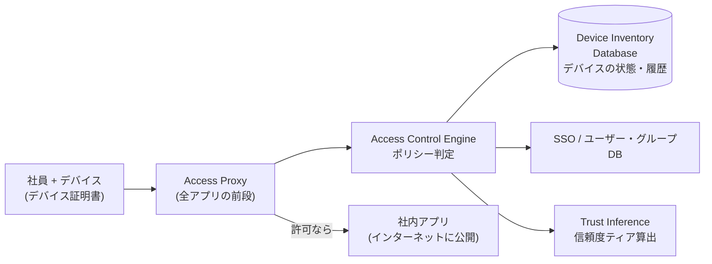

# BeyondCorp

Googleが自社で実践した[[zero-trust|ゼロトラスト]]の実装。「社内ネットワークにいること」を特権にせず、**社内アプリをすべてインターネットに公開した上で、ユーザーとデバイスの信頼度でアクセスを判定する**構成に全社移行した。2014〜2018年に6本の論文として公開され、ゼロトラストが「理念」ではなく「大企業で実際に回る」ことを示した事例として影響が大きい。

- 発端は2009年の**Operation Aurora**（Googleを含む多数の企業が受けた標的型攻撃）。境界の内側が侵害される前提に立った再設計が始まった
- 帰結として**社員はVPNを使わない**。カフェのWi-Fiからでもオフィスからでも、同じ経路・同じ検証でアクセスする（オフィスのLANにいても信頼は上がらない）

## アーキテクチャの構成要素

- **Device Inventory Database**: 全デバイスの構成・パッチ状態・履歴を集約する台帳。BeyondCorpの土台で、論文でも構築が最も大変だった部分として語られる
- **デバイス証明書**: デバイスの識別子（[[mtls|mTLS]]クライアント証明書の用法）。「管理されたデバイスか」を暗号学的に確認する
- **Trust Inference**: デバイス状態とユーザー情報から**信頼度ティア**を動的に算出。パッチ未適用ならティアが下がり、アクセスできるアプリが減る——[[zero-trust|NIST SP 800-207]]の「動的ポリシー」（原則4）の原型
- **Access Proxy**: 全社内アプリの前段に立つリバースプロキシ。認証（SSO）・デバイス確認・ポリシー判定をここで一元化し、通過したリクエストにユーザー情報を付けてアプリに渡す——**アイデンティティ認識型プロキシ（IAP）**というカテゴリの原型
- **Access Control Engine**: 「誰が・どのデバイスで・どの信頼度ティアで・どのアプリに」のポリシーを評価する中枢

## 後続への影響

- Access Proxyの形はそのまま製品カテゴリになった: Google CloudのIdentity-Aware Proxy、[[cloudflare-zero-trust|Cloudflare Access]]、その他ZTNA製品群はいずれもこの構図（前段プロキシ＋IdP＋ポリシー）
- Google自身の製品化はBeyondCorp Enterpriseとして提供され、現在は**Chrome Enterprise Premium**に統合されている（ブラウザをエンドポイントの制御点として使う方向）
- 教訓として引用されがちな点: 技術より**デバイス台帳の整備と移行プロセス**が本体だったこと（トラフィック分析で影響ゼロを確認しながら段階的にネットワーク特権を剥がしていった）。ゼロトラスト移行は製品導入ではなく運用改革、という[[zero-trust]]の注意書きの実例

## [[web-auth-moc|Webアプリ認証認可MOC]]の中での位置づけ

[[zero-trust]]の概念に「実在する完全な実装例」を与える歴史ノート。個人規模での同型の体験は[[cloudflare-zero-trust]]。

## 出典

- [BeyondCorp: A New Approach to Enterprise Security（論文1本目）](https://research.google/pubs/beyondcorp-a-new-approach-to-enterprise-security/)
- [BeyondCorp: The Access Proxy](https://research.google/pubs/beyondcorp-the-access-proxy/)
- [Google Cloud: BeyondCorp](https://cloud.google.com/beyondcorp)
- [Wikipedia: BeyondCorp](https://en.wikipedia.org/wiki/BeyondCorp)

#ゼロトラスト #セキュリティ #google
