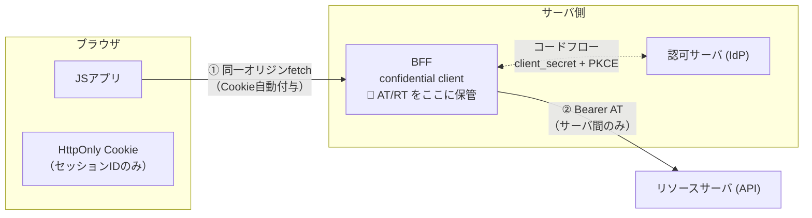
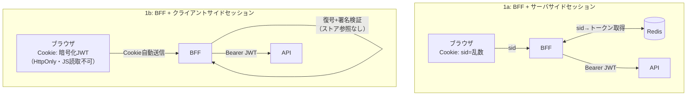

# BFFパターン（認証のBackend For Frontend）

[[oauth-browser-based-apps|IETFのブラウザアプリ向けOAuthドラフト]]のパターン1（§6.1）。トークンを**一切ブラウザに出さない**構成。BFFがconfidential clientとしてOAuthフローを実行し、トークンをサーバ側に保管。ブラウザはHttpOnlyセッションCookieのみ持ち、リソースサーバへのアクセスは全てBFF経由（プロキシ）。

- **守れるもの**: トークン窃取／リフレッシュトークン悪用／サイレントなトークン再取得攻撃を全て防ぐ
- **残るリスク**: [[xss-token-theft|XSS]]によるセッション相乗り（BFF側で異常検知・即時失効が可能）。また Cookie認証ゆえ[[csrf|CSRF]]対策が**MUST**
- **コスト**: サーバコンポーネントの運用、全リクエストのプロキシ

## セッション管理の2方式（1a / 1b）

ドラフト§6.1はBFFのセッション管理として**サーバサイドセッションとクライアントサイドセッションの両方**を明示的に認めている。パターンの分類軸は「OAuthトークンがブラウザのJSから見えるか／誰がBearerヘッダを付けるか」であり、保管がRedisかCookieかではない——**どちらも同じパターン1**。

1bの詳細は[[stateless-session]]。1aと1bの選択を決めるのは失効特性（[[token-revocation]]）:

| | 1a: Redisセッション | 1b: JWT in HttpOnly Cookie |
|---|---|---|
| XSSでの持ち出し | 不可 | 不可（**同等**） |
| XSSでのセッション相乗り | 可（生存セッション内） | 可（**同等**） |
| CSRF対策の要否 | 必要 | 必要（**同等**） |
| ストア（Redis）依存 | あり | **なし** |
| **即時失効** | **可（削除一撃）** | **不可**（expまで有効） |
| 権限変更の反映 | 即時 | 再発行まで反映されない |
| サイズ制限 | なし | Cookie上限 約4KB |
| 鍵管理 | 不要 | 署名・暗号鍵のローテーション設計が必要 |
| リクエスト毎のコスト | Redis往復（〜1ms） | 復号＋署名検証（CPUのみ） |

## 1aと1bが「同じ安全度」である理由

「HttpOnlyでもJWT本体を渡す1bは、引換券だけ渡す1aより危ないはず」という直感は誤り（[[session-id-vs-jwt]]の危険度3要素参照）。

- 1bでブラウザに置かれるのは生のJWTではなく**暗号化された封筒（JWE）**。ドラフトは「SHOULD encrypt its cookie contents」を要求。開けられるのは復号鍵を持つBFFだけで、攻撃者から見れば中身の読めないバイト列——**乱数のsidと区別がつかない**
- この封筒Cookieを受け付けるのは**BFFだけ**。APIはこのCookieを受理しない
- つまりCookieを盗まれた瞬間にできることは1a/1bで**完全に同一**（BFFへの全権）。差は「盗まれた後、止められるか」（失効性）だけ

サーバ側侵害の弱点も対称: 1aは**Redisの中身**（全ユーザーの生トークン）が金庫、1bは**Cookie暗号鍵**が金庫。どちらもcrown jewelが1つある。

## Cookie属性の実装規律

`Secure` / `HttpOnly` / `SameSite=Lax`以上 / `Path=/` / `Domain`属性は付けない（ドラフトのMUST/SHOULDに準拠）。ログイン時にセッションID再生成（session fixation対策）、ログアウト＝サーバ側セッション削除（Cookie削除だけで済ませない）。

## [[web-auth-moc|Webアプリ認証認可MOC]]の中での位置づけ

機微データを扱うWebアプリの第一推奨構成。Next.jsでの実装上の落とし穴は[[nextjs-token-exposure]]、採否の判断枠組みは[[browser-token-tradeoff]]。

## 出典

- [OAuth 2.0 for Browser-Based Applications draft-26 §6.1](https://www.ietf.org/archive/id/draft-ietf-oauth-browser-based-apps-26.html)

#認証認可 #oauth #bff
