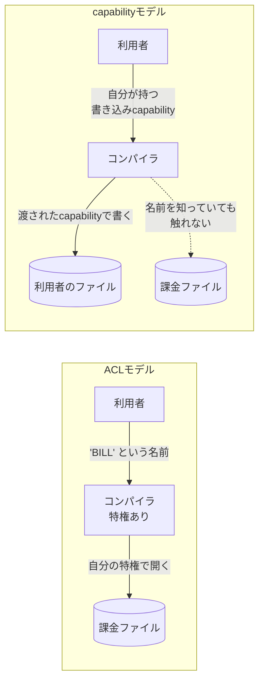

# capabilityベースのセキュリティ

権限を「誰が何にアクセスしてよいか」の表（ACL）で判定するのではなく、**持っているだけで行使できる偽造不能な参照**——capability——を渡すことで管理する方式。capabilityは「communicable, unforgeable token of authority（受け渡し可能で偽造不能な権限のトークン）」と定義される。

起源は古く、Dennis と van Horn の1966年の論文まで遡る。長らくOS研究の世界の話だったが、AIエージェントに権限を持たせる設計の文脈で改めて参照されるようになっている（[[cloudflare-os]]が明示的にこのモデルを採っている）。

## ACLとの根本的な違い: 指定と権限を分離しない

capabilityの世界の標語は「**don't separate designation from authority**（指定と権限を切り離すな）」。

| | ACL | capability |
|---|---|---|
| 権限の在り処 | 対象の側に「誰が何をしてよいか」の表がある | **参照そのもの**が権限 |
| 呼び出し側がすること | 対象を**名前**で指定する（`/etc/passwd`） | 対象を**参照**で指定する（fd、stub） |
| 主体の権限 | 主体の身元に紐づき、常に背景で効いている（**ambient authority**） | 明示的に渡されたものだけ |
| 権限の委譲 | 表を書き換える | 参照を渡すだけ |

ACLでは「対象を名指しする行為」と「その対象に触る権限」が別物なので、名前さえ言えれば、自分が持っている権限の**全部**が発動しうる。これがambient authority（周囲に漂う権限）で、後述のconfused deputyの原因になる。

## confused deputy: ambient authorityの帰結

Norm Hardyが1988年の "The Confused Deputy" で書いた例。

- `SYSX`という特権ディレクトリにFortranコンパイラ`FORT`が置かれている。置き場所の都合で、`FORT`はそのディレクトリ内の全ファイルに書き込めた。その中には課金ファイル`BILL`も含まれる
- `FORT`はデバッグ出力の書き出し先をコマンドライン引数で受け取る
- 利用者が書き出し先に`BILL`を指定すると、課金ファイルが壊れる

`FORT`は悪意なく動いている。問題は、`FORT`が**2つの出所の権限**（自分自身が持つ特権と、依頼者のために行使すべき権限）を混同していること。ファイル名という「ただの文字列」を受け取った時点で、それがどちらの権限で開かれるべきかを区別する情報が失われている。これが「混乱した代理人」。

capabilityモデルだと、依頼者は**開ける権利そのもの**（capability）を渡す。コンパイラは名前を解決せずそのcapabilityに書くだけなので、依頼者が持っていない権限が発動する余地がない。「capabilityシステムはconfused deputyを防ぐが、ACLベースのシステムは防がない」という整理がよくされる。

## POLA（最小権限の原則）

Principle of Least Authority。各主体には、その仕事に必要な権限だけを与える。ACLでも理念としては言えるが、ambient authorityがある環境では「必要な分だけ」を表現する手段がない（プロセスは実行ユーザーの全権を引き継いでしまう）。capabilityは**渡さなければ持たない**が既定なので、POLAが構造的に実現される。

## 実装例

- **Unixのファイルディスクリプタ** — 一度openしたfdは、パスの権限チェックを再度通らずに使える。「名前」ではなく「参照」で対象を持つという点でcapabilityに近い性質を持つ、と昔から指摘されてきた
- **Capsicum**（FreeBSD） — そのfdの性質を徹底したサンドボックス機構。capability modeに入るとプロセスは**グローバル名前空間（ファイルシステムのパス、PID等）へのアクセスを失い**、既に持っているfdだけが権限になる。fd自体にも細かい権利（rights）を付けられる
- **seL4** — capabilityベースのマイクロカーネル。あらゆるオブジェクトへのアクセスが適切なcapabilityによって認可される必要がある。形式検証されている
- **object-capability model (ocap)** — オブジェクト指向言語の上でこれをやる。オブジェクト同士はメッセージパッシングでしか相互作用せず、参照は偽造できない。[[capnweb|Cap'n Web]]やCap'n Protoはこの系譜で、Cap'n Protoを土台にプラットフォーム全体をcapabilityで作った実例が[[sandstorm]]

## AIエージェントの文脈で再浮上している理由

エージェントは**その場でコードを書いて実行する**。何をするか事前に列挙できない主体に、事前定義のACLで権限を与えるのは筋が悪い。[[cloudflare-os]]のREADMEはこれを「エージェントに適したsecurity modelはACLではなくcapabilityベースだ」と直截に書いている。

具体的な現れ方:

- **[[mcp|MCP]]サーバの一般的な設定は逆側にある** — 起動時に全サーバを繋いでおく形なので、どのチャットでも全サービスへの広いアクセスが常時ambientに効く。Cloudflare OSはこれを「introduction（紹介）」モデルに置き換え、その仕事に必要なリソースだけを都度渡す
- **[[dynamic-workers|Dynamic Workers]]のbindings** — サンドボックスに渡すのはURLやAPIキーではなくstub。Cloudflareのドキュメントは「stubs have no global identifier and cannot be forged（stubにはグローバルな識別子がなく、偽造できない）」と書いていて、これはcapabilityの定義そのもの
- **[[code-mode|Code Mode]]のサンドボックス** — 既定でネットワークを遮断し、渡された名前空間経由でしか外に出られない

## 既存の議論との接続

[[session-id-vs-jwt]]で整理した「reference（サーバ側の状態を指すだけ）vs capability（持っているだけで行使できる）」の軸は、まさにこの話。JWTのようなbearer tokenは典型的なcapabilityで、だからこそ**漏洩が即座に権限の獲得になる**（[[xss-token-theft]]）。

ただしocapの立場から見ると、bearer tokenの問題はcapabilityであること自体ではなく、**1つのトークンに広すぎる権限を載せ、それを広い範囲に配ってしまう**運用のほう。[[oauth-token-exchange]]で権限を絞ったトークンに交換してから下流に渡す、[[bff-pattern|BFF]]でブラウザにトークンを置かない、といった設計はPOLAをbearer tokenの世界で近似する試みと読める。

## [[ai-agent-moc]]の中での位置づけ

この地図の土台。他のノートは全部、この原則の実装（[[capnweb]]・[[dynamic-workers]]のbinding・[[sandstorm]]のpowerbox）か、そこからの逸脱（事前接続の[[mcp]]）として読める。

## 出典

- [The Confused Deputy (or why capabilities might have been invented)](https://dl.acm.org/doi/10.1145/54289.871709) — Norm Hardy, ACM SIGOPS Operating Systems Review, 1988
- [Capsicum: practical capabilities for UNIX](https://www.usenix.org/legacy/event/sec10/tech/full_papers/Watson.pdf) — USENIX Security 2010
- [The seL4 Microkernel whitepaper](https://sel4.systems/About/seL4-whitepaper.pdf)
- [Capability-based security — Wikipedia](https://en.wikipedia.org/wiki/Capability-based_security)
- [cloudflare/cloudflare-os README](https://github.com/cloudflare/cloudflare-os) — エージェントにcapabilityモデルを適用する立場
- [Cloudflare Docs: Dynamic Workers — Bindings](https://developers.cloudflare.com/dynamic-workers/usage/bindings/) — stubが偽造できないという記述

#セキュリティ #アーキテクチャ #ai-agent #カーネル
