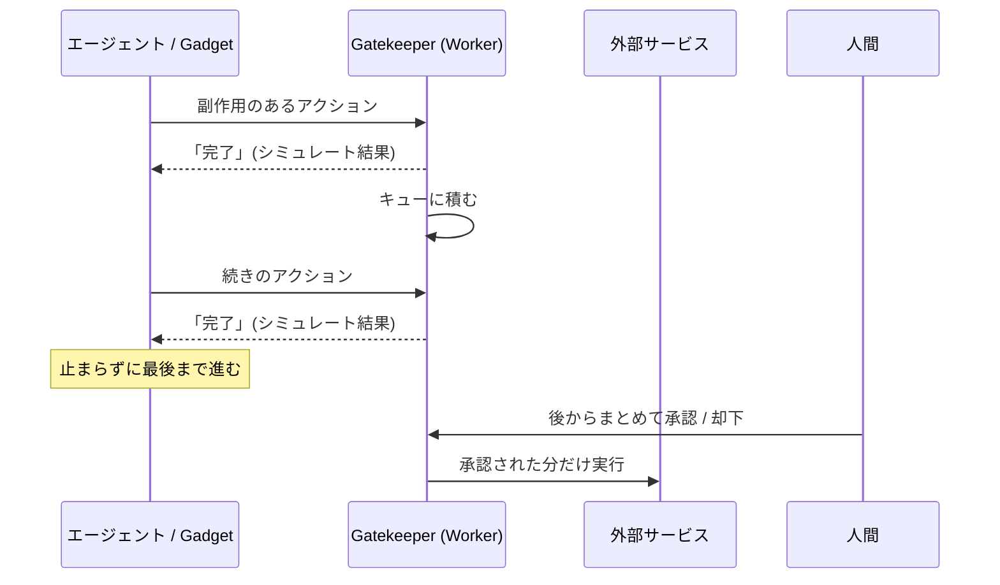

# Cloudflare OS

Cloudflareが2026年8月、Agents Weekに合わせてApache 2.0で公開したOSS。名前に「OS」と付くが、LinuxやWindowsのような従来型のコンピュータOSではなく、**社内向けのAIエージェント作業環境（agent workspace）**。[[cloudflare-workers|Workers]]の上に構築されていて、自分のCloudflareアカウントや自前サーバにデプロイして使う。

READMEの言い方では「OS」は2つの意味で使われている。

- **会社がAIで生産的に働くためのOS** — セキュリティチームが安心して眠れるやり方で
- **AIワークロードのためのOS** — 従来のOSが計算ワークロードを管理するのと同じ意味で

Cloudflare社内では実際に全社的に使われていて（エンジニアリングから営業まで）、それを外に出したもの。公開リポジトリはv1の学びを踏まえた完全な書き直しのv2で、2026年8月時点では「early access」と明記されている。

作者のKenton Vardaは公開時に「10年前の自分のスタートアップ[[sandstorm|Sandstorm.io]]のリメイクだ」と書いている。設計の由来はそちらのノートを参照。

> The idea is not that your company uses Cloudflare OS, but rather that you make it "*Your Company* OS".

## Workers / Pagesとの関係

Workers・Pagesが「自分でコードを書いて置く実行基盤」なのに対し、Cloudflare OSは**その実行基盤の上に載る一段上のプロダクト（アプリケーション）**。Workersを直接触るのではなく、ブラウザのチャットUIからエージェントに指示して文書・スライド・小さな業務アプリを作らせる。裏では[[durable-objects|Durable Objects]]やDynamic Workerが動いているが、利用者はそれを意識しない。

つまり系統としては、[[cloudflare-workers|Workers]]や[[cloudflare-d1|D1]]と横並びのインフラ製品ではなく、**Workersチーム自身がWorkersで書いたアプリのソースコードが公開された**もの、と捉えるのが近い。

## 3つの構成要素

1. **エージェントチャットUI** — 会社の業務知識をあらかじめ持たせた状態でタスクを頼める
2. **サンドボックス化されたアプリ開発** — 「gadget」と呼ぶ小さな個人用アプリをエージェントに作らせ、安全に共有できる
3. **Gatekeepers** — エージェントとアプリの両方にガードレールをかけるセキュリティ機構

## Gadget: 1ユーザー1インスタンスのアプリ

Cloudflare OSの中心概念。スライドを作るとき、クラウド上のSaaSを呼び出すのではなく、**自分専用のスライドアプリのインスタンスが生成される**。これがgadget。他人のスライドとは別のサンドボックスで動く。

READMEが挙げる帰結は2つ。

- スライドアプリにセキュリティバグがあっても、他人に自分のスライドが漏れる経路が構造的にない（サンドボックスが全アクセスを制御する）
- コードを自由に書き換えられる。機能が足りなければエージェントに追加させればよく、1点目のおかげでそれをやっても安全

過去25年のクラウド／SaaSの前提（中央でホストされた1つのアプリを全員が使う）からの大きな転換だと位置づけられている。「誰もがエージェントに頼んで必要な機能を足せるなら、ソフトウェアを中央集権化するモデルは意味を失う」という立て付け。

体験としてはオンラインオフィススイート（Google Docs等）に近い。ただしファイル種別が固定（文書・表計算・スライド）ではなく、**1ファイル＝1つの独自アプリ**になりうる点が違う。

### Blueprint: コードのほうを配る

作ったgadgetが他人にも役立ちそうなとき、gadget本体ではなく**Blueprint**（コードのスナップショット）を共有する。受け取った側は自分のコピーを新規に作る。

- 中身は「gadgetのcommit済みYjsドキュメントのスナップショット」＝ソースコード＋必要なbinding情報＋タイトル等のメタデータ
- **含まれないもの**: SQLiteストレージ、チャット履歴、実際の資格情報。bindingは「どういう接続が必要か」の構造だけが記録される
- 1つのgadgetから異なるコードバージョンの複数Blueprintを作れる。IDはサーバ生成の128bit乱数（同梱Blueprintは`format.document`のような可読ID）
- 共有は`https://<host>/blueprint/<blueprint-id>`のリンク。メタデータは未認証でも見えるが、gadget作成にはログインが要る

従来のWebアプリ配布が「作者がサーバでホストし、利用者が繋ぎに行く」形なのに対し、Blueprintはモバイルアプリ／PCアプリに近い「各利用者が自分のコピーを動かす」形。個人開発者がオンラインサービスを維持し続ける必要がなくなる点と、利用者側がAIで勝手に直せる点の両方が狙い。

## Gatekeeper: capabilityベースのセキュリティ層

READMEいわく「supercharged [[mcp|MCP]] servers」。エージェントやgadgetを外部リソースに繋ぐとき、そのアクセスを管理するGatekeeperが作られる。サービスごとに専用のソフトウェアで、役割は次の通り。

- そのサービスのネイティブAPIをラップして、綺麗な[[capnweb|Cap'n Web]] APIを提供する
- 認可（OAuth等）を処理する
- **利用者が意図した特定のリソースだけ**に絞ってアクセスさせる
- gadget／エージェントの全アクションをログに残す
- 副作用のあるアクションについては、人間に承認／拒否の機会を与える（human in the loop）

実装上は**Gatekeeperごとに別のWorker**。リポジトリにはGitHub / Google / Cloudflare / Supabase / Notion / Confluence / Email Workers / Home Assistant / Slack / Spotify / ZoomInfo のGatekeeperが同梱されている。

### 非同期のhuman-in-the-loop

Gatekeeperで一番面白いのがここ。従来のhuman-in-the-loopは**同期的**で、エージェントが承認待ちで止まる。席を外して戻ってきたら最初のステップの承認待ちで何も進んでいない、という事態になり、結果として利用者が自動承認や`--dangerously-skip-permissions`に流れてしまう。

Gatekeeperの方式はこう。

1. 承認が要るアクションが来たら、Gatekeeperが**ローカルでその結果をシミュレートする**
2. エージェントには「完了した」と伝え、結果を読み返そうとしたらシミュレート結果を返す
3. エージェントはそのまま先に進み、アクションをキューに積んでいく
4. エージェントの作業が終わった後、利用者が都合のいいタイミングで、まとめて／個別に承認・却下する



### introduction（紹介）モデル

エージェントもgadgetも、既定では**何にもアクセスできない**（[[capability-security|capabilityベースのセキュリティ]]）。ワークスペースに外部アカウントを設定してあっても、自動では使えない。使わせたいリソースを都度「紹介（introduce）」する必要がある。

- リンクを貼る、あるいはUIから「add resource」で選ぶ
- エージェント側から「これが要る」と紹介を要求することもでき、人間が許可／拒否する

[[mcp|MCP]]サーバを事前に設定しておく一般的なエージェントハーネスでは、全チャットで全サービスへの広いアクセスが常時（ambientに）与えられてしまう。それに対し、紹介モデルは**その仕事に必要な分だけ**にエージェントを縛る。[[session-id-vs-jwt|reference vs capability]]の議論と同じで、「持っているだけで行使できる」ものをどこまで配るかの設計。

### サンドボックスの実装

gadgetは既定でインターネットに一切出られない。

- **サーバ側**: インターネットアクセスを無効化した[[dynamic-workers|Dynamic Worker]]上で動く。明示的に指定した外部リソースとだけ、Workers Bindings経由で通信できる
- **クライアント側**: サンドボックス化されたiframe。親フレームへの`postMessage()`越しのCap'n Web RPCセッションでしか自分のサーバと話せない。それ以外はCSPとiframe sandbox属性でブラウザが許す限り遮断

## 「実際にOSっぽい」対応関係

READMEにある対応表。

| 普通のOS | Cloudflare OS |
|---|---|
| カーネル | `packages/workshop-backend` |
| デバイスドライバ | `packages/gatekeeper-*` |
| シェル | `packages/workshop-frontend` |
| プロセス | gadget |
| 実行ファイル | blueprint |
| ユーザー | ユーザー |
| ACL | 共有パーミッション |
| ??? | エージェント |

バックエンドは実際にカーネル的な仕事をしている——ユーザーをプログラムとデバイス（gadgetとGatekeeper）に繋ぎ、アプリをサンドボックス化してアクセス制御を強制する。Gatekeeperが外部サービスへの接続を担うのはドライバがデバイスを担うのと同じ、という見立て。

最後の行（従来OSに対応物がない「エージェント」）がこのプロジェクトの主張で、**AIエージェントは単なるユーザーとして扱えない**という立場を取る。エージェントは人間のユーザーに対して説明責任を負いつつ、それ自身の制限された権限を持つ必要がある。そしてエージェントはその場でコードを書いて実行するので、適した security model はACLではなく**capabilityベース**（[[capability-security]]）である、と。

## アーキテクチャ: Workersの最先端機能の実地デモ

Workersチーム自身が書いていて、Dynamic WorkersやFacetsなど**いくつかの機能はCloudflare OSのためにランタイムへ追加された**とREADMEに書かれている。「Workersランタイムチームが考えるWorkersの使い方」を読むのに良い題材、という位置づけ。

- ワークスペース1つ＝1つの[[durable-objects|Durable Object]]
- gadget 1つ＝1つの[[dynamic-workers|Dynamic Worker Facet]]
- Gatekeeperも各ワークスペースにfacetを差し込んで外部サービスへのアクセスを管理する
- gadgetのクライアント／サーバ間通信は[[capnweb|Cap'n Web]] RPCが**必須**。これによりサーバ側は自動的にエージェントから叩けるAPIになる（MCPサーバを別途書かなくてよい）
- エージェントは[[code-mode|Code Mode]]方式。ツールを呼ぶのではなく、コード片を書いてその場で実行することでタスクをこなす
- リアルタイム共同編集はDurable Objectsが土台。コーディングエージェントが頼まなくても既定で実装してしまう、と書かれている
- LLMプロバイダは`pi-agent-core`で抽象化されていて選択可能（自前ホストのモデルも含む）
- エディタはMonaco、コード同期・履歴リプレイにYjs、開発ループにVite

## 動かす

```sh
pnpm run-local   # http://localhost:8787
```

これでwrangler + workerdでスタック全体がローカルで動く（データは`.wrangler/`以下）。本番用ではない。

自分のCloudflareアカウントへのデプロイは`https://os.cloudflare.app/deploy`のオンラインフロー、より作り込む場合は`cloudflare-os-starter`リポジトリを使う。starterのREADMEによると、アカウント側で必要なものは:

- Workers / KV / [[cloudflare-r2|R2]] / Browser Rendering / Dynamic Worker Loaders
- Workers AI と AI Gateway（既定のモデルカタログ用。無効化すれば任意）
- Node.js 24.19+ / pnpm 11.17 / TypeScript 7
- ホスト名設定用のCloudflareゾーン

サインインは[[cloudflare-zero-trust|Cloudflare Access]]の**self-hostedアプリケーション**として設定し、そのaudience tagを`deployment.jsonc`に書く。つまり認証は自前実装ではなくAccessに寄せる構成になっている。

自前サーバでのセルフホストは、workerd（OSSのWorkersランタイム）の上で動く前提ではあるものの、ドキュメントとツールは「COMING SOON」。

なお外部コントリビューションは現時点では受け付けていない方針が明記されている（数行程度の明確な修正は可）。

## [[cloudflare-moc]]の中での位置づけ

MOCの2系統（Zero Trust系 / Workers系）のどちらでもなく、**Workers系の上に載るアプリケーションの実例**という第3の層。個人開発の文脈では「Workersでこういうものが作れる」というリファレンス実装として読む価値がある。

## [[ai-agent-moc]]の中での位置づけ

この地図の実例。このノートから切り出した要素技術が、そのまま地図の構成要素になっている。

- [[dynamic-workers]] — gadgetを隔離して動かす実行基盤（Worker Loader / Durable Object Facets）
- [[capnweb]] — gadgetのクライアント／サーバ間通信であり、Gatekeeperが露出するAPIの形式
- [[code-mode]] — エージェントがコードを書いて実行する方式
- [[capability-security]] — Gatekeeperと紹介モデルの背景にある考え方
- [[mcp]] — Gatekeeperが「supercharged MCP servers」を名乗る相手
- [[sandstorm]] — 作者自身による前身。gadget＝grain、紹介＝powerbox

## 出典

- [cloudflare/cloudflare-os README](https://github.com/cloudflare/cloudflare-os) — 一次情報。本ノートの記述の大半はここから
- [docs/blueprints.md](https://github.com/cloudflare/cloudflare-os/blob/main/docs/blueprints.md) — Blueprintの仕様
- [cloudflare/cloudflare-os-starter README](https://github.com/cloudflare/cloudflare-os-starter) — デプロイ要件
- [Cloudflare OS: an open platform for agents, apps, and work](https://blog.cloudflare.com/cloudflare-os/) — 発表ブログ
- [Cloudflare OS Is the First AI Workspace Built Around How Companies Actually Work](https://www.cloudflare.com/press/press-releases/2026/cloudflare-os-is-the-first-ai-workspace-built-around-how-companies-actually-work/) — プレスリリース

#cloudflare #ai-agent #セキュリティ #アーキテクチャ
