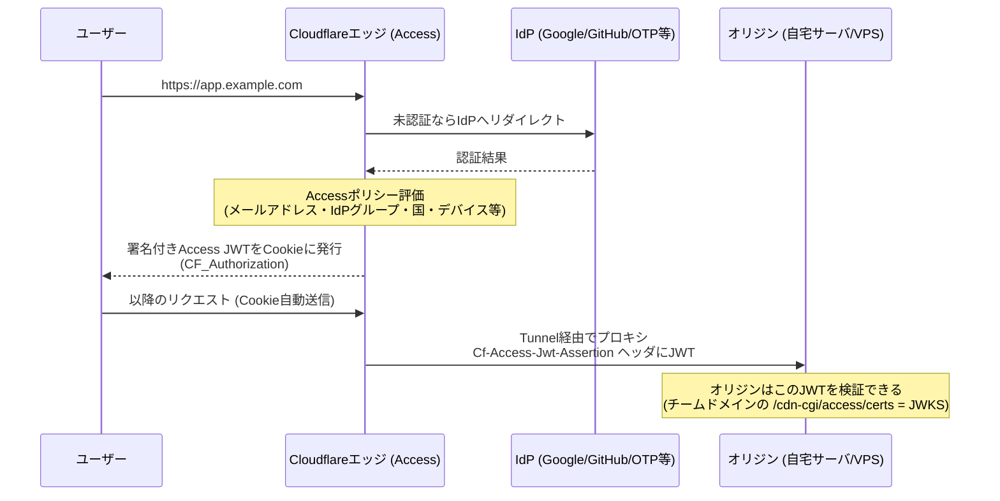

# Cloudflare Zero Trust

[[zero-trust|ゼロトラスト]]をマネージドサービスとして提供するCloudflareの製品群（SASEプラットフォーム「Cloudflare One」の一部）。個人開発・自宅サーバの文脈では「**ポートを一切開けずにアプリを公開し、前段でユーザー認証をかける**」構成が無料枠で組めるのが実用的。

## 主要コンポーネント

| コンポーネント | 役割 |
|---|---|
| **Access** | アイデンティティ認識型プロキシ（ZTNA）。アプリの前段で認証・ポリシー評価 |
| **Tunnel**（cloudflared） | オリジンから**アウトバウンド専用**の接続をCloudflareエッジに張るコネクタ。インバウンドのポート開放が不要になる |
| **Gateway** | DNS/HTTPフィルタリング（Secure Web Gateway）。デバイスからの外向き通信を検査 |
| **WARP** | デバイス側クライアント。Gatewayへのトラフィック送出やプライベートネットワークへの到達に使う |

## Accessの仕組み（リクエストが通る道）

- IdPはGoogle・GitHub・任意の[[oidc|OIDC]]/SAML IdPを接続できるほか、IdPなしのOne-time PIN（メールでコード送付）も使える
- Accessが発行するのは署名付きJWTで、オリジン側はチームドメインの`/cdn-cgi/access/certs`（[[jwks-key-rotation|JWKS]]）で検証できる。構造は[[oauth-resource-server|OAuthリソースサーバ]]の検証（署名・iss・aud・exp）と同型
- 人間以外のクライアント（CI・スクリプト）には**サービストークン**（`CF-Access-Client-Id`/`CF-Access-Client-Secret`ヘッダ）を払い出せる。[[oauth-client-credentials|client_credentials]]のAccess版に相当

## Tunnelがゼロトラスト的である理由

`cloudflared`をオリジンで動かすと、オリジン→Cloudflareへの**アウトバウンド接続だけ**でトラフィックを受けられる:

- ルータのポート開放・固定IP・動的DNSが不要。オリジンのIPはインターネットに露出しない（スキャンでも見つからない）
- 「境界の穴（開放ポート）を守る」のではなく「境界に穴を開けない」構成——[[zero-trust|ZTNA]]の「アプリ単位で到達経路を作り、それ以外は見えもしない」の実装
- NAT越え問題も同時に解決するので、自宅サーバ・ラボ環境と相性がよい

## 個人開発での定石構成

1. ドメインをCloudflareに載せ、オリジンで`cloudflared`を起動して`dev.example.com`をTunnelにルーティング
2. Zero TrustダッシュボードでAccessアプリケーションを作り、ポリシー「自分のメールアドレスのみ許可」を付ける
3. 開発サーバ・管理画面・Grafana・自宅NASのWeb UIなどが「HTTPSで公開されているが自分しか入れない」状態になる

⚠️ **バイパス経路を残さない**こと。オリジンにTunnel以外の経路（直接届くグローバルIP・開放ポート）が残っていると、Accessは素通しされる。対策は①そもそもTunnel専用にしてリッスンをlocalhostに絞る、②オリジン側でも`Cf-Access-Jwt-Assertion`のJWT検証を行う（[[zero-trust|ゼロトラスト]]の「前段を信頼しすぎない」の実践）、③オリジンをCloudflare経由の接続しか受けない設定にする（Authenticated Origin Pulls、[[mtls]]参照）。

料金（2026年8月時点）: Zero Trustは**50ユーザーまで無料**（クレジットカード不要・期間制限なし）。無料枠はログ保持24時間などの制約はあるが、Access・Tunnel・Gatewayの中核機能は使える。超過後は$7/ユーザー/月のPay-as-you-go。

## [[web-auth-moc|Webアプリ認証認可MOC]]の中での位置づけ

[[zero-trust]]の概念を個人規模で体験できる実装（元祖は[[beyondcorp]]のAccess Proxy）。認証を自作せずアプリの前段に外付けする点で、[[bff-pattern|BFF]]がアプリ内でやることの「インフラ版」。コードごとCloudflareのエッジに置く選択肢は[[cloudflare-workers]]。Cloudflare製品群の全体像は[[cloudflare-moc]]。

## 出典

- [Cloudflare One docs](https://developers.cloudflare.com/cloudflare-one/)
- [Cloudflare Docs: Validate Access JWTs（Cf-Access-Jwt-Assertionとcerts）](https://developers.cloudflare.com/cloudflare-one/access-controls/applications/http-apps/authorization-cookie/validating-json/)
- [Cloudflare Docs: Service tokens](https://developers.cloudflare.com/cloudflare-one/identity/service-tokens/)
- [Cloudflare: Zero Trust plans](https://www.cloudflare.com/plans/zero-trust-services/)

#cloudflare #ゼロトラスト #個人開発 #セキュリティ
