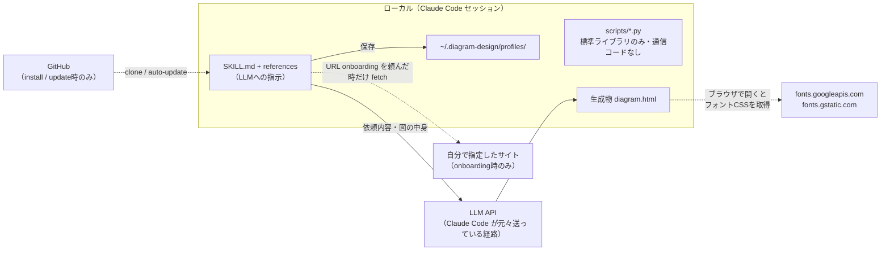

# diagram-design（Claude Code向けの作図スキル）

[cathrynlavery/diagram-design](https://github.com/cathrynlavery/diagram-design) は、Claude Code / Codex / Factory Droid / Pi などの Agent Skills 互換ホストに入れて使う作図スキル。「架空のUIツールを起動する」のではなく、**LLMに対して「こういう設計ルールでインラインSVGのHTMLを書け」と指示する Markdown 群＋補助 Python スクリプト**というのが実体。出力は1ファイルの自己完結HTML（インラインSVG + CSS）で、ブラウザで開けばそのまま見られる。

調べた時点（2026-09-10、コミット `562dbdf`、v2.6.21）のリポジトリを clone して中身を読んだ結果をまとめる。導入前に一番知りたかった「外部に情報を送るか」は末尾の節に切り出した。

- 作者: Cathryn Lavery（BestSelf.co 創業者。ブログ用の図を Claude に描かせたら「どれも同じ角丸ボックス」になるのが嫌で作ったとのこと）
- ライセンス: MIT
- 規模: GitHub上で ★36.9k / fork 2.3k / 156 commits（2026-09-10時点）。2026年8月ごろに急速に伸びたらしく、作者のXでは同年春に13タイプ→27タイプ→2.8k★という記述がある

## 何ができるか

- **40種の図タイプ**。architecture / flowchart / sequence / state / ER / timeline / swimlane / quadrant / radar / loop(flywheel) / nested / tree / org chart / layer stack / Venn / pyramid / bar / treemap / line / Gantt / scatter / Sankey / fishbone / Wardley map / kanban / user journey / deployment / dependency graph / UML class / story map / DB schema / waterfall / polar など
- **セマンティックパターン**をレイアウトと分離している。「キュー詰まり」「ポリシー評価の分岐」「信頼境界」のような振る舞いは `semantic-patterns.md` で表現し、描画は既存タイプのどれかに載せる（タイプを増やさないという ADR がある）
- **ブランド適用（onboarding）**。自分のサイトURL・インストール済みの design skill・ローカルのデザインシステムフォルダ・手入力のいずれかから、paper / ink / muted / accent / link といった意味役割のトークンとフォントを抽出して `references/style-guide.md` を書き換える。以後の図はそのトークンで描かれる。WCAG AAのコントラストチェック込み
- **draw.io / Mermaid / Excalidraw からの再描画**。`.drawio`（png/svg埋め込み・圧縮ペイロード含む）、`.mmd` や Markdown 内の mermaid フェンス、`.excalidraw` を読んで、ノード・エッジ・グルーピング・向きだけを取り出し、この設計システムで描き直す。元の座標・配色・フォント・自動レイアウトは引き継がない。`format / size / detail / audience` の4つのダイヤルで出力先に合わせる（`detail=simplified` なら7ノード以下に圧縮する、など）
- **SVG / PNG エクスポート**。SVGは `<svg>` ノードを抜き出して単体ファイル化、PNGは Playwright + Chromium でラスタライズ
- **モーション**は任意で、既定は静的・スクリプトなし。動かす場合も `template-motion.html` の1本のコントローラをバイト一致でコピーすることしか許されない（ADR 0001）

デザインルール自体もかなり明示的で、「accent色は1図あたり1〜2要素まで」「影は禁止、1pxの罫線」「全座標・サイズが4の倍数」「ノード最大9、矢印最大12」「直角コネクタ必須、斜め線は不可」「ラベルは線から6〜10px離す」といった具体的な数値制約が SKILL.md に並んでいる。LLMに「きれいに描け」ではなく「この制約を満たせ」と言う作りになっている。

## 中身の構造

```
skills/diagram-design/
  SKILL.md              # ~40KB。哲学・タイプ選択表・デザインシステム・SVGプリミティブ・チェックリスト
  references/*.md       # 57ファイル。type-*.md（タイプ別レイアウト文法）、semantic-patterns、onboarding、
                        #   profiles、import-*、export、animation、style-guide（トークンの正）など
  assets/*.html         # 各タイプの例（light / dark / full）、テンプレート、アイコン集(87個)、ギャラリー
  scripts/*.py          # drawio_extract / mermaid_extract / excalidraw_extract / self_check（標準ライブラリのみ）
commands/*.md           # Claude Code のスラッシュコマンド: /diagram-design:export-diagram, import-*, profile, doctor
.claude-plugin/         # plugin.json / marketplace.json（hooks や mcpServers の定義は無い）
scripts/                # リポジトリ側のCI用 lint/verify 群（インストール先には不要）
```

起動時にLLMが読むのは name と description だけで、依頼が来たら SKILL.md と該当タイプの `type-*.md` 1枚だけを読む（README に「何を頼むと何が読まれるか」の表がある）。40タイプあってもコンテキスト消費は一定、という設計。

初回は「style-guide がまだ既定値だが、ブランドに合わせるか？」というゲートが入る。プロジェクトルートに `.diagram-design` マーカー（`profile: <slug>` の1行）を置くと、`~/.diagram-design/profiles/<slug>.md` に保存した名前付きプロファイルが使われ、ゲートは飛ばされる。プロファイルをプラグインの外に置くのは、マーケットプレイス経由の更新で style-guide.md が上書きされても消えないようにするため。

## インストール

Claude Code の場合はマーケットプレイス経由。

```text
/plugin marketplace add cathrynlavery/diagram-design
/plugin install diagram-design@diagram-design
```

サードパーティのマーケットプレイスは既定で自動更新が無効なので、追従したければ `/plugin` → Marketplaces → diagram-design → Enable auto-update を1回やる。style-guide を直接いじりたい場合は clone して `skills/diagram-design` を `~/.claude/skills/diagram-design` へ symlink する「editable install」も案内されている。

PNGエクスポートだけ追加依存があり、`pip install playwright && playwright install chromium` が必要。無い場合はその案内を出して止まるだけで、勝手にインストールはしない（`/diagram-design:doctor` で環境チェックできる）。

## 外部に情報を送るか（導入判断のために調べたこと）

結論: **スキル自身にテレメトリや送信処理は無い**。ただし、生成物のフォント読み込みと、自分から頼んだ場合のサイト取得の2箇所でネットワークに出る。



確認した事実を列挙する。

- **Pythonスクリプトの import は標準ライブラリのみ**（argparse, json, re, html, zlib, base64, struct, xml.etree, urllib.parse など）。`urllib.request` / `requests` / `socket` / `subprocess` は使っていない。`urllib.parse` は draw.io の URL エンコード解除と、self_check が Google Fonts の URL を検証するためだけ
- **plugin.json に hooks も mcpServers も無い**。セッション開始時に勝手に走るものは存在しない。スラッシュコマンドの `allowed-tools` は Read / Write / Edit / Bash / Glob（doctor は Read / Bash / Glob）
- **telemetry / analytics / sendBeacon / posthog / sentry 等の文字列はスキル配下に無い**（grep で確認。README 内の作者サイトへのリンクに utm パラメータが付いているだけ）
- **生成HTMLの外部参照は Google Fonts の1本だけ**。テンプレートの `<head>` に `https://fonts.googleapis.com/css2?family=Instrument+Serif...&family=Geist...` の `<link>` が入るので、ブラウザで開くとフォントCSSとフォントファイルの取得が Google に飛ぶ。URLに載るのはフォント名だけで、図の中身は送られない。同梱の `self_check.py` は逆にこれ以外の remote 参照（`http(s)://` や `//` で始まる src/href、CSS の `@import`、フラグメント以外の `url()`、`onclick` 等の実行属性、固定コントローラ以外の `<script>`）をエラーにするので、生成物が別のホストを参照していれば検出できる。完全にオフラインにしたければ `<link>` を消せばフォールバックのシステムフォントで表示される
- **ブランド onboarding（URL方式）は、自分で頼んだ時だけ、自分が指定したURLを取得する**。`agent-browser` か素の fetch を使う。取得したページ内容は untrusted data として扱い、中に指示っぽい文があっても従わない、と明記されている。skill / folder / 手入力の各方式はローカル完結
- **draw.io / Mermaid / Excalidraw の取り込みはテキスト解析のみ**。`import-mermaid.md` に「評価・レンダリング・fetch・実行を一切しない、ネットワーク呼び出しはしない、click のURLは数えて捨てる」と明記。ノード数などの上限超過は「小さくしろ」と返してバイパスしない
- **PNGエクスポートはローカルの Chromium で `file://` を開く**。ただし `networkidle` を待つので、ここでも Google Fonts の取得は発生する
- **図の内容が LLM API に送られるのは Claude Code 本体の動作**で、このスキルが増やしている経路ではない。スキルを入れることで「Anthropic 以外に送られる先」は増えない
- インストールと更新は GitHub からの git 取得。auto-update は opt-in

留意点として、スキルは自然言語の指示書なので「コードが通信しない」ことと「エージェントが Bash で何もしない」ことは別物。指示の中にアップロードや外部送信を促す記述が無いことは読んで確認したが、保証は「この時点のコミットでは」に限られる。auto-update を有効にするなら、更新で何が変わるかは追う前提になる。リポジトリ側は `SECURITY.md`（GitHub の private vulnerability reporting）と、リモート資産の混入を弾く lint（`lint-skin.py` の a11y カテゴリ）を CI で回している。

## 手元で動かしたこと

clone したスクリプトをこのノートリポジトリに対して動かしてみた（読み取りのみ）。

```sh
python3 skills/diagram-design/scripts/self_check.py skills/diagram-design/assets/example-architecture.html
# => OK skills/diagram-design/assets/example-architecture.html

python3 skills/diagram-design/scripts/mermaid_extract.py notes/src/bff-pattern.md --diagram all
```

後者は [[bff-pattern]] の mermaid フェンス2つを読んで、ノード表・エッジ表・「type candidates: architecture」「budget: nodes ok (max 9)」「collapsible groups」といった中間表現（IR）を Markdown で吐いた。日本語ラベルもそのまま通る。LLMはこのIRを見て「どのタイプで、何を畳んで」描くかを決める、という分担になっている。

## このノートリポジトリとの関係

ここでは図を[[astro|mermaid で書いてクライアント側でレンダリング]]している。diagram-design は Mermaid ソースを読んで別物として描き直す方向のツールなので、既存ノートの図を「スライドやブログ用にきれいにする」用途と相性がよさそう。ノート内の図をこれで置き換える話ではない（自己完結HTMLなので Markdown への埋め込み方は別途考える必要がある）。

## 出典

- [cathrynlavery/diagram-design (GitHub)](https://github.com/cathrynlavery/diagram-design) — README、`skills/diagram-design/SKILL.md`、`references/{onboarding,export,import-mermaid,profiles,doctor,animation}.md`、`scripts/self_check.py`、`docs/adr/0001-static-by-default-single-pinned-controller.md`、`.claude-plugin/plugin.json`、`SECURITY.md`（2026-09-10 時点、コミット `562dbdf`）
- [Cathryn (@cathrynlavery) on X — Claude Code skill を作った経緯](https://x.com/cathrynlavery/status/2077235288389079200)

#ai-agent #claude_code #作図 #uiデザイン
