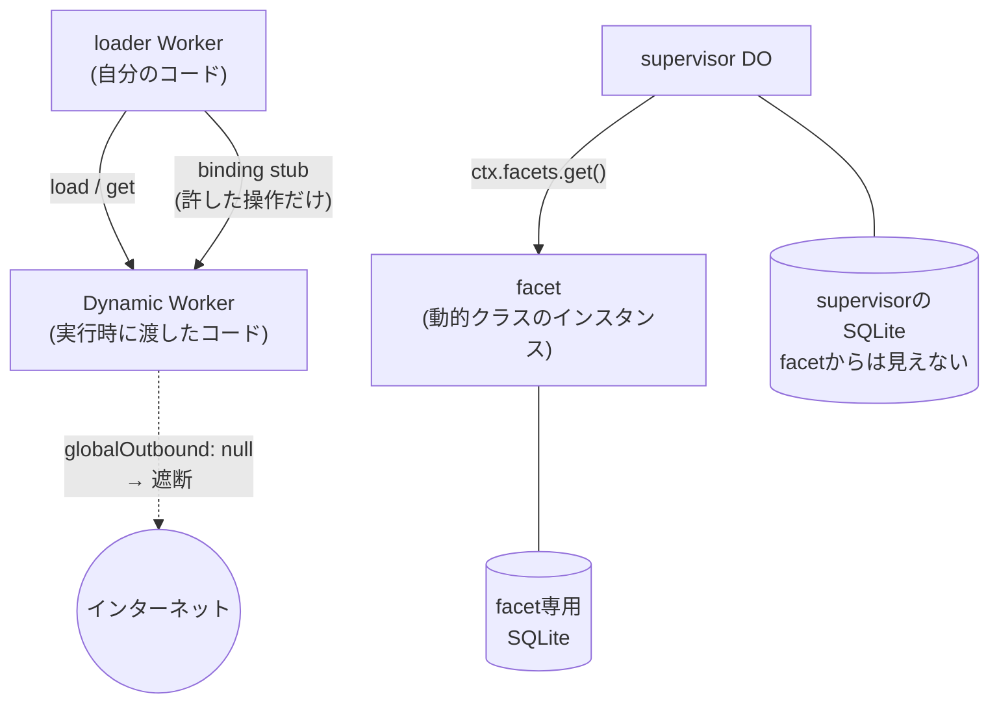

# Dynamic Workers

**実行時に決まったコードをその場でWorkerとして起動する**ための仕組み。Worker Loader bindingを通じて、親Worker（loader Worker）が任意のコード文字列を渡して子Workerを作り、呼び出す。2026年4月に発表され、Workers有料プラン向けにopen betaで提供されている。

想定されている主な用途はAIエージェントが生成したコードの実行で、実際に[[code-mode|Code Mode]]や[[cloudflare-os|Cloudflare OS]]のgadget実行基盤がこれを使っている。ユーザーがアップロードしたコードを動かすマルチテナント基盤、という使い方も挙げられている。

## isolateをサンドボックスとして直接使う

Cloudflareの主張は「AIエージェントのサンドボックスにコンテナを使うのは重すぎる」というもの。Dynamic Workersは[[cloudflare-workers|Workers]]がもともと基盤にしている**V8 isolate**をそのままサンドボックスのプリミティブとして露出する。

- isolateは数ミリ秒で起動し、数MBのメモリで済む。コンテナ比で起動が約100倍速く、メモリ効率が10〜100倍という説明
- 1回のコード片を実行して即座に捨てる、という使い捨て前提の運用ができる
- 同時サンドボックス数や作成レートに制限を設けていない（Workers本体と同じ技術基盤のため）

裏返すと制約もWorkersと同じで、動かせるのはJavaScriptとPython（TypeScriptは事前コンパイルが必要）。任意のネイティブバイナリを動かしたい用途はコンテナ側の担当。

## 使い方

`wrangler.jsonc`にloader bindingを足す。

```jsonc
{
  "worker_loaders": [
    { "binding": "LOADER" }
  ]
}
```

`load(code)`で使い捨てのWorkerを作るか、`get(id, callback)`でIDごとにキャッシュして温かい状態を使い回す。

```ts
export default {
  async fetch(request: Request, env: Env): Promise<Response> {
    const worker = env.LOADER.load({
      compatibilityDate: "$today",
      mainModule: "src/index.js",
      modules: {
        "src/index.js": `
          export default {
            fetch(request) {
              return new Response("Hello from a dynamic Worker");
            },
          };
        `,
      },
      globalOutbound: null,
    });

    const entrypoint = worker.getEntrypoint();
    return entrypoint.fetch(request);
  },
};
```

## 3つの制御軸

このAPIの本体は「コードを動かせること」より、**動かすコードに何を許すか**を細かく決められる点にある。

### 1. bindings: 渡したものだけが使える

Dynamic Workerはloader Workerが渡したbinding経由でしか外部リソースに触れない。KVやR2をテナントごとに区切って渡せるほか、**custom binding**として`WorkerEntrypoint`クラスを書き、そのstubを`env`に載せて渡せる。

- 実装の詳細（APIキー、接続先、テナントの識別子）はloader側に隠れたまま、許した操作だけが露出する
- `props`でstubごとに文脈（どのユーザーか、どのルームか）を差し込める
- ドキュメントは「stubs have no global identifier and cannot be forged」と書いていて、これは[[capability-security|capabilityベースのセキュリティ]]そのもの。渡されていない権限は名指しすらできない

例として挙がっているのは、チャットルームへの投稿だけを許すbindingを各エージェントに配る構成。エージェントはメッセージを投稿できるが、APIキーを読むこともルームを変えることも自分の名前を変えることもできない。

### 2. egress control: 既定でインターネットから切り離す

`globalOutbound`で外向き通信を制御する。

- `null`にすると、Dynamic Worker内の`fetch()`と`connect()`が例外を投げる。外に出る手段はbindingだけになる
- `WorkerEntrypoint`を渡すと、全ての外向きリクエストがそこを通る。宛先のallowlist、監査ログ、**サンドボックスに秘密を渡さずに認証情報を注入する**（loader側のenvからトークンを付与して転送する）といった処理が書ける

### 3. custom limits

CPU時間（`cpuMs`）とサブリクエスト数（`subRequests`）を実行ごとに制限できる。コード側と`getEntrypoint()`側の両方で指定でき、両方あれば**厳しい方**が採用される。超えると即座に例外。

## Durable Object Facets: 動的コードに永続ストレージを与える

Dynamic Workerに状態を持たせたいときの仕組み。動的に読み込んだクラスを、自分の[[durable-objects|Durable Object]]の**子**として動かす。

- **supervisor** — 自分でデプロイした普通のDO
- **facet** — Worker Loaderで読み込んだ動的コードが`DurableObject`を継承したクラスをexportし、そのインスタンスとして動くもの
- facetは**自分専用のSQLiteデータベース**を持つ。supervisorのDBは読めない

`this.ctx.facets`の3メソッドで操作する。

| メソッド | 動作 |
|---|---|
| `get(name, callback)` | facetを作る／再開し、リクエストを送るstubを返す |
| `abort(name, reason)` | ストレージを残したままfacetを止める |
| `delete(name)` | abortした上でfacetのDBを完全に削除する |

AI生成コードやユーザーアップロードのコードに「永続ストレージは与えるが、こちらのデータは見せない」を成立させるための道具立て。[[cloudflare-os|Cloudflare OS]]でgadget 1つがDynamic Worker Facet 1つになっているのはこれ。



## 課金

Workers有料プランに含まれるのは、月あたり1,000個のユニークなDynamic Worker・1,000万リクエスト・3,000万CPUミリ秒。超過分は「Dynamic Worker 1個あたり1日0.002ドル」「100万リクエストあたり0.30ドル」「100万CPUミリ秒あたり0.02ドル」。

課金単位が「Worker IDとコードの組み合わせ×日」なので、同じWorkerに複数回リクエストするなら`load()`ではなく**安定したIDで`get()`を使う**のが基本、とドキュメントに明記されている。CPU時間にはisolateの初期化とコードのパース時間も含まれる（I/O待ちは含まれない）。

## [[cloudflare-moc]]の中での位置づけ

Workers系スタックの中では「実行基盤そのものを実行時に組み立てる」層。[[durable-objects]]が状態の合流点を作るのに対し、Dynamic Workersは**信頼できないコードの隔離**を担う。[[code-mode]]と[[cloudflare-os]]はどちらもこの上に載っている応用。

## 出典

- [Cloudflare Docs: Dynamic Workers](https://developers.cloudflare.com/dynamic-workers/)
- [Cloudflare Docs: Dynamic Workers — Getting started / Bindings / Egress control / Limits / Pricing](https://developers.cloudflare.com/dynamic-workers/usage/bindings/)
- [Cloudflare Docs: Durable Object Facets](https://developers.cloudflare.com/dynamic-workers/usage/durable-object-facets/)
- [Sandboxing AI agents, 100x faster（Cloudflare Blog）](https://blog.cloudflare.com/dynamic-workers/)
- [Durable Objects in Dynamic Workers: Give each AI-generated app its own database（Cloudflare Blog）](https://blog.cloudflare.com/durable-object-facets-dynamic-workers/)

#cloudflare #serverless #セキュリティ #ai-agent
