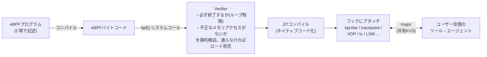

# eBPF

Linuxカーネルの中で**サンドボックス化されたプログラムを安全に動かす**仕組み。カーネルの再コンパイルもカーネルモジュールも書かずに、カーネルの挙動を実行時に拡張・観測できる。「カーネルにとってのJavaScript（ブラウザを再ビルドせずに挙動を足せる）」という喩えがよく使われる。

名前はBerkeley Packet Filter（tcpdumpのパケットフィルタ）の拡張(extended)だが、現在はパケット処理に限らない汎用の仕組みになっている。

## 仕組み

- **フック**: カーネル内のイベント発生点にプログラムをアタッチする。関数呼び出し（kprobe）、静的トレースポイント（tracepoint）、NICドライバ直後の超早期パケット処理（**XDP**）、トラフィック制御（tc）、セキュリティフック（LSM）など
- **Verifier**: ロード時にバイトコードを静的検証し、「カーネルをクラッシュ・ハングさせうるプログラム」を拒否する。これが「カーネルモジュール（バグればカーネルパニック）と違って安全」の根拠
- **maps**: eBPFプログラムとユーザー空間が共有するKVS。計測結果の受け渡しや設定の注入に使う
- CO-RE (Compile Once – Run Everywhere) / libbpf により、カーネルバージョン差異を吸収してバイナリ配布できるようになった

## 3大応用分野

| 分野 | 何をするか | 代表 |
|---|---|---|
| **ネットワーキング** | XDPでNIC直後にパケットを処理（カーネルスタックを通す前に転送/破棄）。ロードバランサ・DDoS防御・CNI | **Cilium**（Kubernetes CNI。[[service-mesh|サービスメッシュ]]機能もeBPFでサイドカーレス提供）、Katran |
| **可観測性** | カーネル・アプリの任意のイベントを本番環境で低オーバーヘッドに計測。再起動・再デプロイ不要 | **bpftrace**（awk風のワンライナーでカーネルをトレース）、BCC |
| **セキュリティ** | システムコール・プロセス挙動の監視と（LSMフックでの）強制 | Falco、Tetragon |

実際にこのリポジトリの作業環境でbpftraceを動かした記録は[[ebpf-bpftrace-experiment]]（コンテナ環境特有の躓きどころ含む）。

## 押さえておく限界

- 特権が要る（root or CAP_BPF）。コンテナ内など権限のない環境では動かせない
- Verifierの制約（プログラムサイズ・ループ・呼べるヘルパー関数の制限）があり、何でも書けるわけではない
- 「カーネルを拡張する」と言っても任意コードではなく、**検証可能な範囲の安全なコード**に限られる——その制約こそが価値

## 出典

- [ebpf.io: What is eBPF?](https://ebpf.io/what-is-ebpf/)
- [Brendan Gregg: Linux eBPF Tracing Tools](https://www.brendangregg.com/ebpf.html)
- [Cilium: eBPF-based Networking, Observability, Security](https://cilium.io/)
- [bpftrace](https://bpftrace.org/)

#ebpf #linux #カーネル #ネットワーク
