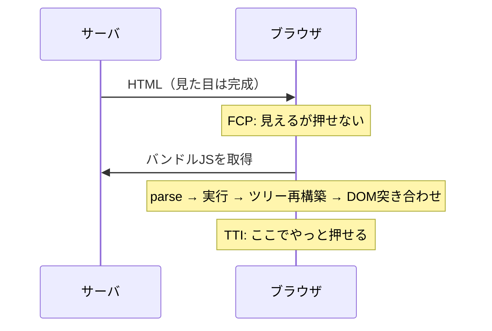

# ハイドレーション

サーバで生成した静的HTMLに対し、クライアントでJavaScriptを実行してイベントハンドラと状態を結び付け、インタラクティブにする処理。「乾いたHTMLに水を与えて動くようにする」という比喩。

## なぜ二重実行が必要になるのか

サーバがネットワークに流せるのは**文字列**だけ。`onClick={handleClick}`の`handleClick`は関数なので、HTMLに直列化できない。そのためクライアントは、サーバが実行したのと**同じコンポーネントツリーをもう一度最初から実行**し、その結果を既存のDOMノードに突き合わせて「このボタンにはこの関数」と対応付ける。

```js
import { hydrateRoot } from 'react-dom/client';
hydrateRoot(document.getElementById('root'), <App />);
```

つまりSSRは「サーバで1回、クライアントで1回」の**二重レンダリング**であり、これがハイドレーションのコストの正体。



FCPとTTIの間に開く「**見えているのに反応しない**」区間が、ハイドレーションが批判される最大の理由（uncanny valley と呼ばれる）。SSRで初期表示を速くしたつもりが、バンドルが太いとこの区間が伸びて体感はむしろ悪化する。

## hydration mismatch

Reactはクライアント側の初回レンダリング結果がサーバのHTMLと**完全に一致する**ことを前提にしている。ずれると警告が出る。

よくある原因はすべて「サーバとクライアントで値が違う」もの:

- `new Date()` / `Date.now()` — サーバとクライアントで時刻が違う
- `Math.random()`
- `typeof window !== 'undefined'`での分岐、`window.matchMedia()`でのレイアウト切替
- ロケール依存のフォーマット（`toLocaleDateString()`など）— サーバとクライアントのロケール設定が違う
- HTMLの前後に混入した余分な空白・改行

危険なのは表示崩れよりも、**イベントハンドラが誤った要素に付く**こと。Reactは開発時に警告し、本番では一部を自動回復するが、**テキスト内容のミスマッチはパッチしない**。バグとして直すべきもの。

意図的にサーバとクライアントで違う内容を出したい場合は、`suppressHydrationWarning`（警告を黙らせるだけで内容は直らない。1階層のみ有効な避難ハッチ）か、`useState`＋`useEffect`の二段階レンダリング（初回はサーバと同じものを描き、マウント後に差し替える。ただし2回描くので遅くなる）。

## ハイドレーションを削る系譜

フロントエンドのこの10年の変化は、大きく「**ハイドレーションのコストをどう削るか**」の探索として読める。

| アプローチ | やり方 | クライアントでコンポーネントを再実行するか |
| --- | --- | --- |
| 全体ハイドレーション | ページ全体を一括で | する（全部） |
| selective hydration（React 18） | Suspense境界単位で、ストリーミングSSRと組み合わせて段階的に。境界は開発者が明示するのではなくSuspenseの設計から自然に決まる | する（順序と粒度を制御） |
| 部分ハイドレーション（[[islands-architecture]]） | 開発者が`client:*`で島を明示。島ごとに独立・並列に | する（島だけ） |
| [[react-server-components]] | そもそもクライアントで動かさないコンポーネント種別を作る | しない（Server Componentは） |
| resumability（Qwik） | ハイドレーション自体を廃止 | **しない** |

resumabilityが面白いのは前提の置き換え方で、イベントリスナの位置をHTML属性に直列化しておき（`on:click="./chunk-abc123.js#handler"`のような形）、**実際にクリックされて初めて**該当チャンクをダウンロードする。起動時にツリーを走査する処理そのものが存在しない。「サーバでの実行結果を再現する」のではなく「中断した続きから再開する」という発想。

## 実装を選ぶときの軸

「そのUIはクライアントで再実行される必要があるか」を部品ごとに問うと整理できる。記事本文・ナビゲーション・フッターは再実行する意味がなく、ハイドレーションは純粋な無駄。逆にエディタやドラッグ操作は再実行が本質。この線引きを**フレームワークが自動でやるか（React 18のstreaming）、開発者に宣言させるか（[[astro|Astro]]のアイランド）、言語機能として分けるか（RSCの`'use client'`）**が各アプローチの差になっている。

## [[frontend-rendering-moc|レンダリング境界MOC]]の中での位置づけ

**なぜ境界が問題になるのか**を説明する土台のノート。アイランド・RSC・resumabilityは、どれもここで説明した二重実行のコストを削るための異なる答えとして並べられる。

## 出典

- [hydrateRoot — React](https://react.dev/reference/react-dom/client/hydrateRoot)
- [JavaScript on Demand: How Qwik Differs From React Hydration — The New Stack](https://thenewstack.io/javascript-on-demand-how-qwik-differs-from-react-hydration/)
- [Islands architecture — Astro Docs](https://docs.astro.build/en/concepts/islands/)

#フロントエンド #react #パフォーマンス #レンダリング
