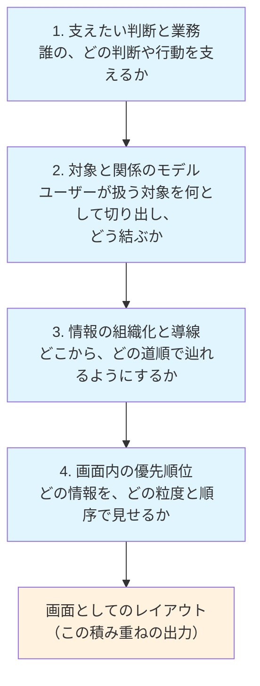
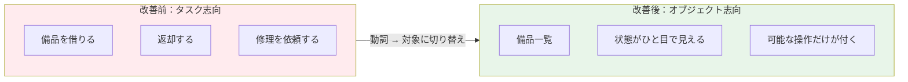
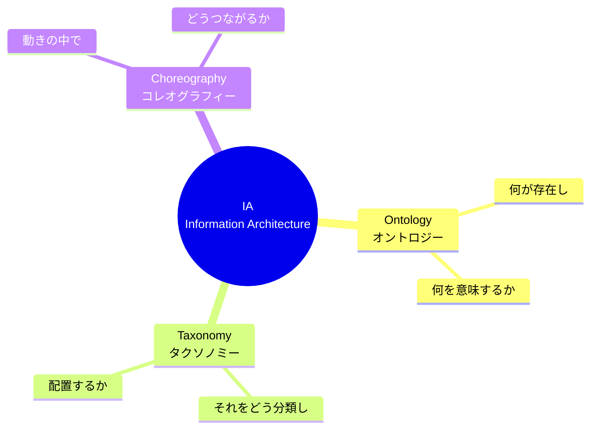

# UIをAIが作れる時代の情報設計（IA）

「UIをAIが作れる時代に、一番重要になったデザインスキルは情報設計」という記事を読んだ。フロントエンドエンジニアとしてUIを実装する側の自分には無かった視点だったので構造化して残す。

記事の主張の核: AI時代に人に残るのは「画面を描く仕事」ではなく、その手前にある**決定の連なり**。

- 誰の、どの判断を支えるのか
- ユーザーが扱う対象を何として切り出すのか
- それをどこからどう辿れるようにして、各画面では何を優先するのか

画面はこの決定の連なりの**出力**であり、決定を与えればAIが画面にしてくれる。ただし決定そのものは目的と業務の理解からしか導けない。

## 情報設計の4層モデル

記事では、狭義のナビゲーション設計ではなく、次の4層をつなぐ仕事を情報設計と呼んでいる。レイアウトより何段も手前にある。

重要なのは、意図（誰の、どの判断を支えたいか）を決める工程が独立してあるわけではないこと。「異常に気づかせたい」という意図は「異常行を先頭に出す」という**構造の選択**になって初めて画面に現れる。だから意図のデザインは情報設計から切り離せない。

そしてこの選択はセンスでは決まらないが、意図を入れれば唯一解が出る決定論でもない。**意図と利用状況と制約を判断基準に変換して、複数案のトレードオフを比較する**仕事。答えが一つに定まらなくても、なぜその案を選んだかは必ず説明できる——そういう種類のロジカルさが求められる領域。

## AIが埋めるのは「気づかれなかった判断」

AIは判断基準を渡せば反映するし、指示すれば曖昧な点の確認もしてくる。問題は、目的や判断基準を与えないまま生成を走らせたときに、**何らかの前提を勝手に補って画面を完成させてしまう**こと。

補われた前提は画面の上ではもっともらしく見えるので、そこに判断があったこと自体が見えなくなる。AIが質問できないのではなく、**何を確認させるべきかを人間側が把握していない**ことが問題の正体。

## 「判断が畳まれている場所」の3事例

記事はshadcn/uiで組んだ同じ表層の画面を、情報設計の観点で組み替える改善例を3つ挙げている。どの改善も起点は「ここに判断が畳まれている」という気づき。

### 事例1: 動詞の列挙をオブジェクトの一覧にする（OOUI）

社内備品管理を作らせると「備品を借りる」「返却する」「修理を依頼する」という動詞メニューのホーム（タスク志向UI）がよく出てくる。対象である備品そのものが画面に出てこないので、借りる前に状態を見比べられず、どの操作も入口フォームからやり直しになる。

並べるものを動詞から対象に変えると、画面の主役は備品一覧になり、状態がひと目で見え、操作は備品ごとに「いま可能なものだけ」が付く。OOUI（オブジェクト指向UI）と呼ばれてきた組み替えで、**機能は一つも増えていないのに探索と操作の自由度が変わる**。

### 事例2: 主役のプロパティがビューの形式を決める

同じオブジェクト一覧でも、どのプロパティを主役にするかでビューの形式そのものが変わる。賃貸物件一覧を管理台帳の論理で作ると、物件名・所在地・賃料・面積が均等に並ぶテーブルになる。しかし部屋を探す人の判断は「見て比べる」なので、主役にすべきは写真と賃料。

主役を差し替えるとテーブルはカードギャラリーに変わり、築年のような脇役は小さく沈む。**プロパティの優先度は列の並び順の話ではなく、ビューの形式を決める判断**。載っている物件は同じでも形が変わる。

### 事例3: ナビゲーションは誰の論理で分けるか

社内ナレッジベースのナビを作る側の論理で分けると、総務部・経理部・情シスという組織のフォルダツリーになる。しかし探す人は「経費のルールってどの部署のフォルダだっけ」という状態で来る。

利用者の文脈で分け直すと、ナビは「入社・異動のとき」「経費と購買」「休暇・勤怠」に変わり、どこに属すか迷うものを受け止める検索が前面に出る。載っている記事は同じで、**どの軸で情報を組織化するか**という古典的な判断の出力がナビゲーション。

## 情報設計とオントロジー

3事例に通底するのは「この業務の世界には何が存在して、それらがどう関係し、使う人にとって何と呼ばれるべきか」を決め直す作業。エージェント時代の文脈では、この概念と関係の体系化を**オントロジー**と呼ぶ。

- 事例1で備品を並べたのは、備品をこの業務世界の**一級の存在として認め直した**ということ
- 事例2で主役プロパティを選んだのは、物件という概念の**どの属性が判断に効くか**を決めたということ
- 事例3で分け直したのは、同じ記事群に**どんな分類の体系を与えるか**ということ

情報アーキテクチャの分野では、Dan KlynがIAを Ontology / Taxonomy / Choreography の3つで説明している。

4層モデルの最初の2層はほぼオントロジーの仕事で、**AIが最も勝手に補ってしまうのもこの最上流**。生成AIは表層のパターンを大量に知っているが、その業務世界に何が存在するべきかはパターンからは出てこない。LLMにドメイン知識を渡す文脈でオントロジーやナレッジグラフが再注目されているのも、同じ地点にAIの限界があるから、というのが記事の見立て。

## デザイナーの「引き出し」の正体と分業

デザイナーの「引き出し」「経験」と呼ばれてきたものの少なくとも一部は、**「どこに判断が潜んでいるか」を見つけるパターンの在庫**として説明できる。UIパターン在庫が脳内にある人は、画面を見た瞬間に「ここは意図で分かれる場所だ」と気づけて、意図が与えられれば候補を絞れる。

つまりAI対人間の話ではなく、「脳内の引き出し（UIパターン在庫）と意図の接続がインターフェースの質を決める」という昔からの話が、生成の速さによって露出した形。実務での分業もここから導ける。

1. AIに画面を作らせる**前に**、その画面の意図と、意図で決めるべき判断点を言語化して渡す
2. 渡しきれなかった判断点は、生成後のレビューで「ここに判断があったはずでは」と問い直す

速く作ることはAIに任せ、人間は**判断の網羅**に時間を使う。手を動かす速さでは差がつかなくなるほど、どの構造を選んだかの差と、そこに判断があると気づけたかの差だけが残る。

## 考えたいこと（フロントエンドエンジニア視点のメモ）

- 自分がAIにUIを生成させるとき、まさに「動詞メニューのホーム」のような出力をそのまま受け入れていないか。生成物のレビュー観点として「ここに判断が畳まれていないか」を持ち込みたい。
- コンポーネント設計（propsの切り方、一覧と詳細の分割）は事例2の「主役プロパティがビューの形式を決める」と地続きの判断で、実装側でも同じ判断を無自覚に埋めている可能性がある。
- 4層モデルの上流2層（オントロジー）は、フロントエンドで言えば型定義・ドメインモデルの設計に対応しそう。UIの構造の質は型の切り方の時点でかなり決まっているのでは。

## 出典

- 元記事「UIをAIが作れる時代に、一番重要になったデザインスキルは情報設計」（本文を直接受け取ったもので、URLは未特定）
- [Understanding Information Architecture — The Understanding Group (TUG)](https://understandinggroup.com/ia-theory/understanding-information-architecture) — Dan KlynのOntology / Taxonomy / Choreographyの裏取り

#情報設計 #uiデザイン #デザイン #ai
