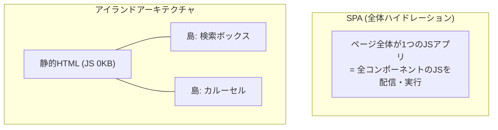

# アイランドアーキテクチャ

ページを**静的HTMLの海**とみなし、その中にインタラクティブな部品を**独立した島**として点在させるフロントエンドの構成パターン。Katie Sylor-Millerが名付け、Jason Millerが記事で広めた。[[astro|Astro]]が最初にフレームワークとして前面に押し出したことで一般化した。

対比されるのはSPAの**全体[[hydration|ハイドレーション]]**（サーバがHTMLを返した後、クライアントで同じコンポーネントツリーを丸ごと再構築してイベントを結び直す）。ページの99%が静的な読み物でも、SPAでは全コンポーネントのJSをダウンロード・パース・実行してからでないと、残り1%のボタンが押せない。アイランドアーキテクチャはこれを「島の分だけ」に切り詰める。



## 部分ハイドレーション（クライアントアイランド）

島だけを、島ごとに独立してhydrateする。Astroでは`client:*`ディレクティブで**いつロードするか**まで宣言する。

| ディレクティブ | hydrateのタイミング | 用途 |
| --- | --- | --- |
| `client:load` | ページロード直後、即座に | 到着してすぐ触られるUI |
| `client:idle` | 初期描画完了後、`requestIdleCallback`で | 優先度中。少し遅れても困らないもの |
| `client:visible` | ビューポートに入ったとき（IntersectionObserver） | 折り返し下のUI、重いウィジェット |
| `client:media` | 指定のメディアクエリが成立したとき | モバイルだけに出るサイドバー等 |
| `client:only="react"` | サーバ描画をスキップし、クライアントのみで描画 | サーバで動かせない（`window`依存の）コンポーネント |

`client:visible`が象徴的で、「**ユーザーが見なかった島のJSは、ダウンロードすらされない**」という節約ができる。全体ハイドレーション前提のSPAでは原理的に取れない選択肢。

各島は独立・並列にhydrateするので、重い島が軽い島をブロックしない。

## サーバアイランド

同じ発想を「クライアントJS」ではなく「**サーバでの動的描画**」に適用したもの。ページ本体は静的生成してCDNにキャッシュしつつ、一部だけリクエスト時にサーバで描画して差し込む。

```astro
---
import Avatar from "../components/Avatar.astro";
---
<Avatar server:defer>
  <div slot="fallback">読み込み中…</div>
</Avatar>
```

「ページ全体が静的か、全体が動的か」の二択を崩すのが要点。ログインユーザー名・カート個数・在庫数・レコメンドといった**パーソナライズされた一部分のために、ページ全体のキャッシュを諦める**必要がなくなる。Astro 5で安定機能になった。

## 島同士は状態を共有しない

島は文字通り独立しているので、React ContextやReduxのように「共通の親から状態を配る」ことができない（そもそも共通の親がクライアント上に存在しない）。島をまたいで状態を共有したい場合は、島の外に状態を置く:

- **nanostores** — Astroドキュメントが推奨するフレームワーク非依存の軽量ストア。React島とSvelte島の間ですら共有できる
- **URLクエリパラメータ / localStorage** — ページ遷移をまたいでも残す必要があるもの
- **カスタムイベント** — 単純な一方向の通知だけならこれで足りる

これは制約であると同時に**設計の圧力**でもあり、「島を大きくしすぎると結局SPAに戻る」という自己ブレーキになっている。島が増えて相互に状態を共有し始めたら、その画面はアイランドアーキテクチャに向いていない兆候と読める。

## 適用の判断

| | |
| --- | --- |
| 効く | 静的部分が支配的で、インタラクションが局所的に散らばっているページ（記事＋コメント欄、ドキュメント＋検索ボックス、商品一覧＋カート） |
| 効かない | 画面全体が1つの状態機械として動くもの（エディタ、ダッシュボード、チャット）。島が画面を覆い尽くすなら、素直にSPAにした方が単純 |

## [[frontend-rendering-moc|レンダリング境界MOC]]の中での位置づけ

境界を**フレームワークの外側で切る**流派。特定のUIフレームワークに依存しない一般パターンなので、[[astro|Astro]]以外にも実装がある（Denoの Fresh は`islands/`ディレクトリの規約で島を決め、Eleventyの`is-land`はサイトジェネレータに依存しない1.79KBの部品として提供される）。[[hydration]]のコストを「島の分だけ」に切り詰めるのが目的。

## 出典

- [Islands architecture — Astro Docs](https://docs.astro.build/en/concepts/islands/)
- [Template directives reference — Astro Docs](https://docs.astro.build/en/reference/directives-reference/)
- [Server islands — Astro Docs](https://docs.astro.build/en/guides/server-islands/)
- [Sharing state between islands — Astro Docs](https://docs.astro.build/en/recipes/sharing-state-islands/)
- [Islands Architecture — Jason Miller (patterns.dev)](https://www.patterns.dev/vanilla/islands-architecture/)
- [A Gentle Introduction to Islands — Deno (Fresh)](https://deno.com/blog/intro-to-islands)
- [11ty/is-land](https://github.com/11ty/is-land)

#astro #フロントエンド #アーキテクチャ #パフォーマンス
