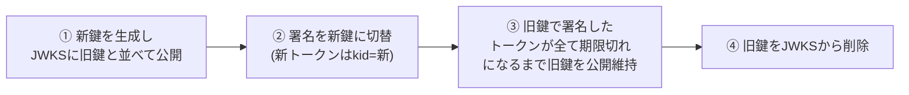

# JWKSと署名鍵ローテーション

**JWKS (JSON Web Key Set)** は、JWTの署名検証に使う公開鍵の集合をJSONで公開する仕組み（RFC 7517）。[[jwt-stateless-availability|JWTのステートレス検証]]は「公開鍵を事前に取得してキャッシュできる」ことで成立しており、その配布と世代交代（ローテーション）を支えるのがJWKS。

```json
{
  "keys": [
    { "kid": "2024-key", "kty": "RSA", "alg": "RS256", "use": "sig", "n": "...", "e": "AQAB" },
    { "kid": "2026-key", "kty": "RSA", "alg": "RS256", "use": "sig", "n": "...", "e": "AQAB" }
  ]
}
```

- 置き場所はIdPの`jwks_uri`（[[oidc|OIDCのDiscovery]]文書 `/.well-known/openid-configuration` に書いてある。慣例的に`/.well-known/jwks.json`が多い）
- **`kid`（Key ID）**がJWTヘッダ側にも入っており、検証側は「このトークンはどの鍵で署名されたか」をkidで引き当てる。**keysが複数並べられる**ことがローテーションの鍵

## 検証側のキャッシュ戦略

毎リクエストでJWKSを取りに行くとステートレスの意味がない（しかもIdPのレート制限を食う）ので、キャッシュが前提:

1. JWKSをメモリにキャッシュする（kid→鍵のマップ）
2. トークンのkidがキャッシュにあれば、そのままローカル検証（外部I/Oゼロ）
3. **kidがキャッシュにない場合のみJWKSを再取得**する（＝ローテーション直後の新鍵をイベント駆動で拾う。キャッシュTTLが長くても鍵切替に追従できる）
4. ただし再取得は**レート制限する**（例: 一定時間に1回だけ）。未知のkidを付けた偽トークンを連打されてJWKSエンドポイントへのリクエストが暴発するのを防ぐ

この「unknown kid → refetch（+抑制）」はAuth0・Cognitoの公式ガイドが共通して推す定石。たいていのJWTライブラリ/ミドルウェアに組み込みがあるので自前実装しないのが吉。

## ローテーションの手順（発行側）

即時に鍵を差し替えると、旧鍵で署名済みの有効なトークンが全部死ぬ。正しい手順は**重ね置き**:



- ③の待機時間 ≥ 旧鍵で署名した最長寿命トークン（[[token-revocation|RTが長寿命]]ならそれも考慮）
- 緊急ローテーション（秘密鍵漏洩時）は逆に**即削除**が正しい。全ユーザー再ログインのコストを払ってでも旧鍵を無効化する
- 検証側でやってはいけないこと: JWKSの鍵をコードや設定にハードコピーして固定する（ローテーションで突然死ぬ）。`alg`をトークンヘッダから信用する（[[oauth-resource-server|alg固定]]と矛盾。kidで引いた鍵の`alg`と突き合わせる）

## 主要IdPの実情

- **Cognito**: 鍵はユーザープールごとに発行され、`https://cognito-idp.{region}.amazonaws.com/{userPoolId}/.well-known/jwks.json`で公開。**ユーザー側から鍵ローテーションを起動する手段はなく**、AWS側の裁量で回りうる——だからkid追従キャッシュの実装が必須
- **Auth0**: ダッシュボード/APIから手動ローテーション可能。テナントのJWKSに新旧が並ぶ
- **Cloudflare Access**: チームドメインの`/cdn-cgi/access/certs`がJWKS相当（[[cloudflare-zero-trust]]でオリジン側がAccess JWTを検証するときに使う）

## [[web-auth-moc|Webアプリ認証認可MOC]]の中での位置づけ

[[jwt-stateless-availability]]（原理）と[[oauth-resource-server]]（検証ミドルウェア）の間を埋める運用ノート。「署名検証・JWKSキャッシュ・kidローテーション追従」の中身。

## 出典

- [RFC 7517: JSON Web Key (JWK)](https://datatracker.ietf.org/doc/html/rfc7517)
- [Auth0: JSON Web Key Sets](https://auth0.com/docs/secure/tokens/json-web-tokens/json-web-key-sets)
- [Amazon Cognito: Verifying JSON web tokens](https://docs.aws.amazon.com/cognito/latest/developerguide/amazon-cognito-user-pools-using-tokens-verifying-a-jwt.html)
- [AWS re:Post: Cognito Key Rotation](https://repost.aws/questions/QUa8TZhP3_TGGd9akoxH3B7w/cognito-key-rotation)

#認証認可 #jwt #運用
