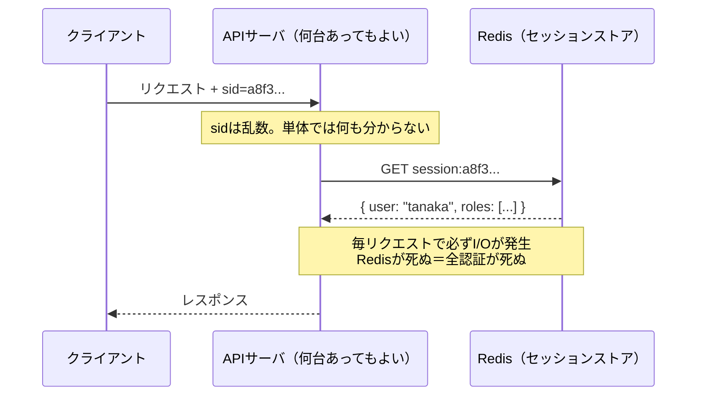
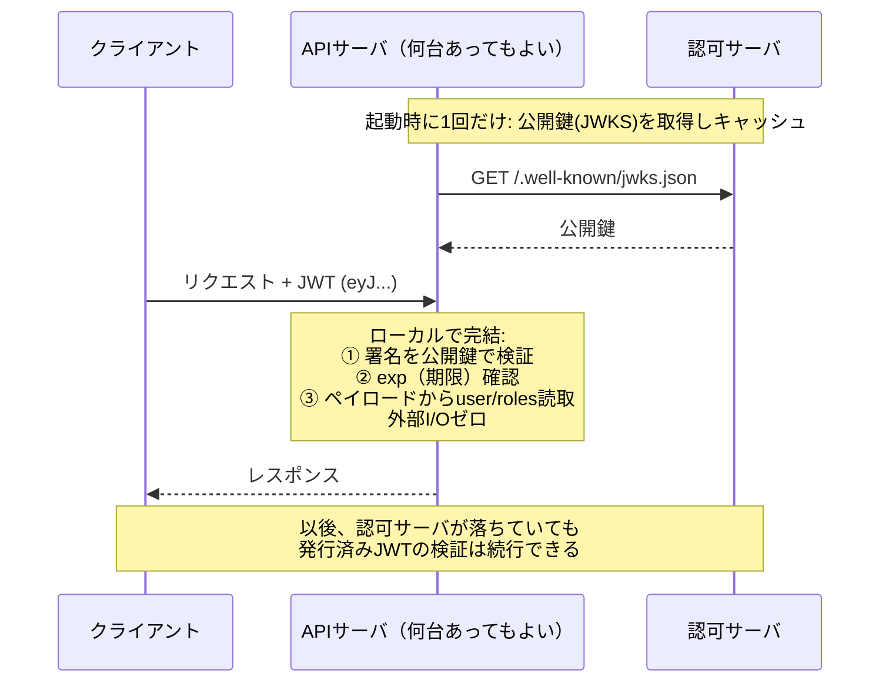

# JWTのステートレス性と可用性

「JWTは署名検証のみだからステートレスで可用性が高い」の原理の整理。

## ステートフル（セッションID）: 毎リクエストでストアI/O

セッションIDはただの乱数で、それ自体は何も証明しない（[[session-id-vs-jwt]]）。「このIDは有効か？誰のものか？」に答えるには、**毎リクエスト、サーバがストアに問い合わせる**しかない。

## ステートレス（JWT）: 検証時に外部I/Oゼロ

JWTは「ペイロード（誰で、何の権限で、いつまで有効か）＋発行者の署名」が一体。検証に必要なのは**発行者の公開鍵だけ**で、公開鍵（[[jwks-key-rotation|JWKS]]）は事前に取得してメモリにキャッシュできる。

## 「可用性が高くなる」の正確な意味

絶対的に可用性が上がるのではなく、**認証経路から依存コンポーネントが消える**ということ:

- ステートフル: `認証の可用性 = APIサーバ × セッションストア`（Redisが可用性の掛け算に入る）
- ステートレス: `認証の可用性 = APIサーバ`（検証時は認可サーバの生死すら関係ない）

スケール面でも、サーバを何台に増やしてもストアの共有・整合を考えなくてよい（各サーバが公開鍵だけ持てば独立に検証できる）。

## 対価は「即時失効の喪失」

署名検証だけで通す＝**発行済みトークンを止める手段がexp（期限切れ）しかない**。失効させたければdenylistを全サーバが参照することになるが、それは毎リクエストのストア参照の復活＝ステートレス性の放棄に他ならない。**ステートレス性と即時失効性は原理的にトレードオフ**。詳細は[[token-revocation]]。

## 層ごとに最適解が違う

- **人間のブラウザセッション**: 失効要件が支配的 → ステートフル（[[bff-pattern|BFF]]+Redis）。リクエスト頻度も人間の操作速度なのでストア参照コストは無視できる
- **サービス間API呼び出し**: 組織をまたいでストアを共有できない／呼び出し頻度が高い／クライアントは「アプリ」なので退職者失効のような要件が薄い → **ステートレスJWT（短命AT）が最適**（[[oauth-resource-server]]）

「Web UIはセッション、API層はJWT」は矛盾ではなく、この原理に従って層ごとに使い分けた結果。

## [[web-auth-moc|Webアプリ認証認可MOC]]の中での位置づけ

「なぜAPI層はJWTでWeb層はセッションなのか」に答える原理ノート。裏面のトレードオフは[[token-revocation]]。

## 出典

- [RFC 7519: JSON Web Token](https://datatracker.ietf.org/doc/html/rfc7519)
- [OAuth 2.0 for Browser-Based Applications draft-26](https://www.ietf.org/archive/id/draft-ietf-oauth-browser-based-apps-26.html)

#認証認可 #jwt #可用性
