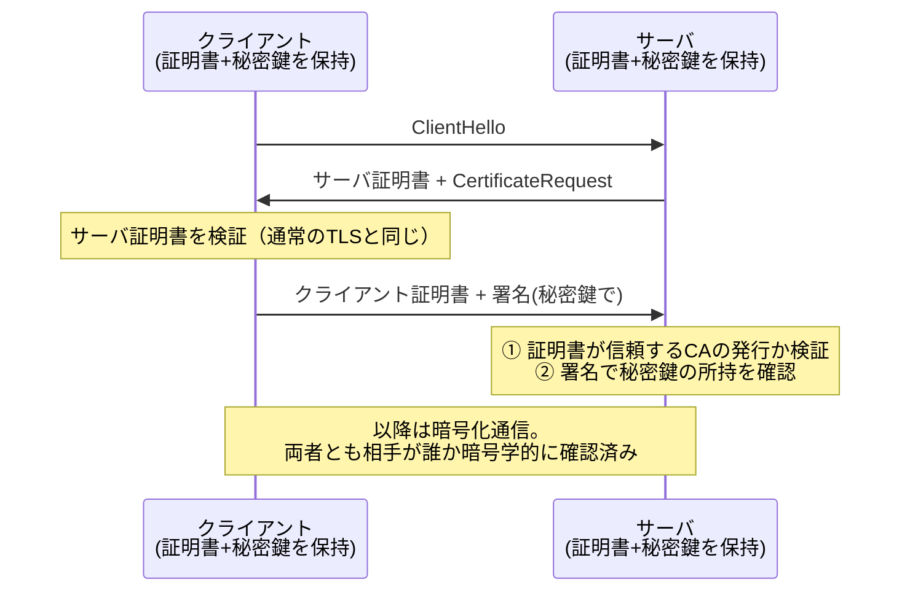

# mTLS（相互TLS）

通常のTLSは**サーバだけ**が証明書を提示する片方向認証（ブラウザがサーバの正当性を検証する。クライアントが誰かはTLS層では分からない）。**mTLS (mutual TLS)** はハンドシェイク中に**クライアントも証明書を提示**し、双方が相手を検証する。

## bearer tokenとの本質的な違い: 持参人 vs 所有証明

- APIキーやJWTは**bearer credential**（持参人払い）——通信路やログから漏れたら、拾った者がそのまま使える（[[session-id-vs-jwt]]）
- mTLSのクライアント証明書は**proof of possession**（所有証明）——ハンドシェイクで**秘密鍵による署名**を要求されるため、証明書（公開情報）だけ盗んでも使えない。秘密鍵はネットワークに流れない

この性質からOAuthの世界でも、client_secretの代替としてのmTLSクライアント認証や、盗まれたアクセストークンを他所から使えなくする**certificate-bound token**が標準化されている（RFC 8705）。

## どこで使われるか

- **[[service-mesh|サービスメッシュ]]**（Istio・Linkerd等）: マイクロサービス間の全通信を、サイドカーが自動でmTLS化する。ワークロードの識別子と証明書発行は[[spiffe|SPIFFE/SPIRE]]のような仕組みで自動化。[[zero-trust|ゼロトラスト]]の原則2「場所によらず全通信を保護」のサービス間実装で、[[oauth-resource-server|アプリ層のトークン検証]]を置き換えるのではなく**下の層として重ねる**（mTLSは「どのワークロードか」を、トークンは「誰のどんな権限の操作か」を証明する——守る対象が違う）
- **B2B API・M2M**: [[oauth-client-credentials|client_credentials]]のクライアント認証を秘密鍵ベースに強化する、あるいはIdPを介さず証明書だけで相手を確認する
- **IoT・社用デバイス**: デバイス識別。[[beyondcorp|BeyondCorp]]がデバイス証明書を信頼判定の起点にしたのがこの用法
- **CDNとオリジンの間**: 下記

## Cloudflareでの実例（個人開発で触れる形）

- **Authenticated Origin Pulls**: Cloudflare→オリジンの接続でCloudflareがクライアント証明書を提示し、オリジンは「Cloudflare経由のリクエストしか受けない」設定にできる。[[cloudflare-zero-trust|Access]]の**バイパス経路（オリジン直撃）を塞ぐ**手段の1つ
- **API Shield mTLS / クライアント証明書**: 自分のAPIエンドポイントに対し、Cloudflare管理のCA（または持ち込みCA）発行のクライアント証明書を持つ相手だけを通す。モバイルアプリやIoTクライアント向け

## 運用コストは証明書のライフサイクル管理

mTLSの難所は暗号ではなく運用: 全クライアントへの証明書の**発行・配布・更新・失効**（CRL/OCSP）が回り続ける必要がある。[[jwks-key-rotation|署名鍵ローテーション]]と同型の「重ね置きで世代交代」問題を、クライアントの数だけ抱えることになる。[[service-mesh|サービスメッシュ]]が普及したのは、まさにこの部分を自動化したから。逆に人間のブラウザ相手にmTLSが普及しないのも、端末への証明書配布が重いから（だからWebの人間向け認証は[[oidc|OIDC]]+Cookieに寄っている）。

## [[web-auth-moc|Webアプリ認証認可MOC]]の中での位置づけ

トークン認証（アプリ層）の下に重ねる通信層の相互認証。[[zero-trust]]の「全通信の保護」と「デバイス識別」を支える要素技術。

## 出典

- [RFC 8446: TLS 1.3（client authentication）](https://datatracker.ietf.org/doc/html/rfc8446)
- [RFC 8705: OAuth 2.0 Mutual-TLS Client Authentication and Certificate-Bound Access Tokens](https://datatracker.ietf.org/doc/html/rfc8705)
- [Cloudflare Docs: Authenticated Origin Pulls (mTLS)](https://developers.cloudflare.com/ssl/origin-configuration/authenticated-origin-pull/)
- [Cloudflare Docs: API Shield — Configure mTLS](https://developers.cloudflare.com/api-shield/security/mtls/configure/)
- [SPIFFE](https://spiffe.io/)

#セキュリティ #tls #ゼロトラスト #認証認可
