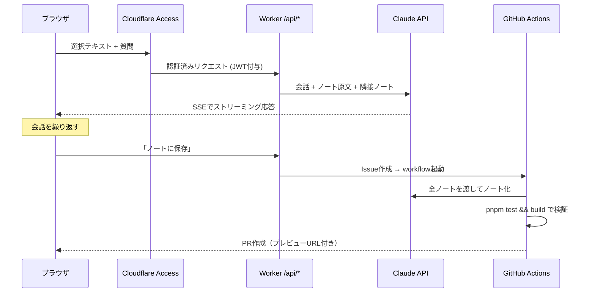

# ノートサイトにLLMチャットを生やす設計

このノートサイト（[[astro|Astro]]で静的生成し[[cloudflare-workers|Cloudflare Workers]]で配信）に、次の機能を足すときの設計メモ。

> ノートのわからない文章・単語を選択してチャットを呼び出し、LLMと壁打ちする。納得したらその会話をノートとして保存し、既存ノートとのリンクを更新する。

## 何が難しいのか

LLMを呼ぶこと自体は難しくない。難所は「**読むだけのサイトに、サーバと書き戻しを生やす**」ことで、新しい境界が3つ増える。

1. 公開ドメインに**課金されるAPIエンドポイント**が生える → 認証・濫用対策が必須（[[worker-protected-api]]）
2. 保存先が**静的ビルドの入力（git）**なので、ランタイムにDBへ書いても表に出ない → git への書き戻し経路が要る（[[static-site-write-back]]）
3. 「リンクを更新する」はリポジトリ全体の文脈が要る作業で、チャットの延長では書けない（[[llm-agent-role-separation]]）

## 全体構成

対話は**低レイテンシ・狭い文脈**、ノート化は**高品質・全文脈**と、性質がまったく違う2つのLLM呼び出しに分かれる。これが設計の背骨。

## 決めたこと

| 論点 | 決定 | 理由 |
|---|---|---|
| 利用者 | 自分だけ。`/api/*` を Cloudflare Access で保護 | 公開エンドポイントに課金経路を晒さない |
| 保存の粒度 | Issue → Actions → PR | 既存CI（テスト・ビルド・プレビューURL）が検証ゲートになる |
| リポジトリ | private 化する | [[repo-visibility-and-automation]] |
| チャットUI | 未決。まず素の`<script>`+`<dialog>`で試す | 既存の検索ダイアログと同じ流儀。判断材料は後述 |

## 段階分け

1. **Phase 0（サーバなし）** — ビルド時に`/raw/<slug>.md`を出力、選択→フローティングボタン→`<dialog>`チャット、LLMはBYOキーでブラウザから直接、保存はMarkdownをクリップボードへ。ここまで既存構成を一切壊さない。
2. **Phase 1** — `/api/chat` Worker + Access + [[server-sent-events|SSE]]ストリーミング。APIキーをサーバ側へ。
3. **Phase 2** — 保存 → Issue → Actions のノート化エージェント → PR。
4. **Phase 3** — 選択箇所のアンカリング（`data-src-line`）で既存ノートへのリンク差し込み精度を上げる。

Phase 0 は「選択してすぐ聞ける」という体験そのものが有用かを、サーバもキー管理もなしに確かめられる点が大きい。ブラウザに自分のAPIキーを置く構成の是非は[[browser-token-tradeoff|トークンをブラウザに出すかの判断基準]]と同じ天秤で、ここでは「BFFを置く場所がまだない」ケースに当たる。

## チャットUIをどう作るか（未決）

分かれ目は**LLM応答のMarkdownを誰がレンダリングするか**。

- 既存の変換パイプライン（`src/lib/pipeline.ts`）はunified + shiki + KaTeXで、ブラウザに送るには重い。
- (a) クライアントで軽量パーサ / (b) Worker側でレンダリングしてHTMLを返す（`pipeline.ts`を再利用できるがバンドルサイズとCPU時間の制約を要確認）/ (c) チャット内はプレーンテキスト+コードブロックだけで妥協。

(c) なら素のJSで足りる。[[astro]]・[[frontend-rendering-moc]]では「チャットは画面全体が1つの状態機械だからSPA向き」と整理したが、それは**会話が主役のアプリ**の話。ここでは静的な読み物が主役で、チャットは局所的な島にすぎないので、[[islands-architecture|島]]を入れるかどうかは「チャット内で数式やmermaidまで描きたいか」で決まる。まず(c)で作って不足を体感してから決めるのが安い。

## 実装上の注意

- ノート原文（md）をLLMに渡したいので、`/search-index.json`（HTML由来のプレーンテキスト）は流用できない。`[[...]]`や`#tag`の構造が消えているため。
- Actions側で`git config core.hooksPath .githooks`を実行しないと、pre-commitフックが動かず`created`/`updated` frontmatterが付かない。`src/lib/notes.ts`はfrontmatterが無いとmtimeにフォールバックするので、壊れ方が静かで気づきにくい。
- ビルド時のbroken wikilink警告を**エラー扱いにしてPRを止める**と、エージェント出力の検証ゲートになる（現状はwarnのみ）。
- エージェントのジョブには`timeout-minutes`を必ず付ける。リトライループに入ると実行時間を一気に食う。

#llm #アーキテクチャ #個人開発 #静的サイト #cloudflare
