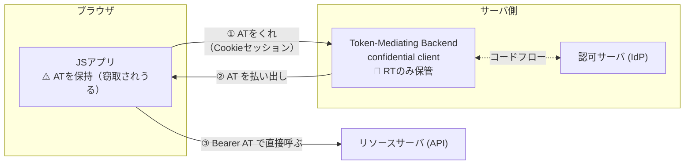

# OAuth 2.0 for Browser-Based Applications

ブラウザアプリ（SPA等）向けOAuthのベストカレントプラクティスを定めるIETFドラフト。ブラウザアプリの構成として**3つの推奨パターン（§6）**と**非推奨パターン群（§7）**、ブラウザ保管する場合の**保管場所のバリエーション（§8）**を定義している。

## 3つの推奨パターン

### パターン1: Backend For Frontend — BFF（§6.1）

トークンは**一切ブラウザに出ない**。詳細は[[bff-pattern]]。ドラフトは「**業務アプリ・機微なアプリ・個人データを扱うアプリに強く推奨**」としている。

### パターン2: Token-Mediating Backend — TMB（§6.2）

中間形。バックエンドがconfidential clientとしてトークンを取得するが、**アクセストークンだけはブラウザに渡し**、ブラウザがリソースサーバを**直接**叩く。リフレッシュトークンはサーバに留まる。

- 守れるもの: RT窃取防止、攻撃者による新規トークンのサイレント取得防止（clientがconfidentialなため）
- 守れないもの: **ATの持ち出しは防げない**（有効期限まで攻撃者のサーバから悪用可）
- 位置づけ: 「**プロキシ型BFFが使えない事情がある場合にのみ**検討せよ」。利点はプロキシのオーバーヘッドがないこと

### パターン3: ブラウザベースOAuthクライアント（§6.3）

いわゆる「素のSPA + トークン」。ブラウザ自身がpublic clientとして[[pkce|PKCE]]付きコードフローを実行し、**AT・RTともにブラウザに保管**して直接APIを叩く。

- ドラフトの評価: 「**本書で論じた全攻撃シナリオに対して脆弱**」「高度な攻撃への**実用的な対抗策は存在しない**」
- PKCE・RTローテーション等の必須要件はあるが、これらは緩和であって解決ではない

## パターン比較表

| | BFF | TMB | ブラウザクライアント |
|---|---|---|---|
| ブラウザが持つもの | セッションCookieのみ | Cookie + **AT** | **AT + RT** |
| XSS時: AT持ち出し | ❌ 不可能 | ⭕ 可能 | ⭕ 可能 |
| XSS時: RT持ち出し | ❌ 不可能 | ❌ 不可能 | ⭕ 可能 |
| XSS時: 新規トークン取得 | ❌ 不可能 | ❌ 不可能 | ⭕ 可能 |
| 即時失効 | ⭕ セッション削除 | △ RT失効のみ | △ 同左＋RT自体も奪われうる |
| サーバ運用 | 必要（プロキシ） | 必要（トークン仲介のみ） | 不要 |
| 推奨度 | **業務・機微データに強く推奨** | BFF不可の場合のみ | 消去法の最後 |

XSS発生時に何が起きるかの詳細は[[xss-token-theft]]。

## §8: パターン3を採る場合のトークン保管場所（すべて「ましさ」の差でしかない）

| 保管場所 | 特性 | XSS耐性 |
|---|---|---|
| Cookie（§8.1） | HttpOnlyならJS読取不可。ただしCSRF対策必須 | JSからの**読取**は防げるが、自動送信されるため相乗りは可 |
| Service Worker（§8.2） | メインJSコンテキストから隔離 | SW自体が侵害されれば同じ |
| Web Worker（§8.3） | スレッド隔離、リロードで消える | 隔離は暗号学的保護ではない |
| メモリのみ（§8.4） | リロードで消える＝永続窃取リスク減 | 実行中のJSからは読める |
| localStorage / IndexedDB（§8.5） | 永続・大容量 | **最悪**。同一オリジンの任意JSが常時読める |

## §7: 非推奨・廃止パターン

- **Implicit Grant（§7.2）**: URLフラグメントでATを返す旧方式。履歴・Referer・ログに漏れる。**廃止**
- **Resource Owner Password Grant（§7.3）**: アプリがID/パスワードを直接預かる。**非推奨**
- **Service Worker内でOAuthフロー実行（§7.4）**: SWも侵害対象なので意味がない。**非推奨**
- **単一ドメインアプリはそもそもOAuth不要（§7.1）**: フロントとバックエンドが同一ドメインなら、伝統的なCookieセッションで足りる（本仕様のスコープ外）という注記

なお**性能・スケーラビリティを理由にパターン3を選ぶ正当化はドラフト上存在しない**。ブラウザ保持が正当化される実在ケースは[[browser-token-tradeoff]]参照。

## [[web-auth-moc|Webアプリ認証認可MOC]]の中での位置づけ

方式選定の議論の「標準側の根拠」。個別方式のノート（[[bff-pattern]]・[[stateless-session]]）はすべてこのドラフトのパターン分類を参照する。

## 出典

- [OAuth 2.0 for Browser-Based Applications draft-26（本文）](https://www.ietf.org/archive/id/draft-ietf-oauth-browser-based-apps-26.html) / [datatracker](https://datatracker.ietf.org/doc/draft-ietf-oauth-browser-based-apps/)
- [OAuth 2.0 Security Best Current Practice — RFC 9700](https://datatracker.ietf.org/doc/html/rfc9700)
- [oauth.net: Browser-Based Apps](https://oauth.net/2/browser-based-apps/)

#認証認可 #oauth #ietf
