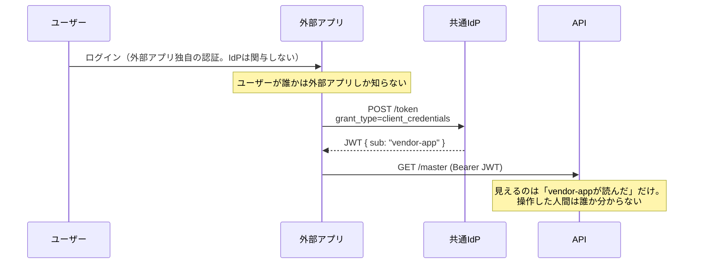

# client_credentialsグラント（M2M認証）

OAuthの**グラント＝トークンをもらう手続きの種類**のうち、**人間が介在しないプログラム同士**（Machine-to-Machine）の通信に使うもの。「client_id + client_secret（＝プログラム用のIDとパスワード）」をIdPに提示して直接トークンをもらう。ログイン画面は出ない。

| グラント | 使う場面 | トークンの`sub`（主体） |
|---|---|---|
| Authorization Code + OIDC | **人間**がブラウザでログイン | ユーザー個人 |
| **client_credentials** | **人間が介在しない**プログラム同士 | アプリ/サービス自身 |

```
バッチ処理 --(client_id + secret)--> IdP
バッチ処理 <--(JWT: sub=batch-app, scope=accounting:read)-- IdP
バッチ処理 --(Bearer JWT)--> API
```

- 夜間バッチ・定期連携には「操作する人間」がいない→ログイン画面を出せない→ユーザー用グラントは成立しない
- `sub`がアプリ名義になり、監査ログに「これはバッチがやった操作」と正しく残る
- スコープを最小に絞れる

## B2B API連携の標準形

「外部組織にIdPからトークンを取らせてAPIを叩かせる」のは完全に標準（サービスアカウント方式）。実例: AWSのIAMアクセスキー、Google Cloudのサービスアカウント、Auth0/Oktaの「M2M Application」、Stripe/SendGridのAPIキー。

「外部＝どこの誰とも知れない相手」ではない点に注意。相手は**事前に登録し、client_id/secretを払い出した既知のクライアント**であり、無条件開放ではない。secretはシークレット管理サービスで保管させる。

## 限界: 「誰の操作か」がトークン上に存在しない

人間の操作の入口にこのグラントを使うと、ユーザーが誰であろうと届くトークンは常に同じ主体（`sub=そのアプリ`）になる。



- APIログの操作主体が全てアプリ名義に潰れ、ユーザー単位の認可もできない
- 「`X-User-Id`ヘッダでユーザーIDを渡せばよい」は解決にならない——**自己申告は認証ではない**。アプリが侵害されれば全ユーザーなりすまし放題。IdPが署名したクレームとして`sub`に載る[[oidc-federation|フェデレーション]]とは証拠能力が根本的に違う
- ユーザー単位の証跡が要件なら（[[audit-trail-requirements]]）、[[oidc-federation]]か[[oauth-token-exchange]]に格上げする

使い分けの標準形: **人間の操作はユーザーのトークン、バッチ・システム間連携はclient_credentials**。併用時は、アプリ名義トークンで人間操作系エンドポイントを叩かれたら拒否する（「バッチが人間のフリをする」抜け道を塞ぐ）。

## [[web-auth-moc|Webアプリ認証認可MOC]]の中での位置づけ

サービス間連携の標準グラント。「これで人間の操作まで済ませてよいか」の分岐が[[audit-trail-requirements|監査証跡要件]]。

## 出典

- [RFC 6749 §4.4: Client Credentials Grant](https://datatracker.ietf.org/doc/html/rfc6749#section-4.4)
- [Auth0: Machine-to-Machine Applications](https://auth0.com/docs/get-started/applications/machine-to-machine-apps)

#認証認可 #oauth
