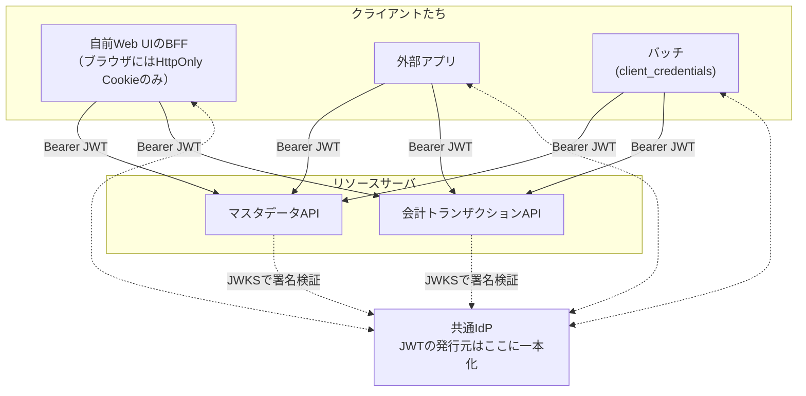

# OAuthリソースサーバ設計

守るべきAPIを「**共通IdPが発行したJWTのみを受け付けるOAuthリソースサーバ**」として作るときの設計原則。

登場人物の整理: **IdP（認可サーバ）**＝トークンを発行する役。**リソースサーバ**＝トークンを検証して通す/弾く役（守るべきAPI）。**クライアント**＝トークンを持ってAPIを叩きに来る側（自前の[[bff-pattern|BFF]]も外部アプリも等しくこれ）。

## 入口に検証ミドルウェアを1枚置き、全リクエストで同じ検証を通す

| 検証 | 意味 | 失敗時 |
|---|---|---|
| 署名（[[jwks-key-rotation|JWKS]]） | 本当にそのIdPが発行したか（キャッシュ＋kidローテーション追従） | 401 |
| `iss` | 発行者が信頼する1つのIdPか | 401 |
| `aud` | 宛先がこのAPIか（トークンの使い回し防止） | 401 |
| `exp` | 期限切れでないか（clock skew許容±60秒程度） | 401 |
| `scope` | そのエンドポイントを叩く権限があるか | 403 |
| `alg`固定 | 署名アルゴリズムを許可リストで固定（`none`・HS系への切替攻撃を拒否） | 401 |

- scopeは「アプリに許す範囲」（例: `master:read` / `accounting:write`）をエンドポイント×HTTPメソッド単位で宣言的に定義。ユーザー単位のデータ認可（この`sub`はこのデータを見てよいか）は**アプリケーション層で別途実装**する（scopeだけで済ませない）
- [[oauth-client-credentials|client_credentials]]トークン（`sub`=アプリ）で人間操作系エンドポイントを叩かれたら拒否する

## なぜ発行元（iss）を1つに絞るのか

1. **呼び出し元で分岐しなくてよい**: BFFでも外部アプリでも検証は同一。「相手が誰か」ではなく「正しいチケットを持つか」だけを見る → 方式論争と切り離してAPI実装に着手できる
2. **信頼の起点が1点に集約**: 守る対象が「このIdPの署名を信じる」の一点になる。入口は狭いほど守りやすい
3. **将来のIdP移行が設定差し替えで済む**: `iss`を設定値化しておけば、組織の統一IdPが後から建ってもコードを触らず移行できる

## マルチクライアント要件はAPI層の話であってブラウザ層の話ではない

「APIが複数クライアントから呼ばれる」から導かれるのは「APIはJWTを受け取るリソースサーバになるべき」であって、「自分のWebアプリのブラウザにトークンを出すべき」ではない。この2つは独立している。

APIをリソースサーバにした上で、自前のWeb UIは引き続き[[bff-pattern|BFF]]を採ればよい。**BFFは「APIのいちクライアント」に過ぎない**。外部アプリも「別のいちクライアント」であり、両者は同じAPIを同じ方式（JWT）で叩く。サービス間でストアを共有できない以上、この層では[[jwt-stateless-availability|ステートレスJWT]]（短命AT）が最適になる。

## ネットワーク的近さを認証の代わりにしない

同一Kubernetesクラスタ・同一Podでも（＝localhost通信でも）JWT検証は省略しない（[[zero-trust|ゼロトラスト]]原則。別組織のコードが同居するならなおさら）。トークンベースにしておけば**将来Podが分かれても、別クラスタに出ても、認証設計は一切変わらない**。NetworkPolicyやmTLS/サービスメッシュは「追加の層」として積む。

## [[web-auth-moc|Webアプリ認証認可MOC]]の中での位置づけ

Web UI側（セッション方式の選択）と切り離して先に確定できる「API層の不変原則」。方式論争でAPI開発を止めないための鍵。

## 出典

- [RFC 6749: The OAuth 2.0 Authorization Framework](https://datatracker.ietf.org/doc/html/rfc6749)
- [RFC 8725: JSON Web Token Best Current Practices（alg固定等）](https://datatracker.ietf.org/doc/html/rfc8725)

#認証認可 #oauth #api設計 #ゼロトラスト
