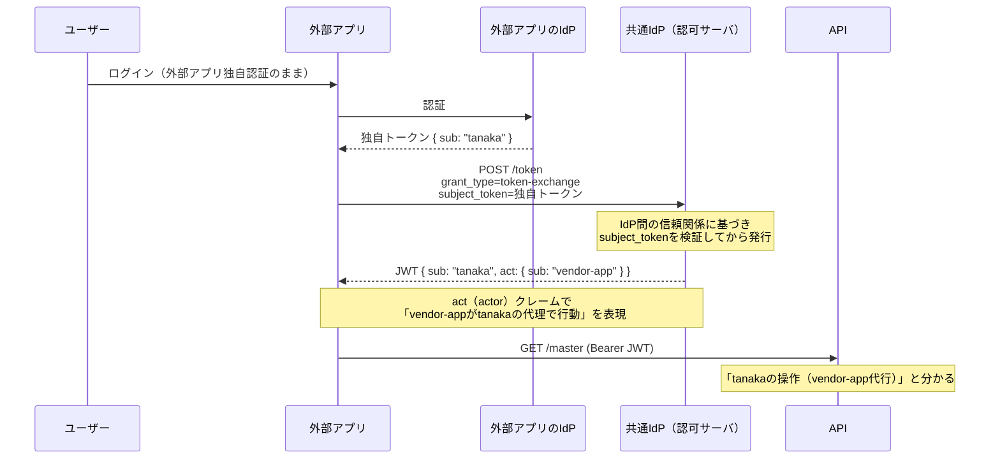

# OAuth 2.0 Token Exchange (RFC 8693)

**「別の信頼ドメインのトークンを、自分のAPIが信頼するトークンに両替する」**ための標準グラント（`grant_type=urn:ietf:params:oauth:grant-type:token-exchange`）。

典型ユースケース: 外部アプリが独自のIdPでユーザー認証しており、その認証を変えられないが、こちらのAPIはユーザー単位の証跡（[[audit-trail-requirements]]）を要求する場合。外部アプリのバックエンドが、自分の発行したユーザートークン（`subject_token`）を共通の認可サーバに提示し、「このユーザーの代理としてAPIを呼ぶためのトークン」に交換してもらう。

- **長所**: 相手は既存のユーザー認証を変えずに済む。委任関係（誰が・どのアプリの代理で）が`act`クレームで標準表現できる
- **短所**:
  - 認可サーバがRFC 8693に対応している必要がある。**Amazon Cognitoはネイティブ非対応**（2026年時点でもコアのトークンエンドポイントには未実装）。採るならKeycloak等の対応IdPが必要になり、IdP選定に直結する
  - 相手IdPの認証品質（パスワードポリシー、MFA）を間接的に信頼することになる＝**信頼境界が相手に広がる**

## [[web-auth-moc|Webアプリ認証認可MOC]]の中での位置づけ

[[oidc-federation|フェデレーション]]（相手の認証を共通IdPに載せ替える）が交渉上むずかしい場合の代替カード。[[oauth-client-credentials|client_credentials]]と違いユーザーがトークンに載る。

## 出典

- [RFC 8693: OAuth 2.0 Token Exchange](https://datatracker.ietf.org/doc/html/rfc8693)
- [AWS re:Post: Does AWS Cognito support OAuth 2.0 Token Exchange grant type?](https://repost.aws/questions/QUO3Q1dpQOTHKY9F6JVl3hEQ/does-aws-cognito-support-oauth-2-0-token-exchange-grant-type)

#認証認可 #oauth
