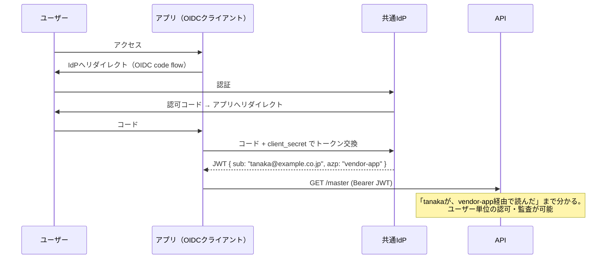

# IDフェデレーション（認証連携）

複数のアプリ・組織にまたがるユーザー認証を、**共通のIdPにログインを委ねる**ことで束ねる方式。アプリを共通IdPのOAuth/OIDCクライアントとして登録し、ユーザーのログインをOIDC（Authorization Code Flow）で共通IdPに委ねる。トークンには**IdPが署名保証したユーザー本人**（`sub`）と経由アプリ（`azp`/`client_id`）が載る。



- **長所**: トークンの`sub`がIdPの署名で保証されたユーザー本人になり、ユーザー単位の認可・[[audit-trail-requirements|監査証跡]]が成立する。副産物として、複数アプリを**1回のログインで使える（SSO）**
- **短所**: 各アプリの認証をOIDCに載せ替える改修が必要。ユーザーアカウントを共通IdP側に収容する運用（払い出し・棚卸し）が必要

## 「認証を全部背負う」わけではない — 責務の4層分解

「共通IdPを持つ＝全ユーザーの認証責務を負う」と1つの塊で考えると重すぎて見える。分解すると新規に抱える部分は限定的:

| 層 | 中身 | 誰が持てるか |
|---|---|---|
| ① 本人確認（パスワード保管・MFA） | 認証の実務 | **既存ID基盤にフェデレーションで委譲できる** |
| ② トークン発行・フェデレーションのハブ | 認証結果を束ねてJWT発行 | IdP（インフラ側が構築・運用） |
| ③ ガバナンス（トークン仕様・scope定義・クライアント審査） | 信じるルール | API提供者（むしろ主導権として取る） |
| ④ 運用実務（払い出し・棚卸し・ヘルプデスク) | 日々の人手作業 | 分担表で他者に残せる |

### IdP間フェデレーション

①は共通IdP自身が持つ必要がない。例えば従業員IDがGoogle Workspaceにあるなら:

```
社内ユーザー → 共通IdP「Googleでログインしてきて」
           → Google Workspaceが本人確認（パスワード・2段階認証はGoogleの中）
           → 共通IdPは結果を受けてJWTを発行するだけ
```

CognitoはGoogle/SAML/OIDCの外部IdP連携を標準サポート。パスワードは共通IdPに保存されない。外部組織のユーザーも同様に、直接収容（共通IdPがパスワードも保持）か、相手組織のIdPをフェデレーション（払い出し・リセット業務を相手に残す）かの2方式から選べる。

## [[web-auth-moc|Webアプリ認証認可MOC]]の中での位置づけ

[[oauth-client-credentials|client_credentials]]（アプリ名義）では満たせないユーザー単位の証跡・認可を、標準形で満たす方式。相手の認証を変えられない場合の代替は[[oauth-token-exchange]]。

## 出典

- [OpenID Connect Core 1.0](https://openid.net/specs/openid-connect-core-1_0.html)
- [Amazon Cognito: サードパーティを通じたユーザープールへのサインイン](https://docs.aws.amazon.com/ja_jp/cognito/latest/developerguide/cognito-user-pools-identity-federation.html)

#認証認可 #oidc #sso
