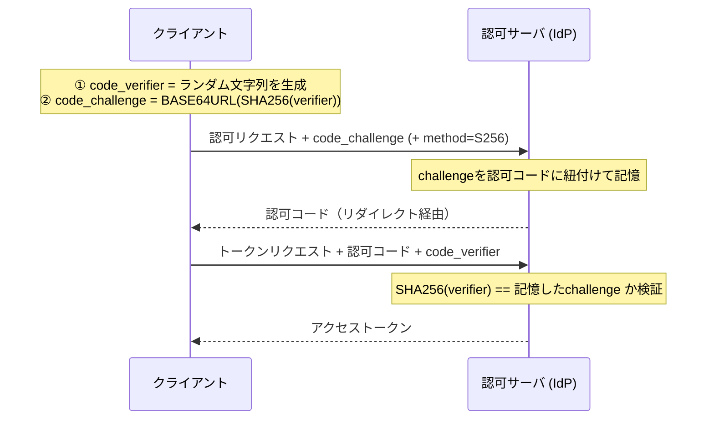

# PKCE (Proof Key for Code Exchange)

OAuthの認可コードフローを**認可コード横取り攻撃**から守る拡張（RFC 7636。「ピクシー」と読む）。[[oauth-browser-based-apps|ブラウザアプリ]]・モバイルアプリのようなpublic clientのために生まれたが、現在は**全クライアントで使うのが標準**になっている。

## 守る対象: 認可コード横取り攻撃

認可コードフローでは、IdPがリダイレクトで返す「認可コード」をクライアントがトークンに交換する。このコードが第三者に横取りされると問題になる:

- モバイルで顕著: カスタムURLスキーム（`myapp://callback`）は複数アプリが同じスキームを登録でき、悪性アプリがリダイレクトを受け取ってコードを奪える
- public clientはclient_secretを持たないので、コードさえあれば**誰でもトークンに交換できてしまう**

PKCEは「認可リクエストを始めたのと同じ主体だけがコードを交換できる」ことを暗号学的に保証する。

## 仕組み

- 横取り犯はリダイレクトで飛んでくる**コード（とchallenge）しか見えない**。SHA-256の逆算ができない限りverifierを再現できず、トークン交換に失敗する
- `code_challenge_method`は`S256`（SHA-256）を使う。`plain`（verifierをそのまま送る）は横取り犯にも見えるので意味がなく、非推奨
- 副次効果としてCSRF的な認可レスポンスの取り違え対策にもなる（`state`パラメータの役割の一部を代替）

## 「public client用」から「全クライアント必須」へ

- RFC 7636（2015年）の想定はpublic client
- [OAuth 2.0 Security BCP（RFC 9700）](https://datatracker.ietf.org/doc/html/rfc9700)は認可コードフローのクライアントにPKCE（またはOIDC nonceによる同等の保護）を要求
- 策定中の**OAuth 2.1**（draft）は認可コードフローに**PKCEを原則必須**として統合した（confidential clientが[[oidc|OIDC]]のnonceで同等の保護を得ている場合の限定的な例外はある）。2026年時点でまだInternet Draftだが、事実上のベストプラクティスプロファイルとして扱われている
- confidential client（[[bff-pattern|BFF]]等）でも付ける理由: client_secretは「クライアントの正当性」を守るが、「このコードはこのフローで発行されたものか」（コード注入・取り違え）はPKCEが守る。防御の層が違う

## PKCEダウングレード攻撃

認可サーバ側の実装注意: 「challengeが来たときだけ検証する」実装だと、攻撃者がchallenge無しの認可リクエストを混ぜてPKCEを迂回できる（ダウングレード）。認可サーバはクライアント単位でPKCEを強制するか、challenge有りで始まったフローのトークン交換にverifierを必須にする必要がある。

## [[web-auth-moc|Webアプリ認証認可MOC]]の中での位置づけ

認可コードフローを使う全ノート（[[bff-pattern]]・[[oidc-federation]]・[[oauth-browser-based-apps]]）の前提となる基盤要素。

## 出典

- [RFC 7636: Proof Key for Code Exchange by OAuth Public Clients](https://datatracker.ietf.org/doc/html/rfc7636)
- [RFC 9700: Best Current Practice for OAuth 2.0 Security](https://datatracker.ietf.org/doc/html/rfc9700)
- [oauth.net: OAuth 2.1](https://oauth.net/2.1/)

#認証認可 #oauth #セキュリティ
