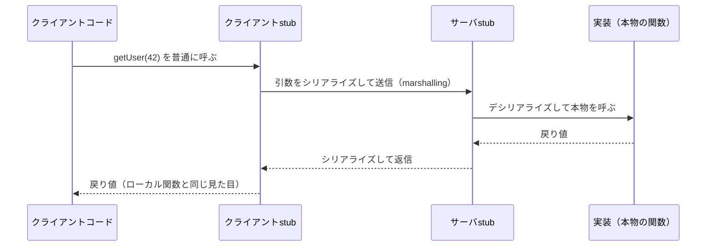

# RPC（Remote Procedure Call / 遠隔手続き呼び出し）

ネットワーク越しの処理を、**ローカルの関数呼び出しと同じ見た目**で呼べるようにする抽象。「HTTPリクエストを組み立てて送ってレスポンスをパースする」という通信の手続きを隠蔽し、`getUser(42)`のように書いたら裏でネットワーク通信が走る、という体験を作る。

用語自体はBruce Nelsonの1981年の博士論文が初出で、Birrell & Nelsonの論文「Implementing Remote Procedure Calls」（Xerox PARC、1984年）が古典。40年以上前の概念だが、gRPCやTypeScript界の型共有RPC（[[typescript-rpc]]）として現役で使われ続けている。

## 仕組み: stubが通信を肩代わりする

呼び出し側・実装側の双方に**stub**（代理オブジェクト）を置くのが基本構造。クライアントは自分のプロセス内のstubを普通に関数として呼ぶだけで、通信はstubが行う。

構成要素は3つで、RPCシステムごとの違いは実質この3つの選び方の違い:

1. **インターフェース定義** — 「どんな関数があり、引数・戻り値は何型か」をどう共有するか。IDL（Interface Definition Language）を書いてstubをコード生成するのが伝統（gRPCの`.proto`、Cap'n Protoの`.capnp`）。TypeScript界の型共有RPCはここを型推論で置き換えた（[[typescript-rpc]]）
2. **シリアライズ形式** — バイナリ（Protocol Buffers等。高速・小さい）かテキスト（JSON。人間が読める）か
3. **トランスポート** — HTTP/1.1、HTTP/2、WebSocket、標準入出力など

## 主な系譜

| 世代 | 代表 | 特徴 |
|---|---|---|
| 古典 | Sun RPC（1984頃〜） | NFSの基盤。UNIX世界の標準 |
| オブジェクト指向期 | CORBA、Java RMI | 言語間/言語内のオブジェクト呼び出し。IDL中心 |
| Web期 | XML-RPC → JSON-RPC | HTTPの上にテキストで載せる軽量路線。JSON-RPCはLSPや[[mcp|MCP]]の通信層として現役 |
| 現代（バイナリ） | gRPC（Protocol Buffers + HTTP/2）、Cap'n Proto | マイクロサービス間通信の定番。ストリーミング対応 |
| 現代（JS/TS） | [[typescript-rpc|tRPC / oRPC / Hono RPC]]、[[capnweb|Cap'n Web]] | 型推論で型安全、またはobject-capability |

## RESTとの違い

RESTは「**リソース**（名詞）をHTTP動詞（GET/POST/PUT/DELETE）で操作する」という考え方で、URLとHTTPの意味論に載せることが第一。RPCは「**関数**（動詞）を呼ぶ」という考え方で、HTTPは単なる輸送路。`POST /users/42/deactivate`をRESTでどう表現するか悩むような操作は、RPCなら`deactivateUser(42)`と呼ぶだけ、という関係。逆に、キャッシュ・ステータスコード・URLの共有可能性などHTTPの意味論に乗る恩恵はRESTの方が受けやすい。

## 「ローカル呼び出しに見せかける」ことの限界

RPCの理想への古典的な批判として、**ネットワーク越しの呼び出しはローカル呼び出しと本質的に違う**という点がある。レイテンシが桁違いに大きい、部分的失敗（相手が落ちた/ネットワークが切れた。呼び出しが実行されたか不明のまま失敗する）がある、参照渡しができない——これらは構文を似せても消えない。CORBAなどが廃れた一因もここにあり、現代のRPCフレームワークは「見せかける」のをある程度諦めて、タイムアウト・リトライ・エラーを一級市民として扱う設計になっている。

## 出典

- [Birrell & Nelson: Implementing Remote Procedure Calls（1984）](http://birrell.org/andrew/papers/ImplementingRPC.pdf)
- [RPC is Not Dead: Rise, Fall and the Rise of Remote Procedure Calls — dist-prog-book](http://dist-prog-book.com/chapter/1/rpc.html)
- [Remote Procedure Calls — pk.org講義ノート](https://pk.org/classes/417/notes/rpc.html)
- [gRPC vs. REST — Postman Blog](https://blog.postman.com/grpc-vs-rest/)

#rpc #分散システム #api
