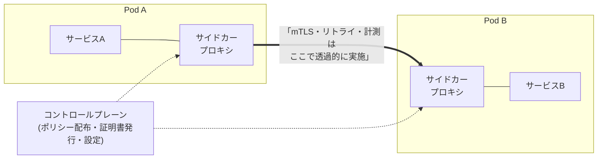

# サービスメッシュ

マイクロサービス間通信の横断的関心事——[[mtls|mTLS]]、リトライ/タイムアウト、負荷分散、トラフィック分割（カナリア）、メトリクス/トレーシング——を**アプリのコードから取り出し、インフラ層で一括提供する**仕組み。各サービスに同じ通信ライブラリを実装・更新して回る代わりに、通信そのものを横取りするプロキシ層に寄せる。

## 仕組み: データプレーンとコントロールプレーン

- **データプレーン**: 各Podに注入されるサイドカープロキシ（Envoy等）。サービスの出入りの全通信が透過的にここを通る。アプリは平文のlocalhost通信を書くだけで、実際の線上はmTLS化・計測済みになる
- **コントロールプレーン**: プロキシ群への設定配布と**証明書の発行・ローテーション自動化**。[[mtls]]の難所「証明書ライフサイクル管理」を機械化するのが中核価値で、ワークロードの識別は[[spiffe|SPIFFE]]互換のIDで行われる

これにより[[zero-trust|ゼロトラスト]]の原則2「場所によらず全通信を保護」がアプリ改修ゼロで入る。ただしmTLSが証明するのは「どのワークロードか」まで——「誰のどんな権限の操作か」は依然[[oauth-resource-server|アプリ層のトークン検証]]の仕事で、層として重ねる関係（代替ではない）。

## 主要実装と潮流（2026年時点）

- **Istio**: 最も普及。近年は**ambientモード**（サイドカーレス）が安定版になり新規構成の主流方向——ノードごとのL4プロキシ（ztunnel）でmTLSと計測を提供し、L7機能が要るサービスにだけwaypointプロキシを足す。サイドカー全部盛りに比べメモリを大幅節約
- **Linkerd**: 軽量・シンプル志向。Envoyより小さい専用Rustプロキシ
- **Cilium**: eBPFベースでカーネル層から提供

## 導入判断

サービスメッシュは「マイクロサービスを大量に運用していて、通信の横断的関心事の実装・運用が回らない」段階で効く道具。サービスが数個のうちは、リトライはHTTPクライアントライブラリ、mTLSは不要（またはマネージドLBのTLS）で足りることが多く、コントロールプレーン自体の運用コスト（バージョンアップ・障害調査の難化）が上回りがち。「ゼロトラストにしたい」だけならまず[[oauth-resource-server|トークン検証の徹底]]とNetworkPolicyから、が現実的な順序。

## [[web-auth-moc|Webアプリ認証認可MOC]]の中での位置づけ

[[mtls]]の運用自動化としてのインフラ層。トークン認証（アプリ層）の下に重ねる。

## 出典

- [Istio: Ambient mode](https://istio.io/latest/docs/ambient/overview/)
- [Linkerd: Architecture](https://linkerd.io/2/reference/architecture/)
- [CNCF: Service Mesh landscape](https://landscape.cncf.io/guide#orchestration-management--service-mesh)

#マイクロサービス #インフラ #ゼロトラスト #kubernetes
