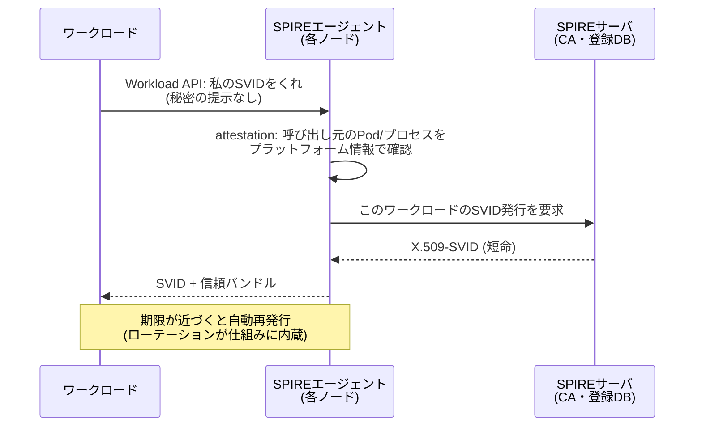

# SPIFFE / SPIRE

**SPIFFE** (Secure Production Identity Framework For Everyone) は、人間ではなく**ワークロード**（サービス・ジョブ・Pod）にアイデンティティを与えるための標準仕様。**SPIRE**はその参照実装。いずれもCNCFのgraduatedプロジェクト。

## 解く問題: "secret zero"

サービス同士が認証し合うには、各サービスが何らかの資格情報（[[oauth-client-credentials|client_secret]]、APIキー、[[mtls|mTLSの秘密鍵]]）を持つ必要がある。ではその**最初の秘密を誰がどうやって安全に配るのか**——環境変数に書けばリポジトリやログから漏れ、配布した瞬間からローテーションの義務を負う。この鶏卵問題がsecret zero問題。

SPIFFEの答えは「秘密を事前配布するのではなく、**プラットフォームが観測できる事実からワークロードの正体を確認（attestation）し、その場で短命な証明書を発行する**」。

## 構成要素

- **SPIFFE ID**: ワークロードの識別子。`spiffe://trust-domain/ns/prod/sa/billing` のようなURI形式
- **SVID** (SPIFFE Verifiable Identity Document): SPIFFE IDを運ぶ証明書。**X.509-SVID**（[[mtls]]のクライアント/サーバ証明書として使う）と**JWT-SVID**（L7プロキシ越しなどTLSを終端される経路用。検証は[[jwks-key-rotation|JWKS]]同様のバンドル配布）の2形式
- **Workload API**: ワークロードが自分のSVIDを受け取るローカルAPI（UNIXソケット）。**認証情報なしで呼べる**のがポイントで、呼び出し元が誰かはAPI側がattestationで確認する
- **attestation**: 「このプロセスはどのK8s ServiceAccount / どのAWSインスタンス / どのバイナリか」をプラットフォームのメタデータ（kubeletへの照会、インスタンスメタデータ、プロセス情報等）で検証し、登録ポリシーに従ってSPIFFE IDを割り当てる

- SVIDは**短命**（分〜時間オーダー）で自動ローテーションされる。「漏れたら期限まで有効」の窓が構造的に小さく、失効リスト運用への依存も減る（[[token-revocation]]の文脈）
- ワークロード間のmTLSは「双方がSVIDを提示し、相手のSPIFFE IDを認可判定に使う」形になる——ネットワーク位置ではなくアイデンティティで判定する[[zero-trust|ゼロトラスト]]のサービス間実装そのもの

## エコシステムでの位置

- [[service-mesh|サービスメッシュ]]のワークロードID（IstioのID形式はSPIFFE互換）はこの仕組みの上に載っている。メッシュを入れずにSPIRE単体でmTLS基盤だけ持つ構成もある
- クラウドの「IAMロール」「Workload Identity」はプラットフォーム固有の同型解。SPIFFEはそれをマルチクラウド・マルチプラットフォームで標準化したもの
- 注意点として、ノード共有型プロキシ（Istio ambientのztunnel等）は複数ワークロードを代理するためWorkload APIの前提と相性が悪く、SPIRE側のDelegated Identity APIで対応する、という発展的な論点がある

## [[web-auth-moc|Webアプリ認証認可MOC]]の中での位置づけ

人間の認証（[[oidc|OIDC]]）に対する「機械の認証」の標準。[[oauth-client-credentials|client_secret配布]]の運用問題を、attestation＋短命証明書で置き換える。

## 出典

- [SPIFFE](https://spiffe.io/) / [SPIFFE Concepts](https://spiffe.io/docs/latest/spiffe-about/spiffe-concepts/)
- [SPIRE Concepts（attestationの仕組み）](https://spiffe.io/docs/latest/spire-about/spire-concepts/)
- [CNCF: SPIFFE/SPIRE Graduation announcement](https://www.cncf.io/announcements/2022/09/20/spiffe-and-spire-projects-graduate-from-cloud-native-computing-foundation-incubator/)

#セキュリティ #ゼロトラスト #マイクロサービス #認証認可
