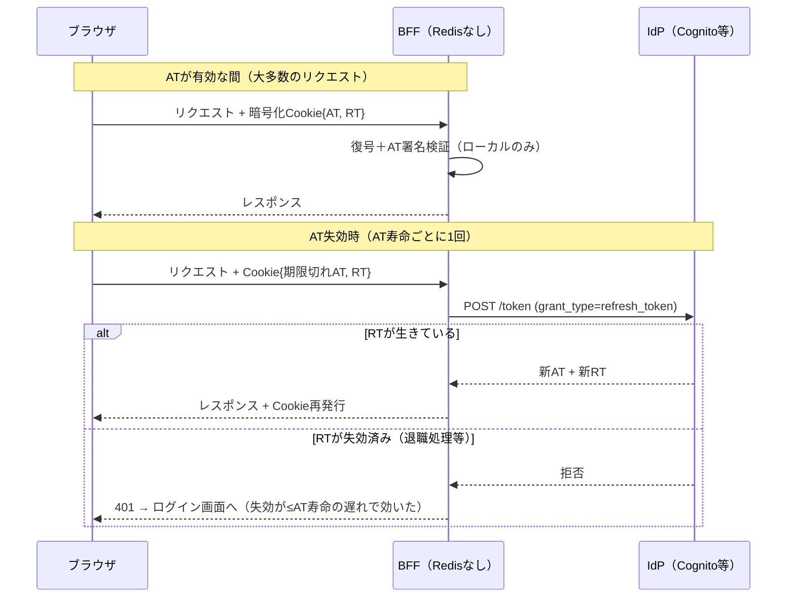

# ステートレスセッション（暗号化Cookieセッション）

セッションの状態をサーバ側ストアに置かず、**署名（＋必要に応じ暗号化）したオブジェクトをそのままHttpOnly Cookieに入れてブラウザに持たせる**方式。サーバは受け取ったCookieを復号・署名検証するだけでセッションを復元でき、ストア参照が不要になる。[[bff-pattern]]のクライアントサイドセッション（1b）はこれ。

「JWTをクライアントに渡す＝危険」ではない。危険なのは**JSが読める場所に置くこと**であり、HttpOnly Cookieに入れたJWTはXSSでも持ち出せない（[[session-id-vs-jwt]]の2軸参照）。

## 主要フレームワークのデフォルトはむしろこれ

**Webの相当部分は、失効チェックなしのステートレスCookieセッションで動いている**:

| フレームワーク | デフォルトのセッション |
|---|---|
| Ruby on Rails | **暗号化Cookieセッション**（CookieStore） |
| Flask | **署名付きCookieセッション** |
| ASP.NET Core | Cookie認証は**暗号化チケットをCookieに格納**（サーバストアなし） |
| Auth.js / NextAuth | **JWTセッション戦略**（暗号化JWE Cookie） |

許容される理由は、対象システムの脅威モデルでは「Cookieが盗まれたら期限まで悪用されうる」リスクの期待損失が、ストア運用のコストを下回るから（EC閲覧・コンテンツサイト・一般SaaS等）。サーバレス／エッジ実行環境（Lambda@Edge、[[cloudflare-workers|Cloudflare Workers]]）では低レイテンシな共有ストアが**そもそも置けない**ため、署名検証だけで各エッジが独立に認証できる価値が支配的になる。

## 変種1b′: 状態をIdPに外注する（Redisなしで失効も効かせる）

「短命expにすると失効確認機構が要る→それはRedis」とは限らない。**IdPが既にステートフルな失効台帳を持っている**（例: CognitoのRevokeToken / GlobalSignOut）ことを使うと、自前ストアなしで失効遅延を抑えられる:

- 暗号化Cookieの中に**短命AT（5〜15分）＋RT**を入れる
- AT有効期間内: BFFは復号＋署名検証のみ。**外部I/Oゼロ**
- ATが切れたら: RTでIdPのトークンエンドポイント（`grant_type=refresh_token`）を叩く。**ここが失効チェックポイント**——失効済みRTならリフレッシュが拒否され、セッションはそこで死ぬ

- expのチェックはBFFが**ローカルで**やる（`exp`クレームを見るだけ）。IdPに「これ有効？」と聞くAPI（イントロスペクション、RFC 7662）は叩かない設計。そもそもCognitoは非対応
- 失効は「問い合わせの答え」ではなく「**更新を試みたら断られる**」形で現れる
- Auth.js（旧NextAuth）のデフォルト（JWTセッション＋IdPリフレッシュ）はまさにこの形で、Next.js界隈では事実上の最多数派構成

ステートレスなのは「自分のBFF」であって、システム全体から状態が消えたわけではない——**状態の置き場所がIdPに移っただけ**。

## SPAだけでは同じことができない

1b′の成立要素は実は**全部サーバ側にある**。「ステートレスにできる＝SPAだけでいける」と混同するとブラウザ保持トークン（[[oauth-browser-based-apps|パターン3]]）に逆戻りする:

| 1b′の成立要素 | ブラウザ単体でできるか |
|---|---|
| HttpOnly Cookieの発行 | ❌ サーバの`Set-Cookie`でしか付けられない |
| Cookie暗号鍵の秘匿 | ❌ ブラウザに秘密を隠す場所はない |
| confidential clientとしてのRT保持とリフレッシュ | ❌ ブラウザはpublic client |

教訓は「サーバを消せる」ではなく「**セッションストアを消せる**」。

## 実装上の注意

- **Cookieサイズ**: IdPのAT/RTは各1KB前後、暗号化でさらに膨張し**4KB上限に接触**する。分割Cookie実装が必要（Auth.jsは自動分割）
- **リフレッシュ競合**: 並行リクエスト時の二重リフレッシュの排他制御
- **鍵管理**: 署名・暗号鍵の保管（KMS/Secrets Manager）とローテーション設計
- **expは2種類あり基準が違う**: 内側のAT寿命＝失効遅延の上限（監査SLAが短く押し、IdP呼び出しコストが長く押す。相場5〜15分）。外側のセッション寿命＝何時間ログインさせ続けるかという業務要件（アイドル＋絶対タイムアウト）。詳細は[[token-revocation]]

## [[web-auth-moc|Webアプリ認証認可MOC]]の中での位置づけ

[[bff-pattern]]の1a（Redisセッション）に対する「Redisを置けない・置きたくない環境での正当な次善」。失効遅延の許容値で選ぶ（[[token-revocation]]）。

## 出典

- [OAuth 2.0 for Browser-Based Applications draft-26（client-side sessionの記述）](https://www.ietf.org/archive/id/draft-ietf-oauth-browser-based-apps-26.html)
- [Auth.js: Session strategies](https://authjs.dev/concepts/session-strategies)
- [Rails Guides: Sessions](https://guides.rubyonrails.org/security.html#sessions) / [Flask: Sessions](https://flask.palletsprojects.com/en/stable/quickstart/#sessions) / [ASP.NET Core: Cookie authentication](https://learn.microsoft.com/en-us/aspnet/core/security/authentication/cookie)
- [Amazon Cognito: Revoking tokens](https://docs.aws.amazon.com/cognito/latest/developerguide/token-revocation.html) / [Token endpoint](https://docs.aws.amazon.com/cognito/latest/developerguide/token-endpoint.html)
- [RFC 7662: OAuth 2.0 Token Introspection](https://datatracker.ietf.org/doc/html/rfc7662)

#認証認可 #jwt #セッション管理
