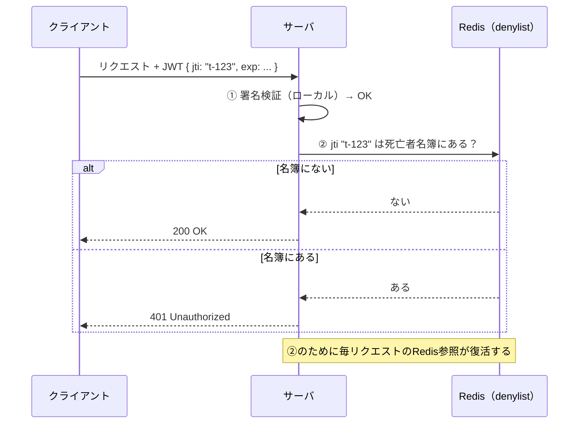

# トークン失効とステートレス性のトレードオフ

[[jwt-stateless-availability|JWTのステートレス性]]の対価は即時失効の喪失。「失効をどう効かせるか」は二択ではなく、**失効チェックをどこに置くかのスペクトラム**として設計する。

## denylist / allowlist

**denylist（拒否リスト）**は「発行済みトークンを失効させるための、サーバ側の死亡者名簿」:

1. 各JWTに一意のID（`jti`クレーム）を入れて発行する
2. 失効させたいとき、その`jti`をストアに記録する
3. **毎リクエスト**、署名検証が通った後に「この`jti`は名簿にないか？」をストアに問い合わせる
4. 名簿のエントリはトークンの`exp`が過ぎたら消してよい

セッションストア（allowlist＝生存者名簿: 載っている者だけ通す）とdenylist（死亡者名簿: 載っている者だけ弾く）は互いの裏返し:

| | allowlist（セッションストア） | denylist |
|---|---|---|
| ストアに載るもの | 生きているセッション全部 | 失効させたトークンだけ（expまで） |
| ストアのサイズ | ユーザー数に比例 | 通常ごく小さい |
| 毎リクエストのストア参照 | **必要** | **必要** ← ここが同じ |
| ストアが落ちたら | 全員認証不能（fail closed） | 失効が効かない状態に（fail openの誘惑—危険） |

毎リクエストのストアI/Oが復活する時点でステートレスの利点は消えている。それなら最初から素直にセッションストアでよい、というのが基幹システム文脈での典型的な結論。

## 短命exp＋再発行の2案

「expを5分にすれば1bでも失効できるのでは」への正確な答え。再発行のやり方は2つしかない:

- **案i: 無条件で再発行**（ステートレスなスライド延長）— 完全にステートレスのまま。**しかし失効が永遠に効かない**（盗んだ攻撃者も延長し放題）。短命expの意味が消える
- **案ii: 再発行時にサーバ側の台帳を確認** — 失効は効く（最大exp分の遅れ）。しかしその台帳はステートフルなストア。つまりこれは「**状態の参照頻度を毎リクエストからN分に1回に間引いた構成**」であり、OAuthの「短命AT＋ステートフルなRT」はまさにこの構造。得るものはストア負荷の軽減、失うものは失効の即時性

台帳を自前で持たずIdPに外注する変種（1b′）は[[stateless-session]]参照。

## 失効チェック位置のスペクトラム

左へ行くほど失効が速くインフラが増え、右へ行くほど軽く失効が遅い。「Redisか否か」の二択ではなく、**失効遅延の許容値を要件から決めて、この線上の点を選ぶ**のが正確な設計行為。右端も欠陥ではなく、フレームワークデフォルトとして多数派（[[stateless-session]]）——「盗まれたら最悪exp期間」を受容したリスクとして明示的に飲んでいる。

方式の分岐条件は「即時無効化の要否」というYes/Noではなく「**失効遅延の許容値**」という連続量で語ると、監査・インフラと数字で会話できる:

> 許容値 = 0秒（剥奪が次のリクエストから効く）が要件ならストア照合。許容値 ≥ AT寿命なら1b′も選択可（コンポーネントが1つ減る）。

付随する差分: インシデント時の全セッション一括破棄はストア型ならflush一撃、1b′は全ユーザーへの失効API連打＋AT寿命分の残存。

## expの決め方

技術定数ではなく「**失効遅延SLAと運用コストの交点**」。決めるexpは2つあり基準が違う:

- **内側のAT寿命**（＝失効遅延の上限）: 監査・セキュリティ要件（剥奪から遮断までの許容時間）が短く押し、IdP呼び出し頻度＝コスト・レート制限・リフレッシュ競合が長く押す。相場は5〜15分
- **外側のセッション寿命**（RT/Cookie寿命）: 「何時間ログインさせ続けるか」という業務要件。アイドルタイムアウト（例: 30分、操作で延長）＋絶対タイムアウト（例: 12時間）。会計系業務システムなら1営業日を超えないあたりが定石

## [[web-auth-moc|Webアプリ認証認可MOC]]の中での位置づけ

セッション方式選定（[[bff-pattern]]の1a vs [[stateless-session]]の1b/1b′）の分岐条件そのもの。

## 出典

- [RFC 7009: OAuth 2.0 Token Revocation](https://datatracker.ietf.org/doc/html/rfc7009)
- [RFC 7519: JWT — jtiクレーム](https://datatracker.ietf.org/doc/html/rfc7519#section-4.1.7)
- [OWASP: JSON Web Token Cheat Sheet](https://cheatsheetseries.owasp.org/cheatsheets/JSON_Web_Token_for_Java_Cheat_Sheet.html)
- [Amazon Cognito: Revoking tokens](https://docs.aws.amazon.com/cognito/latest/developerguide/token-revocation.html) / [GlobalSignOut API](https://docs.aws.amazon.com/cognito-user-identity-pools/latest/APIReference/API_GlobalSignOut.html)

#認証認可 #jwt #セッション管理
