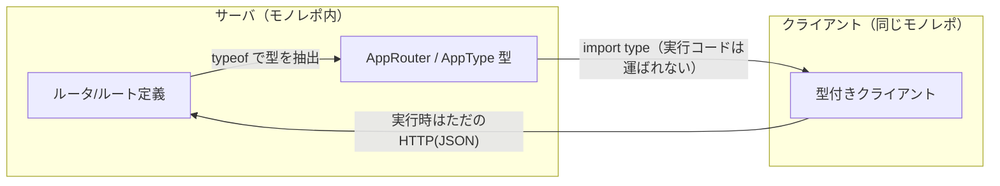

# TypeScriptの型共有RPC（tRPC / oRPC / Hono RPC）

サーバとクライアントが同じTypeScriptコードベース（モノレポ）にいることを前提に、[[rpc|RPC]]の「インターフェース定義とstub生成」を**TypeScriptの型推論**で置き換えるアプローチ。サーバのルータ定義から型をexportし、クライアントが`import type`するだけで、入力・出力（ライブラリによってはエラーも）がend-to-endで型安全になり、IDE補完が効く。

伝統的なRPCがIDL（`.proto`等）を書いてコード生成していたのに対して、「**TSの型システム自体をIDLにする**」のがポイント。コード生成ステップがなく、サーバのコードを直すとその瞬間からクライアント側で型エラーが出る。

実行時に流れるのは普通のHTTP+JSONで、型情報はコンパイル時にだけ存在する。だから**型の共有が成立するのは同一リポジトリ（or 型パッケージを共有できる範囲）だけ**で、外部に公開するAPIには別途OpenAPI等の仕様が必要になる——ここが3ライブラリの分岐点になっている。

## 3つの比較

| | tRPC | oRPC | Hono RPC |
|---|---|---|---|
| 立ち位置 | 独立したRPC層（先駆け） | 独立したRPC層 + OpenAPI第一級 | [[workers-fullstack-ts-stack|Hono]]フレームワーク組み込み |
| API定義 | router + procedure（code-first） | code-first / contract-first両対応 | 普通のHonoルート定義そのもの |
| OpenAPI生成 | 別途プラグイン | **組み込み**（最初から準拠） | 別途（hono-openapi等） |
| エンドポイントの形 | 独自規約のURL | RESTfulにもできる | 普通のRESTfulなURL（curlでも叩ける） |

### tRPC

このジャンルの先駆け。`procedure`（query / mutation / subscription）を`router`に束ねてAPIを定義し、その`AppRouter`型をクライアントの`createTRPCClient<AppRouter>()`に渡す。入力バリデーションはZod等を差し込む。コード生成なし・ランタイムの追加負荷ほぼなしで、TanStack Queryとの統合が厚い。フレームワークに依存しない独立したRPC層が欲しいときの定番。

### oRPC

tRPC的なDXに**OpenAPIサポートを最初から組み込んだ**もの。tRPCがcode-first専用なのに対し、先に契約（ルート・スキーマ）を定義してから実装するcontract-firstも選べる。`Date`や`File`などの型をネイティブに扱え、エラーも型安全。Node / Bun / Deno / Cloudflare Workers / AWS Lambdaで同じルータが動く。「社内はRPCとして使いつつ、同じ定義を外部向けOpenAPIとしても公開したい」ケースが主戦場。

### Hono RPC

独立したRPC層ではなく、**HonoのHTTPルート定義がそのままRPCになる**。サーバ側は`export type AppType = typeof routes`と型をexportするだけで、クライアントは`hc<AppType>()`で型付きfetchクライアントを得る。専用のprocedure/router概念を学ぶ必要がなく、エンドポイントは普通のHTTP APIなのでRPCクライアントを使わない相手（curl、他言語）からも叩ける。HTTPサーバをHonoにするなら追加レイヤなしでtRPC相当の型安全が手に入る——[[workers-fullstack-ts-stack]]で「oRPC不要」とされていた理由がこれ。

## 使い分けの目安

- HTTPサーバがHono → **Hono RPC**（追加ライブラリ不要）
- フレームワーク非依存のRPC層が欲しい、TanStack Query中心 → **tRPC**
- OpenAPIでの外部公開・APIゲートウェイ連携が要る → **oRPC**

## [[capnweb|Cap'n Web]]との違い

同じ「JS/TSの型が効くRPC」でも別物。型共有RPCは**リクエスト/レスポンスの型を共有する**だけで、モデルは従来のHTTP API。Cap'n Webは**オブジェクト参照そのものがネットワークを越えて渡る**object-capability RPCで、関数を渡す・戻り値をawaitせず次の呼び出しに渡す（promise pipelining）といった、呼び出しモデル自体が異なる。

## 出典

- [tRPC](https://trpc.io/) / [tRPC Docs: Quickstart](https://trpc.io/docs/quickstart)
- [oRPC](https://orpc.dev/) / [oRPC v1 Announcement](https://orpc.dev/blog/v1-announcement)
- [tRPC vs oRPC — LogRocket Blog](https://blog.logrocket.com/trpc-vs-orpc-type-safe-rpc/)
- [Hono Docs: RPC](https://hono.dev/docs/guides/rpc)

#rpc #typescript #api
