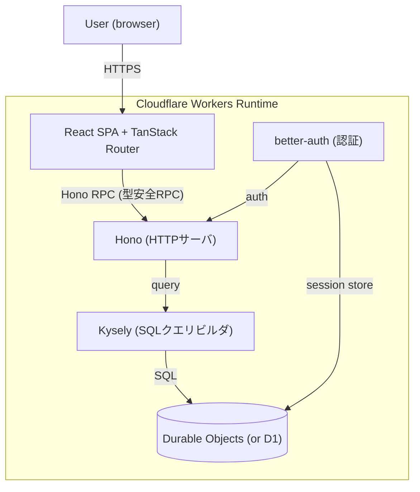

# Cloudflare WorkersフルスタックTS構成（俺的最強技術スタック @R0u9h版）

Xで@R0u9h（LaPh）が共有していた「俺的最強技術スタック」の構成メモ。元になった構成図（TanStack Start + oRPC + Drizzle + D1 + lefthook）への「異論あり」版で、[[cloudflare-workers|Cloudflare Workers]]ランタイムの上にフロントエンドからDB・認証までをTypeScriptだけで完結させる。

## 構成図

ツール周りはBun（パッケージマネージャ）+ Vite Plus（build / lint / format / pre-commit）+ oxlint / oxfmt、IaCが必要ならAlchemy。

## 元構成からの変更点（投稿の主張）

| 元 | 変更後 | 投稿での理由 |
|---|---|---|
| Drizzle | Kysely | Kyselyでいい |
| oRPC | Hono RPC | 不要。「Hono RPCこそが至高」 |
| TanStack Start | React SPA + TanStack Router | よほどのことがなければSSRは要らない |
| lefthook | Vite Plus | oxcを使っているならpre-commitまでVite Plusで完結できる |
| D1 | Durable Objects | DOの方がシャーディングしやすい（D1でも可） |

Bunはパッケージマネージャとして使うならOK、ランタイムとしては使いたくない、という立場も添えられていた（Workers上で動かす以上、本番ランタイムはworkerdなのでBunランタイムの出番は元々ない）。

## 各レイヤのメモ

### Hono RPC

Honoのルート定義から`hc<AppType>()`クライアントが**TypeScriptの型推論だけ**で型安全なAPIクライアントになる仕組み。tRPC的な体験を、コード生成もスキーマ定義もなしにHono本体だけで得られる。サーバ側は`routes`の型を`export type AppType = typeof routes`のようにexportし、フロントは`import type`で参照するだけなので、モノレポ構成と相性がよい。HTTPサーバをHonoにするなら、RPC層のためだけに別ライブラリ（oRPC等）を足さなくてよい、というのが「不要」の中身。

### Kysely（vs Drizzle）

KyselyはORMではなく型安全な**SQLクエリビルダ**に徹したライブラリ。DBスキーマをTypeScriptのinterfaceとして与えると、クエリの結果型まで推論される。スキーマ管理・マイグレーション生成・リレーション抽象は持たない（必要ならkysely-codegen等を別途使う）。Drizzleはスキーマ定義からマイグレーション生成までを備えたSQL寄りの軽量ORMなので、「SQLは自分で書く、型だけ欲しい」ならKyselyで十分という判断。

### D1ではなくDurable Objects

- [[cloudflare-d1|D1]]自体が[[durable-objects|Durable Objects]]のSQLiteストレージの上に実装されており、1データベース＝書き込み点1つ・上限10GB
- DOを直接使うと「ユーザー/テナント/ワークスペースごとにDB1個」という分割（database-per-user）が素直に書ける。各DOがそれぞれ10GBの上限を持ち、書き込み点も分散するので、**シャーディングの設計がそのままDOのID設計になる**
- D1側も思想としては「1個の巨大DBではなく多数の小さなDB」を推奨しているが、分割の単位を自分で制御しやすいのはDO直接利用の方
- better-authのセッションストアも同じDO（またはD1）に同居させる

### SPA + TanStack Router（SSRなし）

TanStack StartはTanStack Routerの上にSSR・サーバ関数を足したフルスタックフレームワーク。逆に言えばSSRが要らないならRouter単体のSPAで足りる、という関係。SEOや初期表示が問題にならない管理画面・ツール系ならSPAで十分で、Workers Static Assetsで静的ファイルとして配信すればWorkers 1つにフロントとAPIを同居させられる（[[cloudflare-workers]]参照）。サーバとクライアントの境界をどこに引くかの整理は[[frontend-rendering-moc]]。

## ツールチェーン

- **Bun** — パッケージマネージャとして
- **Vite Plus（Vite+）** — VoidZeroの統合ツールチェーン。`vp`の1バイナリにVite / Vitest / Rolldown / tsdown / oxlint / oxfmtとタスクランナーが入り、**pre-commitフック機能も組み込み**で持つ。2026年3月にアルファ、7月にベータでMITライセンスにてOSS化。oxc系に寄せているならlefthookを別途入れる理由が薄い、というのが変更点の根拠
- **oxlint / oxfmt** — Rust製（oxc）のlinter / formatter。Vite+経由で使う
- **Alchemy** — TypeScriptネイティブのIaCライブラリ。追加のツールチェーンやサービスなしにpure TypeScriptでリソースを定義でき、stateはローカルファイルとしてリポジトリに置ける。Cloudflareの場合、定義したリソースからWorkersのbinding型（`env`）が推論されるので`wrangler types`のコード生成が要らなくなる

## [[cloudflare-moc|Cloudflare MOC]]の中での位置づけ

[[cloudflare-workers]]・[[durable-objects]]・[[cloudflare-d1]]という原子ノート群を、1本のアプリとして縦に串刺しにした「構成例」。[[cloudflare-os]]がWorkersスタックの大規模なリファレンス実装だとすると、こちらは個人開発規模の最小フルスタック構成。

## 出典

- 発端: @R0u9h（LaPh）のX投稿（「俺的最強技術スタック」の異論あり版構成図）
- [Hono Docs: RPC](https://hono.dev/docs/guides/rpc)
- [Kysely](https://kysely.dev/)
- [Typed Query Builders: Kysely vs. Drizzle — Marmelab](https://marmelab.com/blog/2025/06/26/kysely-vs-drizzle.html)
- [Zero-latency SQLite storage in every Durable Object — Cloudflare Blog](https://blog.cloudflare.com/sqlite-in-durable-objects/)
- [One Database Per User with Cloudflare Durable Objects — Boris Tane](https://boristane.com/blog/durable-objects-database-per-user/)
- [Cloudflare Docs: Durable Objects limits](https://developers.cloudflare.com/durable-objects/platform/limits/) / [D1 limits](https://developers.cloudflare.com/d1/platform/limits/)
- [Announcing Vite+ Alpha — VoidZero](https://voidzero.dev/posts/announcing-vite-plus-alpha) / [Announcing Vite+ Beta — VoidZero](https://voidzero.dev/posts/announcing-vite-plus-beta)
- [TanStack Start](https://tanstack.com/start)
- [Alchemy — TypeScript IaC](https://alchemy.run/)

#cloudflare #typescript #個人開発
